<!-- GENERATED FILE: edit data/ and run scripts/refresh, not this file -->
# Awesome Decomp Games 

> A rated, auto-refreshed list of **decompiled, recompiled and reverse-engineered games**: matching decompilations, static recompilations, source ports, engine remakes, disassemblies and browser ports.

**1336 projects** covering **1145 games** · updated 2026-10-09 · browse and filter on the **[website](https://submitgame.github.io/awesome-decomp-games/)** · data in [`data/games.json`](data/games.json)

> [!IMPORTANT]
> This list only links to source code and project pages. It does **not** host or link to ROMs, ISOs, game assets or other copyrighted material. Most projects need files from a copy of the game you own. See the [disclaimer](#disclaimer).

## Contents

- [Top playable picks](#top-playable-picks)
- [Play in your browser](#play-in-your-browser) (35)
- [Static recompilations](#static-recompilations) (297)
- [Source ports](#source-ports) (75)
- [Engine remakes & reimplementations](#engine-remakes--reimplementations) (169)
- [Browser ports](#browser-ports) (43)
- [Decompilations](#decompilations) (617)
- [Disassemblies](#disassemblies) (134)
- [Tools & launchers](#tools--launchers) (1)
- [How entries are rated](#how-entries-are-rated)
- [Sources](#sources)
- [Contributing](#contributing)
- [Disclaimer](#disclaimer)
- [License](#license)

## Top playable picks

Projects with the best mix of playability, completeness, activity and popularity that you can actually play today (bring your own game files where needed).

### 1. The Legend of Zelda: Ocarina of Time (Ship of Harkinian)
**Source port** · N64 / GameCube · ⭐ 5.6k · score **4.8/5**  
The definitive way to play Ocarina of Time on PC, Switch, Wii U and Android: 60fps, widescreen, randomizer, mods. Bring your own ROM.  
[project](https://github.com/HarbourMasters/Shipwright) · [release](https://github.com/HarbourMasters/Shipwright/releases/tag/9.3.0) · [video](https://www.youtube.com/watch?v=u-EhRErOpHE)

<a href="https://github.com/HarbourMasters/Shipwright">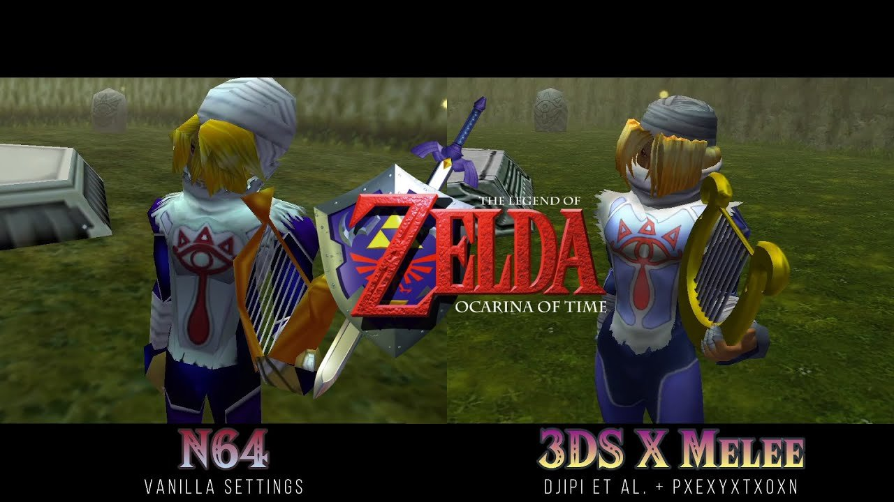</a>

### 2. The Legend of Zelda: Majora's Mask (Zelda64Recomp)
**Static recompilation** · N64 · ⭐ 7.4k · score **4.8/5**  
N64: Recompiled port of Majora's Mask with ultrawide, high framerate, gyro and a mod loader. Needs your US ROM.  
[project](https://github.com/Zelda64Recomp/Zelda64Recomp) · [release](https://github.com/Zelda64Recomp/Zelda64Recomp/releases/tag/v1.2.2) · [video](https://www.youtube.com/watch?v=GIp7C2ro2T8)

<a href="https://github.com/Zelda64Recomp/Zelda64Recomp">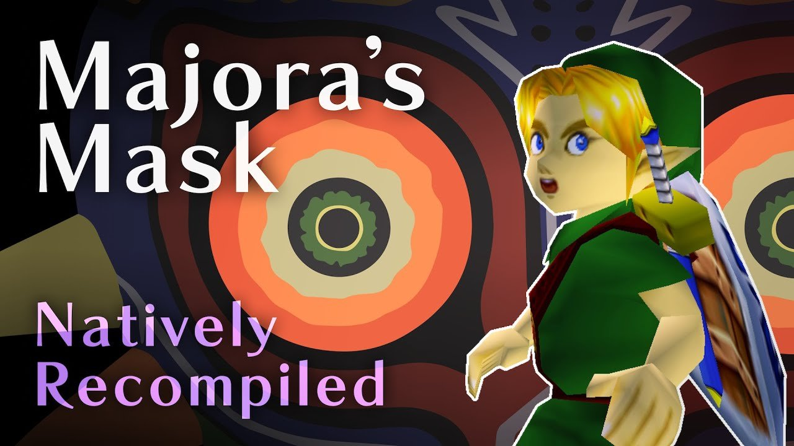</a>

### 3. Sonic Unleashed (Unleashed Recompiled)
**Static recompilation** · Xbox 360 · ⭐ 5.1k · score **4.5/5**  
XenonRecomp port of the Xbox 360 Sonic Unleashed: high framerate, ultrawide, mod support. Needs your own dump.  
[project](https://github.com/hedge-dev/UnleashedRecomp) · [release](https://github.com/hedge-dev/UnleashedRecomp/releases/tag/v1.0.3) · [video](https://www.youtube.com/watch?v=yDlVr1Jv-WU)

<a href="https://github.com/hedge-dev/UnleashedRecomp">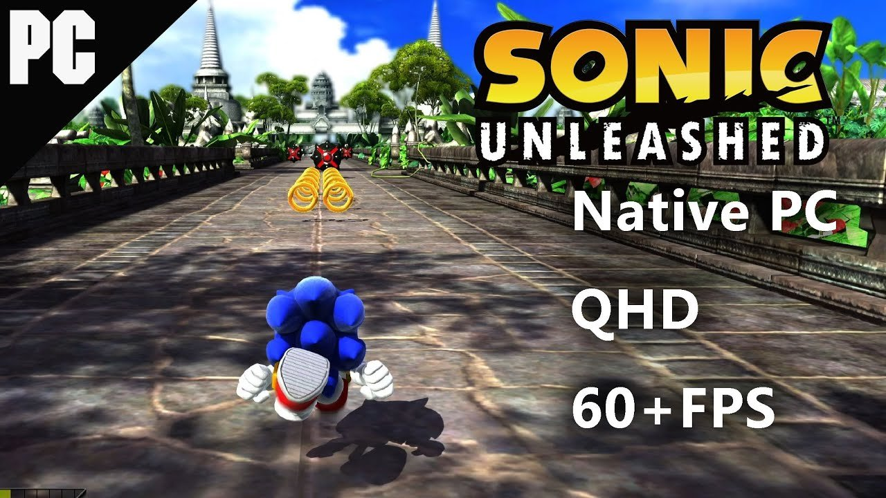</a>

### 4. Super Mario 64 (sm64coopdx)
**Source port** · N64 · ⭐ 1.4k · score **4.3/5**  
Super Mario 64 PC port with online co-op for up to 16 players, Lua mods and DynOS. Built from the SM64 decomp.  
[project](https://github.com/coop-deluxe/sm64coopdx) · [release](https://github.com/coop-deluxe/sm64coopdx/releases/tag/v1.5.1) · [video](https://www.youtube.com/watch?v=hmqbLyszoYY)

### 5. Star Fox 64 (Starship)
**Source port** · N64 · ⭐ 2.1k · score **4.5/5**  
Native Star Fox 64 port (from the SF64 decomp) with widescreen, 60fps and enhancements.  
[project](https://github.com/HarbourMasters/Starship) · [release](https://github.com/HarbourMasters/Starship/releases/tag/v2.0.0) · [video](https://www.youtube.com/watch?v=FZ3o09an9_k)

<a href="https://github.com/HarbourMasters/Starship">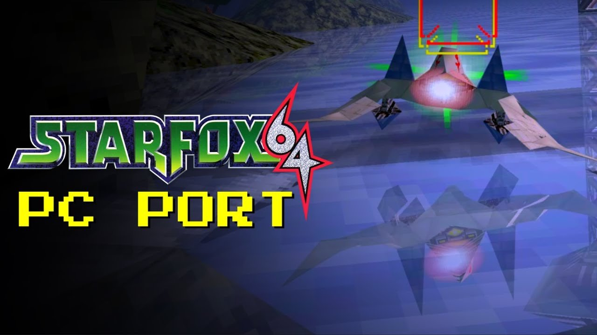</a>

### 6. The Legend of Zelda: Twilight Princess (Dusklight)
**Source port** · GameCube · ⭐ 5.7k · score **4.8/5**  
PC/mobile port of Twilight Princess built on the zeldaret/tp decompilation, with fixes and enhancements.  
[project](https://github.com/TwilitRealm/dusklight) · [release](https://github.com/TwilitRealm/dusklight/releases/tag/v2.0.3) · [video](https://www.youtube.com/watch?v=9ivusJVCtFk)

<a href="https://github.com/TwilitRealm/dusklight">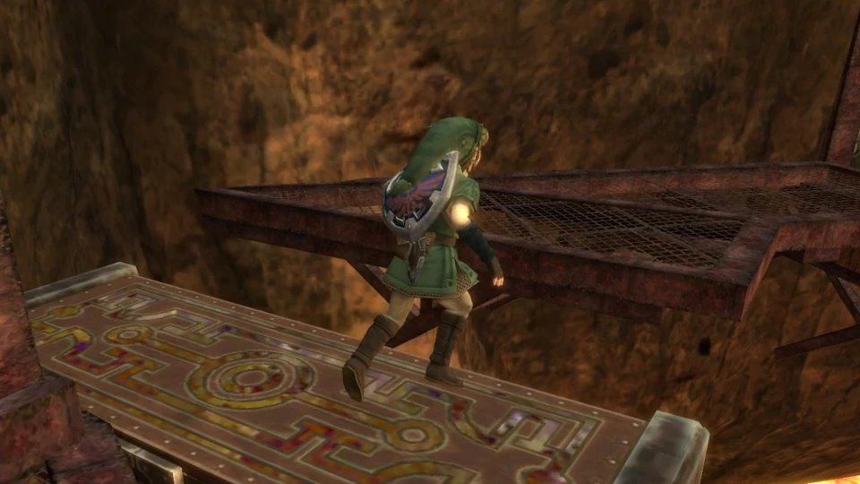</a>

### 7. Banjo-Kazooie (BanjoRecomp)
**Static recompilation** · N64 · ⭐ 2.0k · score **4.5/5**  
N64: Recompiled Banjo-Kazooie for Windows/Linux/Mac with widescreen, high framerate and Thunderstore mods.  
[project](https://github.com/BanjoRecomp/BanjoRecomp) · [release](https://github.com/BanjoRecomp/BanjoRecomp/releases/tag/v1.0.2) · [video](https://www.youtube.com/watch?v=0906Cz-59eU)

### 8. Mario Kart 64 (SpaghettiKart)
**Source port** · N64 · ⭐ 2.4k · score **4.5/5**  
Mario Kart 64 PC port from the MK64 decomp: HD, custom tracks, extra players and modding.  
[project](https://github.com/HarbourMasters/SpaghettiKart) · [release](https://github.com/HarbourMasters/SpaghettiKart/releases/tag/1.0.0) · [video](https://www.youtube.com/watch?v=EOWOtd8sZTQ)

### 9. Diablo (DevilutionX)
**Engine remake** · PC · ⭐ 9.8k · score **4.8/5**  
Diablo and Hellfire for modern systems (PC, consoles, handhelds), based on the reverse-engineered Devilution source.  
[project](https://github.com/diasurgical/DevilutionX) · [release](https://github.com/diasurgical/DevilutionX/releases/tag/1.5.5) · [video](https://www.youtube.com/watch?v=4fxOMpYWBGg)

<a href="https://github.com/diasurgical/DevilutionX">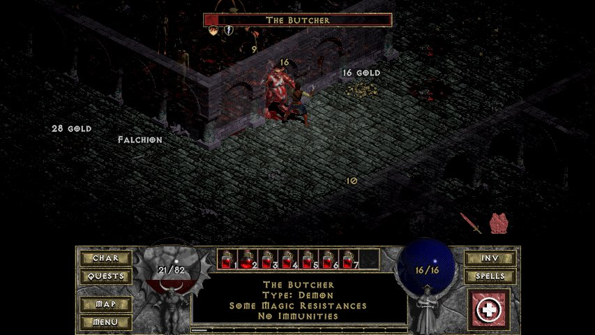</a>

### 10. RollerCoaster Tycoon 2 (OpenRCT2)
**Engine remake** · PC · ⭐ 16.4k · score **4.8/5**  
Full reimplementation of RollerCoaster Tycoon 2 with multiplayer, higher resolutions and quality-of-life fixes.  
[project](https://github.com/OpenRCT2/OpenRCT2) · [release](https://github.com/OpenRCT2/OpenRCT2/releases/tag/v0.5.5) · [video](https://www.youtube.com/watch?v=8dXoNlAR0X4)

<a href="https://github.com/OpenRCT2/OpenRCT2">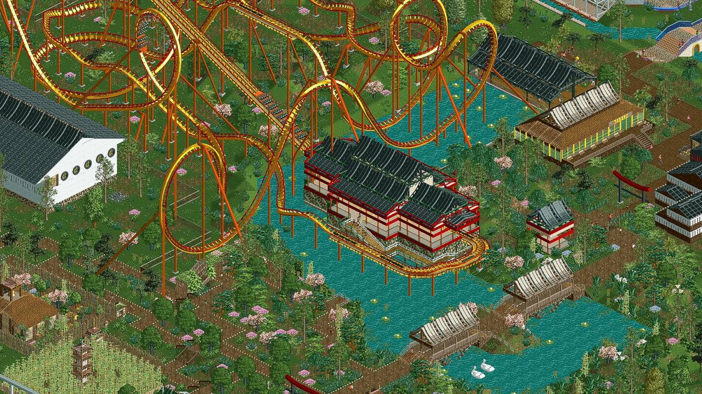</a>

### 11. The Legend of Zelda: A Link to the Past (zelda3)
**Engine remake** · SNES · ⭐ 4.8k · score **4.5/5**  
Reverse-engineered C reimplementation of A Link to the Past: widescreen, pixel shaders, MSU-1. Needs the ROM for assets.  
[project](https://github.com/snesrev/zelda3) · [release](https://github.com/snesrev/zelda3/releases/tag/v0.3) · [video](https://www.youtube.com/watch?v=xctizwBntag)

<a href="https://github.com/snesrev/zelda3">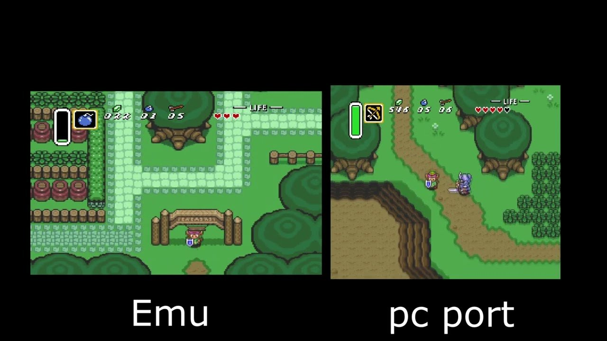</a>

### 12. The Elder Scrolls III: Morrowind (OpenMW)
**Engine remake** · PC · ⭐ 6.6k · score **4.8/5**  
Open-source Morrowind engine: better performance, Lua modding, runs on Linux/macOS/Android.  
[project](https://github.com/OpenMW/openmw) · [release](https://github.com/OpenMW/openmw/releases/tag/openmw-0.51.0) · [video](https://www.youtube.com/watch?v=bR-WZ8NOG_k)

<a href="https://github.com/OpenMW/openmw">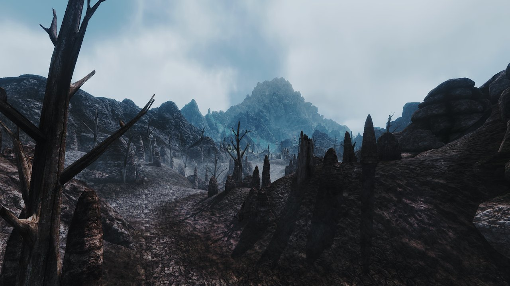</a>

### 13. Sonic Mania
**Decompilation** · PC · ⭐ 810 · score **4.0/5**  
Complete decompilation of Sonic Mania that builds native ports for PC, Switch, Android and more.  
[project](https://github.com/RSDKModding/Sonic-Mania-Decompilation) · [release](https://github.com/RSDKModding/Sonic-Mania-Decompilation/releases/tag/v1.1.1) · [video](https://www.youtube.com/watch?v=CSPhyjHt79Y)

<a href="https://github.com/RSDKModding/Sonic-Mania-Decompilation">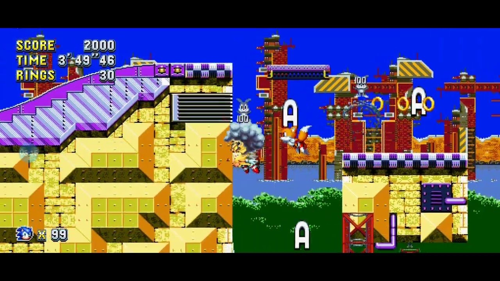</a>

### 14. Transport Tycoon Deluxe (OpenTTD)
**Engine remake** · PC · ⭐ 8.3k · score **4.8/5**  
The long-running, still active reimplementation of Transport Tycoon Deluxe; free graphics sets mean no original files are needed.  
[project](https://github.com/OpenTTD/OpenTTD) · [release](https://github.com/OpenTTD/OpenTTD/releases/tag/15.3) · [video](https://www.youtube.com/watch?v=ZBzRh6lD9J8)

<a href="https://github.com/OpenTTD/OpenTTD">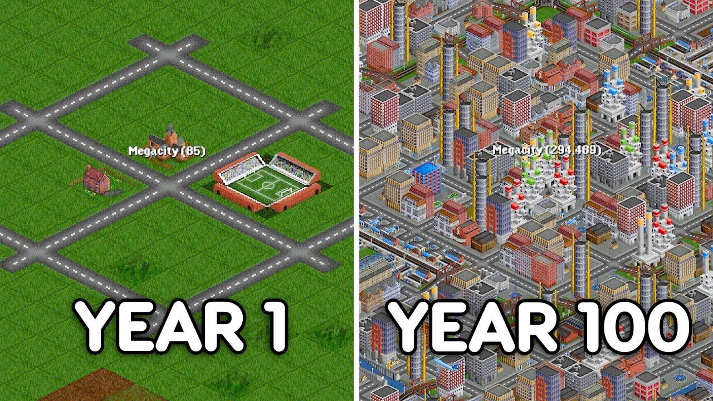</a>

### 15. Sonic the Hedgehog 2006 (Marathon Recompiled)
**Static recompilation** · Xbox 360 · ⭐ 654 · score **3.4/5**  
XenonRecomp port of Sonic the Hedgehog (2006), fixing much of its performance and loading.  
[project](https://github.com/sonicnext-dev/MarathonRecomp) · [video](https://www.youtube.com/watch?v=kQVbKhjSBmk)

<a href="https://github.com/sonicnext-dev/MarathonRecomp">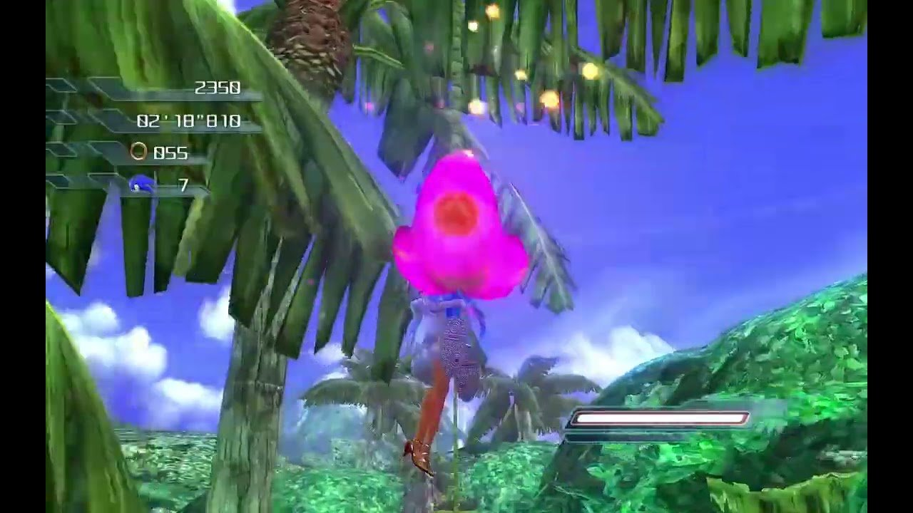</a>

### 16. LEGO Island (isle-portable)
**Source port** · PC · ⭐ 1.1k · score **4.5/5**  
Cross-platform LEGO Island built on the full isledecomp decompilation (Windows, Linux, macOS, web, consoles).  
[project](https://github.com/isledecomp/isle-portable) · [release](https://github.com/isledecomp/isle-portable/releases/tag/continuous) · [video](https://www.youtube.com/watch?v=JUNdWnI5BTk)

<a href="https://github.com/isledecomp/isle-portable">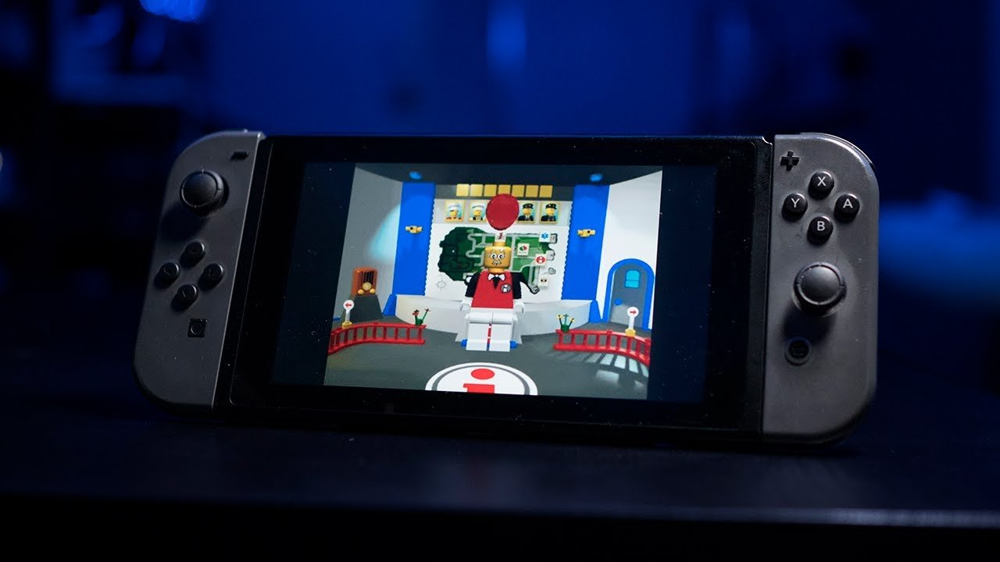</a>

### 17. Heroes of Might and Magic III (VCMI)
**Engine remake** · PC · ⭐ 5.9k · score **4.8/5**  
Heroes of Might and Magic III engine rewrite with HD, mods, multiplayer and Android support.  
[project](https://github.com/vcmi/vcmi) · [release](https://github.com/vcmi/vcmi/releases/tag/1.7.5) · [video](https://www.youtube.com/watch?v=zxC7wLITNpg)

<a href="https://github.com/vcmi/vcmi">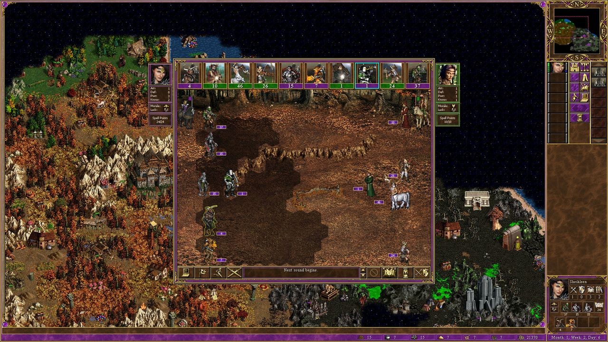</a>

### 18. Tomb Raider 1-5 (OpenLara)
**Engine remake** · n/a · ⭐ 5.1k · score **4.8/5**  
Classic Tomb Raider engine that runs on PC, phones, browsers and retro consoles.  
[project](https://github.com/XProger/OpenLara) · [release](https://github.com/XProger/OpenLara/releases/tag/latest) · [video](https://www.youtube.com/watch?v=RRhyua_l5U8)

<a href="https://github.com/XProger/OpenLara">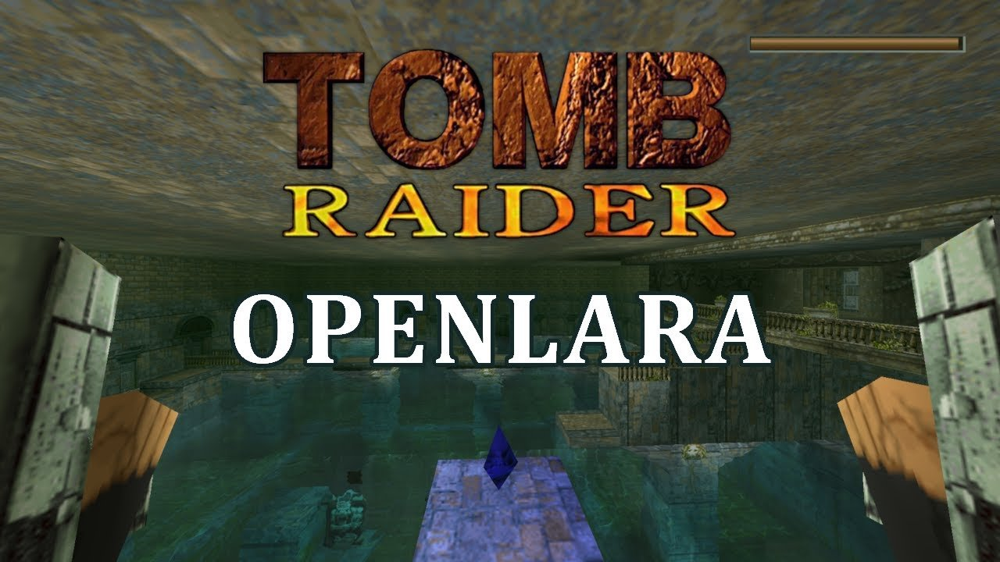</a>

### 19. Carmageddon (dethrace)
**Engine remake** · PC · ⭐ 1.2k · score **4.5/5**  
Reverse-engineered Carmageddon that runs natively on modern Windows, Linux and macOS.  
[project](https://github.com/dethrace-labs/dethrace) · [release](https://github.com/dethrace-labs/dethrace/releases/tag/v0.10.1) · [video](https://www.youtube.com/watch?v=MMI45O0RKq0)

<a href="https://github.com/dethrace-labs/dethrace">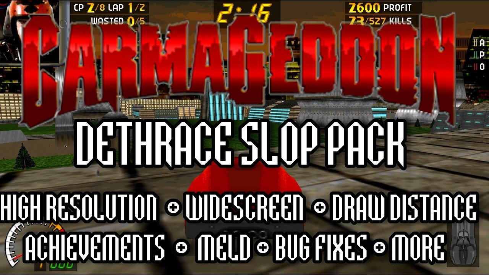</a>

### 20. 3D Pinball Space Cadet
**Decompilation** · PC · ⭐ 4.7k · score **3.6/5**  
Decompilation of Windows' 3D Pinball Space Cadet, ported to modern platforms.  
[project](https://github.com/k4zmu2a/SpaceCadetPinball) · [release](https://github.com/k4zmu2a/SpaceCadetPinball/releases/tag/Release_2.1.0) · [video](https://www.youtube.com/watch?v=smiCSU2sje8)

<a href="https://github.com/k4zmu2a/SpaceCadetPinball">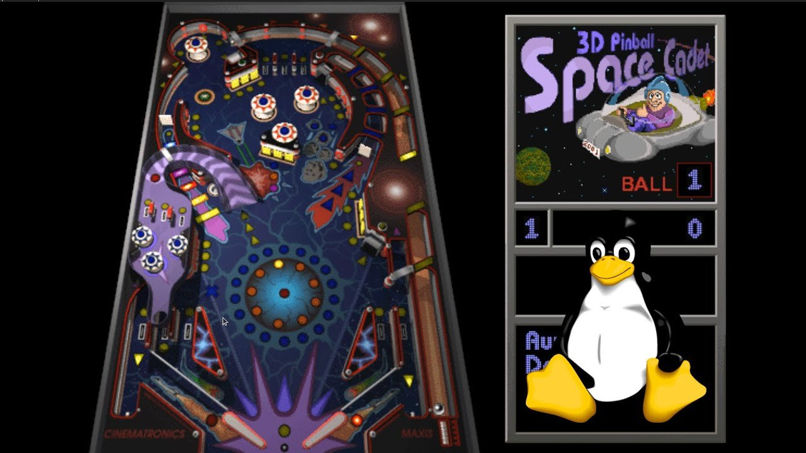</a>

### 21. Theme Hospital (CorsixTH)
**Engine remake** · PC · ⭐ 4.6k · score **4.5/5**  
Open reimplementation of Theme Hospital with high resolutions and campaign editor.  
[project](https://github.com/CorsixTH/CorsixTH) · [release](https://github.com/CorsixTH/CorsixTH/releases/tag/v0.70.1) · [video](https://www.youtube.com/watch?v=fKq04q6a53s)

<a href="https://github.com/CorsixTH/CorsixTH">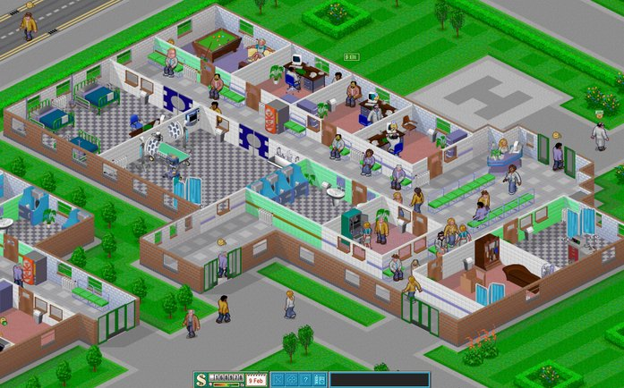</a>

### 22. Caesar III (Julius)
**Engine remake** · PC · ⭐ 3.4k · score **4.5/5**  
Faithful reimplementation of Caesar III that fixes bugs and runs on modern systems; Augustus adds gameplay changes.  
[project](https://github.com/bvschaik/julius) · [release](https://github.com/bvschaik/julius/releases/tag/v1.8.0) · [video](https://www.youtube.com/watch?v=OXONBt5U-U0)

<a href="https://github.com/bvschaik/julius">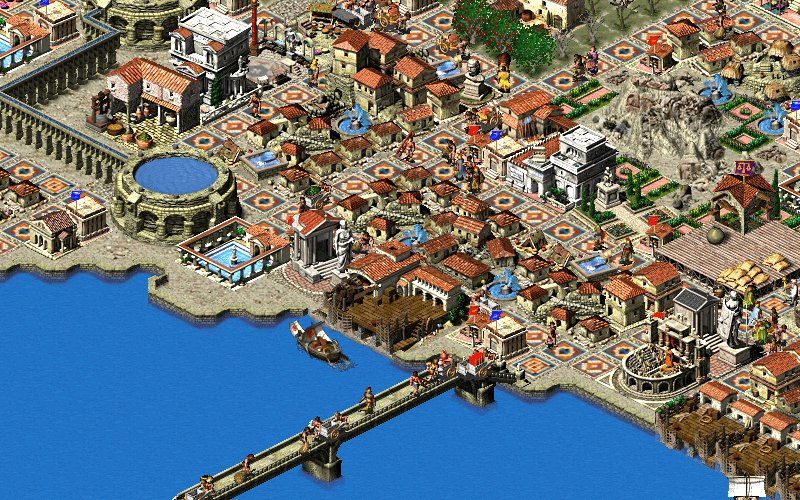</a>

### 23. Quake III Arena (q3js)
**Browser port** · PC · ⭐ n/a · score **4.0/5**  
Quake III Arena in the browser (WebAssembly ioquake3): click and play instantly, demo data included.  
[project](https://q3js.com) · [play](https://q3js.com/) · [video](https://www.youtube.com/watch?v=de7PNFRHNts)

<a href="https://q3js.com">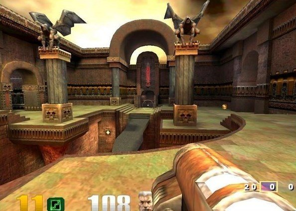</a>

## Play in your browser

35 games you can launch straight from a browser tab (WebAssembly/JS ports and recompilations). Links are re-checked daily in a real browser; ones that are taken down or broken are hidden. Some ask for files from your own copy of the game. Never install a launcher or extension a site pushes on you.

<table>
<tr><td align="center" valign="top" width="33%"><a href="http://vel.gg/bo1z">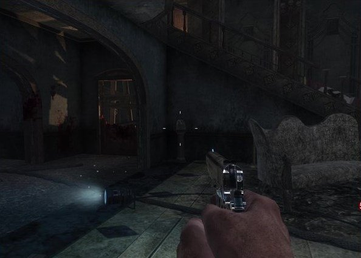</a> <b>Call of Duty: Black Ops Zombies</b> <a href="http://vel.gg/bo1z"><b>▶ Play in browser</b></a> PC · plays instantly</td><td align="center" valign="top" width="33%"><a href="https://ovz-game-production.up.railway.app">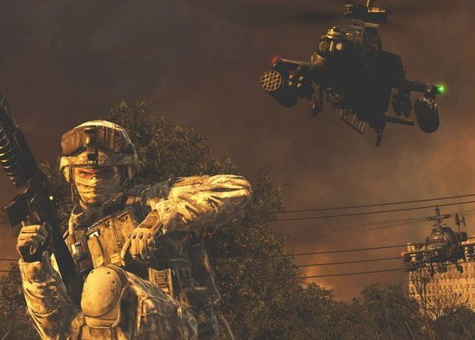</a> <b>Call of Duty: Modern Warfare 2</b> <a href="https://ovz-game-production.up.railway.app"><b>▶ Play in browser</b></a> PC</td><td align="center" valign="top" width="33%"><a href="https://generals.wasm.ltd">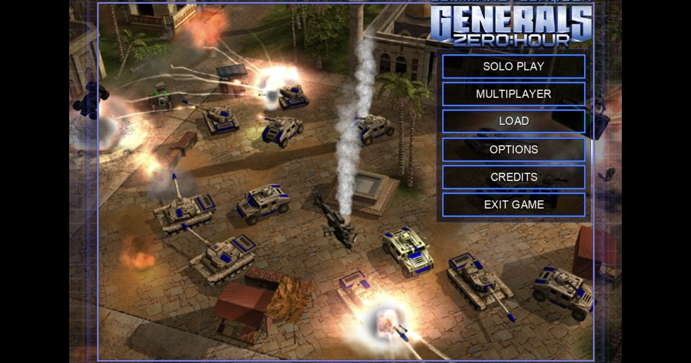</a> <b>Command & Conquer: Generals Zero Hour</b> <a href="https://generals.wasm.ltd"><b>▶ Play in browser</b></a> PC · needs your game files · multiplayer</td></tr>
<tr><td align="center" valign="top" width="33%"><a href="https://chronodivide.com/">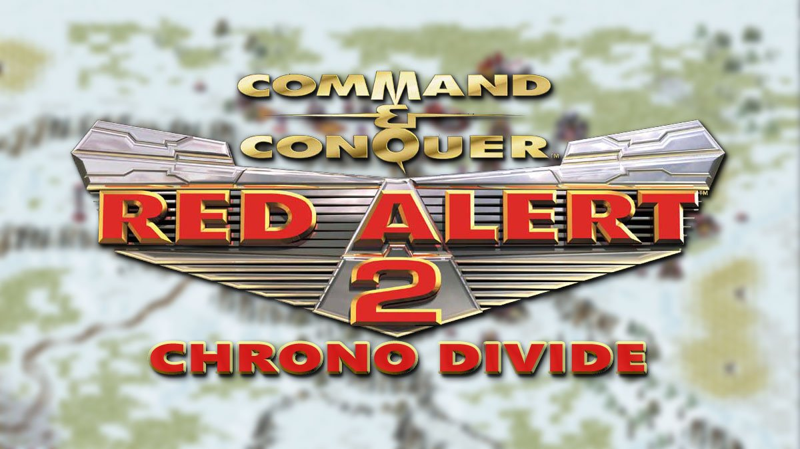</a> <b>Command & Conquer: Red Alert 2</b> <a href="https://chronodivide.com/"><b>▶ Play in browser</b></a> PC · multiplayer</td><td align="center" valign="top" width="33%"><a href="https://csjs.live">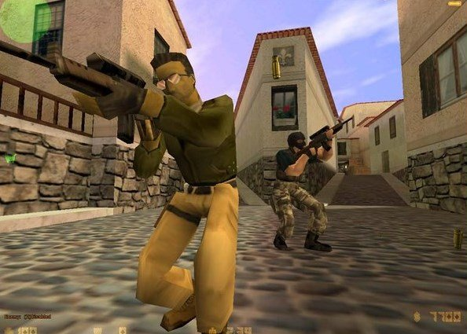</a> <b>Counter-Strike 1.6</b> <a href="https://csjs.live"><b>▶ Play in browser</b></a> PC · multiplayer</td><td align="center" valign="top" width="33%"> <b>Counter-Strike: Source Bunnyhop (bunnyhop.lol)</b> <a href="https://bunnyhop.lol"><b>▶ Play in browser</b></a> PC · plays instantly · multiplayer</td></tr>
<tr><td align="center" valign="top" width="33%"><a href="http://surfd.net">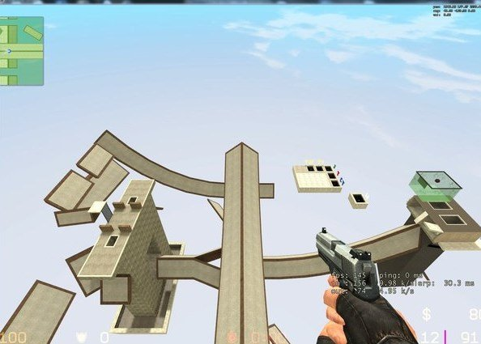</a> <b>Counter-Strike: Source Surf (Surfd)</b> <a href="http://surfd.net"><b>▶ Play in browser</b></a> PC · plays instantly · multiplayer</td><td align="center" valign="top" width="33%"><a href="https://ctr.cmzi.uk/">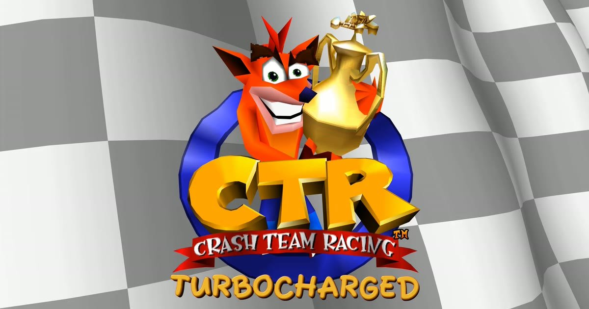</a> <b>Crash Team Racing Turbocharged</b> <a href="https://ctr.cmzi.uk/"><b>▶ Play in browser</b></a> PS1</td><td align="center" valign="top" width="33%"><a href="http://johnimril.github.io/diablo_web/">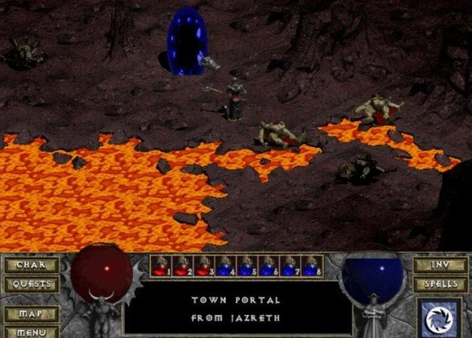</a> <b>Diablo (diablo_web)</b> <a href="http://johnimril.github.io/diablo_web/"><b>▶ Play in browser</b></a> PC · needs your game files</td></tr>
<tr><td align="center" valign="top" width="33%"><a href="https://silentspacemarine.com/">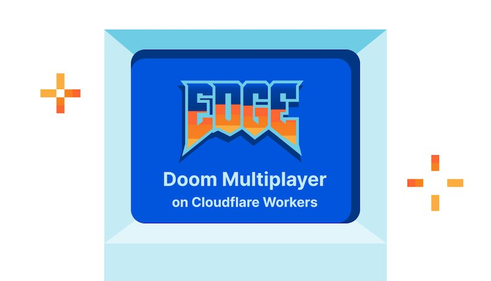</a> <b>Doom Multiplayer (Silent Space Marine)</b> <a href="https://silentspacemarine.com/"><b>▶ Play in browser</b></a> PC · plays instantly · multiplayer</td><td align="center" valign="top" width="33%"> <b>Golden Sun (recompilation)</b> <a href="https://shmargus.github.io/GSRecomp/"><b>▶ Play in browser</b></a> GBA</td><td align="center" valign="top" width="33%"><a href="https://joncodeofficial.github.io/gta-vice-city-wasm/">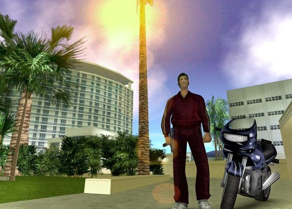</a> <b>Grand Theft Auto: Vice City</b> <a href="https://joncodeofficial.github.io/gta-vice-city-wasm/"><b>▶ Play in browser</b></a> PC</td></tr>
<tr><td align="center" valign="top" width="33%"><a href="http://pixelsuft.github.io/hl/">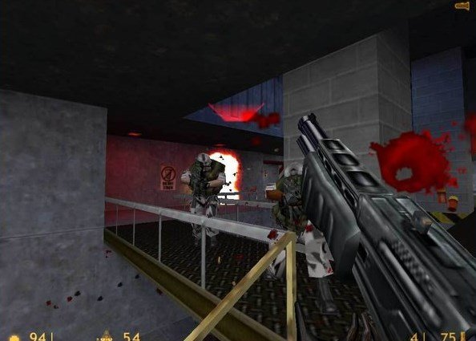</a> <b>Half-Life (pixelsuft)</b> <a href="http://pixelsuft.github.io/hl/"><b>▶ Play in browser</b></a> PC</td><td align="center" valign="top" width="33%"> <b>Half-Life and Counter-Strike 1.6 (WebXash)</b> <a href="http://x8bitrain.github.io/webXash/"><b>▶ Play in browser</b></a> PC · needs your game files</td><td align="center" valign="top" width="33%"><a href="https://mitchellhynes.com/halo/halo.html">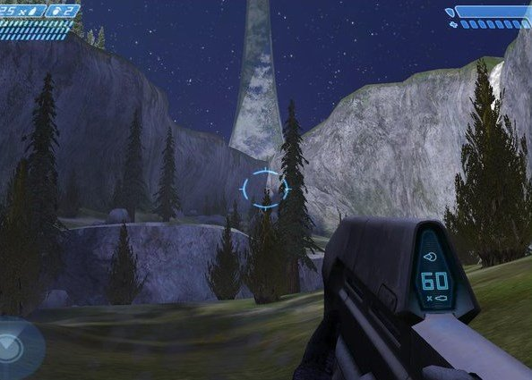</a> <b>Halo: Combat Evolved</b> <a href="https://mitchellhynes.com/halo/halo.html"><b>▶ Play in browser</b></a> Xbox · needs your game files · multiplayer</td></tr>
<tr><td align="center" valign="top" width="33%"><a href="https://hcemobile.com/">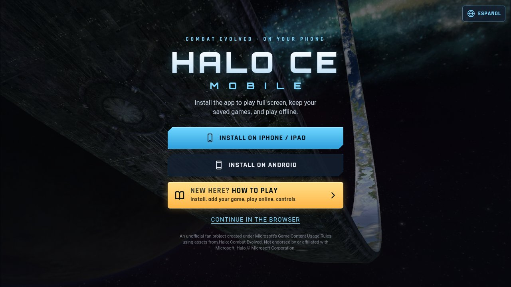</a> <b>Halo: Combat Evolved Mobile (HCEMobile)</b> <a href="https://hcemobile.com/"><b>▶ Play in browser</b></a> Xbox</td><td align="center" valign="top" width="33%"> <b>NetQuake.io</b> <a href="https://www.netquake.io/"><b>▶ Play in browser</b></a> PC</td><td align="center" valign="top" width="33%"><a href="http://pes6.optijuegos.net">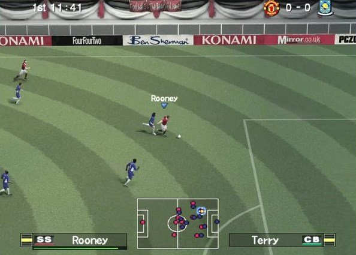</a> <b>Pro Evolution Soccer 6</b> <a href="http://pes6.optijuegos.net"><b>▶ Play in browser</b></a> PC · multiplayer</td></tr>
<tr><td align="center" valign="top" width="33%"><a href="http://q2.pieter.com">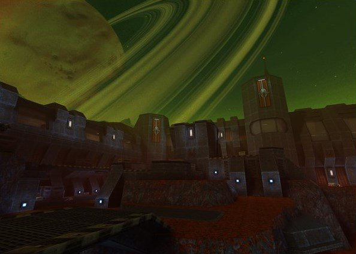</a> <b>Quake II (q2.pieter.com)</b> <a href="http://q2.pieter.com"><b>▶ Play in browser</b></a> PC · multiplayer</td><td align="center" valign="top" width="33%"><a href="https://q3.pieter.com">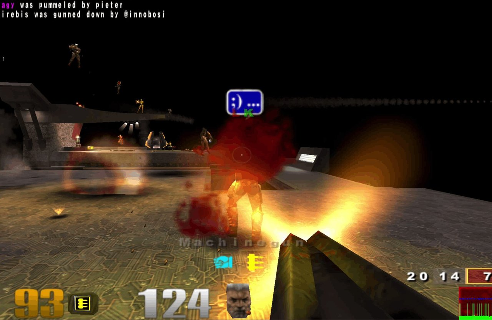</a> <b>Quake III Arena (q3.pieter.com)</b> <a href="https://q3.pieter.com"><b>▶ Play in browser</b></a> PC</td><td align="center" valign="top" width="33%"> <b>Quake III Arena (q3js)</b> <a href="https://q3js.com/"><b>▶ Play in browser</b></a> PC · plays instantly · multiplayer</td></tr>
<tr><td align="center" valign="top" width="33%"><a href="http://q1.pieter.com">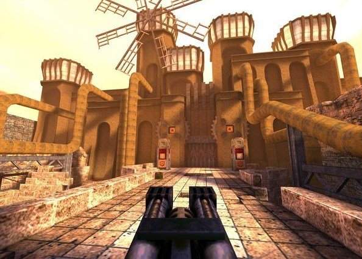</a> <b>QuakeWorld (q1.pieter.com)</b> <a href="http://q1.pieter.com"><b>▶ Play in browser</b></a> PC · multiplayer</td><td align="center" valign="top" width="33%"><a href="https://re-rac.github.io/">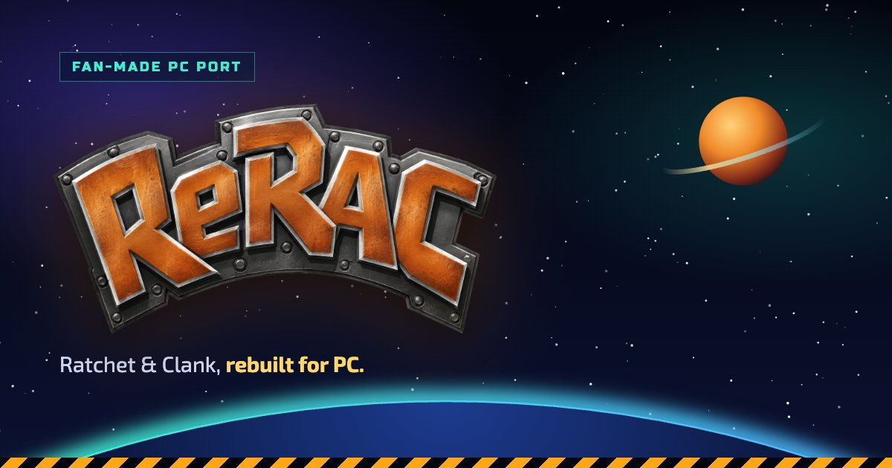</a> <b>Ratchet & Clank (PC port)</b> <a href="https://re-rac.github.io/"><b>▶ Play in browser</b></a> PS2</td><td align="center" valign="top" width="33%"><a href="http://rtcw.pieter.com">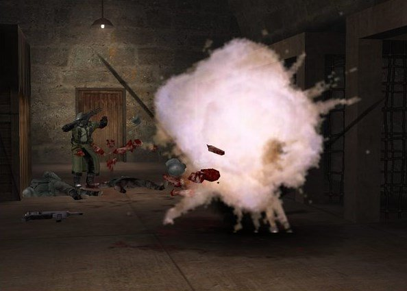</a> <b>Return to Castle Wolfenstein (rtcw.pieter.com)</b> <a href="http://rtcw.pieter.com"><b>▶ Play in browser</b></a> PC · plays instantly · multiplayer</td></tr>
<tr><td align="center" valign="top" width="33%"><a href="http://skate.aaddpp.lol">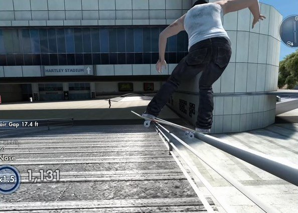</a> <b>Skate 3 (fan browser game)</b> <a href="http://skate.aaddpp.lol"><b>▶ Play in browser</b></a> Xbox 360 · plays instantly</td><td align="center" valign="top" width="33%"> <b>Star Fox Adventures</b> <a href="https://foxhollow.dev/"><b>▶ Play in browser</b></a> GameCube</td><td align="center" valign="top" width="33%"> <b>Star Wars Jedi Knight: Jedi Academy</b> <a href="https://jk.q3js.com"><b>▶ Play in browser</b></a> PC · needs your game files · multiplayer</td></tr>
<tr><td align="center" valign="top" width="33%"><a href="https://olivers.tools/play/">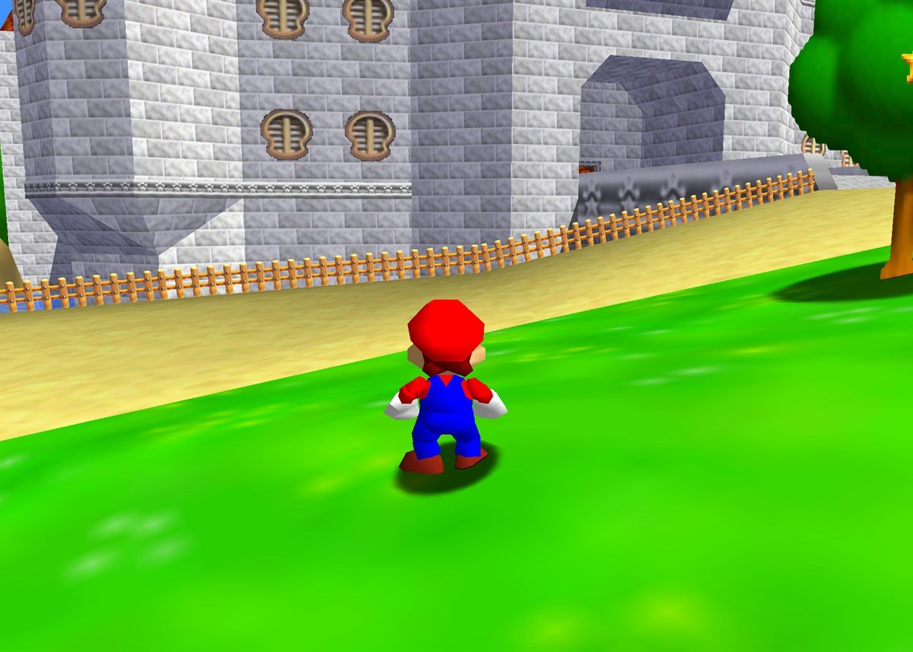</a> <b>Super Mario 64 Multiplayer</b> <a href="https://olivers.tools/play/"><b>▶ Play in browser</b></a> N64 · multiplayer</td><td align="center" valign="top" width="33%"><a href="http://shar-wasm.cjoseph.workers.dev/?skipmovie">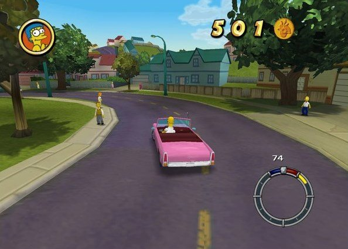</a> <b>The Simpsons: Hit & Run</b> <a href="http://shar-wasm.cjoseph.workers.dev/?skipmovie"><b>▶ Play in browser</b></a> PC</td><td align="center" valign="top" width="33%"><a href="http://xproger.info/projects/OpenLara/">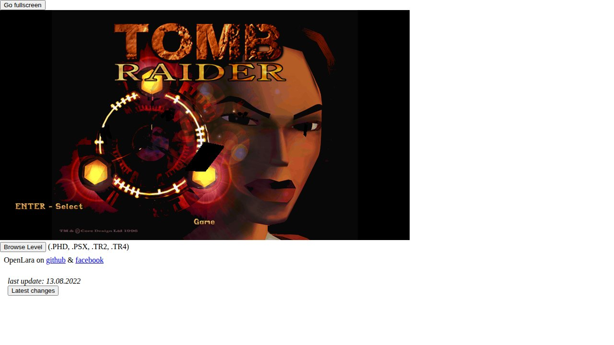</a> <b>Tomb Raider (OpenLara)</b> <a href="http://xproger.info/projects/OpenLara/"><b>▶ Play in browser</b></a> PC · plays instantly</td></tr>
<tr><td align="center" valign="top" width="33%"><a href="http://ut.pieter.com">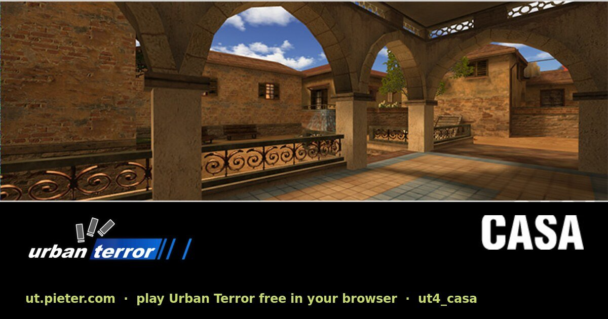</a> <b>Urban Terror (ut.pieter.com)</b> <a href="http://ut.pieter.com"><b>▶ Play in browser</b></a> PC</td><td align="center" valign="top" width="33%"><a href="https://vf1-recomp.pages.dev/">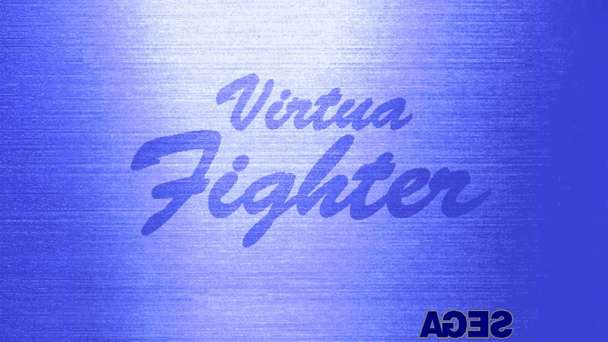</a> <b>Virtua Fighter (arcade recompilation)</b> <a href="https://vf1-recomp.pages.dev/"><b>▶ Play in browser</b></a> Arcade</td><td align="center" valign="top" width="33%"><a href="https://wadcmd.com/">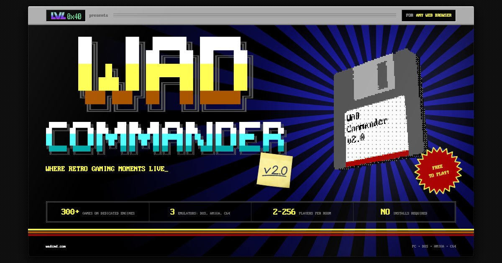</a> <b>WadCMD (Doom in the browser)</b> <a href="https://wadcmd.com/"><b>▶ Play in browser</b></a> PC · needs your game files</td></tr>
<tr><td align="center" valign="top" width="33%"><a href="https://wz2100.net/news/warzone-2100-web-edition/">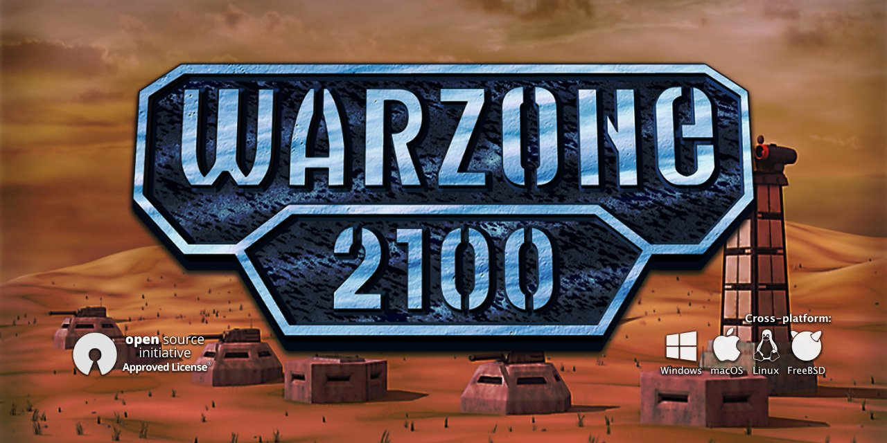</a> <b>Warzone 2100 (Web Edition)</b> <a href="https://wz2100.net/news/warzone-2100-web-edition/"><b>▶ Play in browser</b></a> PC · plays instantly</td><td align="center" valign="top" width="33%"> <b>WASM Arcade (GTA / Minecraft web ports)</b> <a href="https://wasmarcade.com/"><b>▶ Play in browser</b></a> PC</td></tr>
</table>

## Static recompilations

Console/PC binaries statically recompiled to native code (N64Recomp, XenonRecomp, ReXGlue, ps1/ps2 recomp, ...).

| Game | Platform | Score | ⭐ | Last commit | Progress | Links |
|---|---|---|---|---|---|---|
| [The Legend of Zelda: Majora's Mask (Zelda64Recomp)](https://github.com/Zelda64Recomp/Zelda64Recomp) | N64 | 4.8 | 7.4k | 2026-09-25 |  | [release](https://github.com/Zelda64Recomp/Zelda64Recomp/releases/tag/v1.2.2) · [video](https://www.youtube.com/watch?v=GIp7C2ro2T8) |
| [Banjo-Kazooie (BanjoRecomp)](https://github.com/BanjoRecomp/BanjoRecomp) | N64 | 4.5 | 2.0k | 2026-09-25 |  | [release](https://github.com/BanjoRecomp/BanjoRecomp/releases/tag/v1.0.2) · [video](https://www.youtube.com/watch?v=0906Cz-59eU) |
| [BloodBorne for Windows](https://github.com/Supermedo/bloodborne_pc) | PC | 4.5 | 1.3k | 2026-10-08 |  | [release](https://github.com/Supermedo/bloodborne_pc/releases/tag/windows-v1.6) |
| [Mario Kart Wii](https://github.com/patchzyy/Wiicompiled) | Wii | 4.5 | 1.1k | 2026-10-09 |  | [release](https://github.com/patchzyy/Wiicompiled/releases/tag/v0.2.34) |
| [OpenCE](https://github.com/OpenCommunityEdition/OpenCE) | Xbox | 4.5 | 1.3k | 2026-10-09 |  | [release](https://github.com/OpenCommunityEdition/OpenCE/releases/tag/build-168) |
| [Skate 3](https://github.com/mchughalex/skate3recomp) | Xbox 360 | 4.5 | 1.5k | 2026-07-24 |  | [release](https://github.com/mchughalex/skate3recomp/releases/tag/v2.0.2) · [video](https://youtu.be/ETXCOsip1Uo) |
| [Sonic Unleashed (Unleashed Recompiled)](https://github.com/hedge-dev/UnleashedRecomp) | Xbox 360 | 4.5 | 5.1k | 2026-06-29 |  | [release](https://github.com/hedge-dev/UnleashedRecomp/releases/tag/v1.0.3) · [video](https://www.youtube.com/watch?v=yDlVr1Jv-WU) |
| [Blue Dragon](https://github.com/zolaware/reblue) | Xbox 360 | 4.3 | 756 | 2026-10-05 |  | [release](https://github.com/zolaware/reblue/releases/tag/v1.3.1) |
| [Castlevania: Symphony of the Night](https://github.com/BlackLabelHQ/SymphonyRecomp) | PS1 | 4.3 | 851 | 2026-09-27 |  | [release](https://github.com/BlackLabelHQ/SymphonyRecomp/releases/tag/v0.5.1b) |
| [Castlevania: Symphony of the Night (NocturneRecomp)](https://github.com/birabittoh/NocturneRecomp) | Xbox 360 | 4.3 | 360 | 2026-08-27 |  | [release](https://github.com/birabittoh/NocturneRecomp/releases/tag/v1.4.5) |
| [Conker's Bad Fur Day](https://github.com/sciaschi/CBFD-Recompiled) | N64 | 4.3 | 233 | 2026-10-01 |  | [release](https://github.com/sciaschi/CBFD-Recompiled/releases/tag/V0.1.5) |
| [Crash Bandicoot (Matteo842 Recomp)](https://github.com/Matteo842/CrashBandicoot-Launcher) | PC | 4.3 | 246 | 2026-10-09 |  | [release](https://github.com/Matteo842/CrashBandicoot-Launcher/releases/tag/2.1) |
| [Dante's Inferno](https://github.com/florinp93/hells-gate-recomp) | Xbox 360 | 4.3 | 432 | 2026-10-09 |  | [release](https://github.com/florinp93/hells-gate-recomp/releases/tag/v0.7.2-beta-hotfix) |
| [Diddy Kong Racing](https://github.com/ThatGuyMcd/DKR-R) | N64 | 4.3 | 205 | 2026-10-06 |  | [release](https://github.com/ThatGuyMcd/DKR-R/releases/tag/Version1.0.5beta12) |
| [Dinosaur Planet](https://github.com/DinosaurPlanetRecomp/dino-recomp) | N64 | 4.3 | 322 | 2026-09-25 |  | [release](https://github.com/DinosaurPlanetRecomp/dino-recomp/releases/tag/v0.3.0) |
| [Donkey Kong Country](https://github.com/elliotttate/DKC1Recomp) | SNES | 4.3 | 227 | 2026-09-15 |  | [release](https://github.com/elliotttate/DKC1Recomp/releases/tag/v0.0.17) |
| [Fable 2](https://github.com/himdo/Fable-2-Recomp) | Xbox 360 | 4.3 | 374 | 2026-10-09 |  | [release](https://github.com/himdo/Fable-2-Recomp/releases/tag/1.4.0) |
| [Forza Horizon](https://github.com/arcanite24/pinyon-shift) | Xbox 360 | 4.3 | 335 | 2026-10-07 |  | [release](https://github.com/arcanite24/pinyon-shift/releases/tag/v0.4.0) |
| [Ico-PC](https://github.com/nathanialf/ico-pc) | PS2 | 4.3 | 204 | 2026-10-09 |  | [release](https://github.com/nathanialf/ico-pc/releases/tag/v0.5.0) |
| [Lost Odyssey](https://github.com/freefrank/LostOdysseyRecomp) | Xbox 360 | 4.3 | 503 | 2026-10-09 |  | [release](https://github.com/freefrank/LostOdysseyRecomp/releases/tag/v0.9.0) |
| [MeleePC](https://github.com/999sian/melee-pc) | PC | 4.3 | 434 | 2026-09-29 |  |  |
| [Metroid Prime Hunters](https://github.com/mstan/MetroidPrimeHuntersRecomp) | DS | 4.3 | 258 | 2026-10-04 |  | [release](https://github.com/mstan/MetroidPrimeHuntersRecomp/releases/tag/v0.7.3-alpha) |
| [Mystical Ninja Starring Goemon](https://github.com/klorfmorf/Goemon64Recomp) | N64 | 4.3 | 310 | 2026-09-19 |  | [release](https://github.com/klorfmorf/Goemon64Recomp/releases/tag/v0.2.0-dev) |
| [Ocarina of Time 3D (TriAevum Recomp)](https://github.com/coccofresco/TriAevum) | 3DS | 4.3 | 468 | 2026-09-18 |  |  |
| [OpenTIE](https://github.com/elyosh/OpenTIE) |  | 4.3 | 327 | 2026-10-04 |  | [release](https://github.com/elyosh/OpenTIE/releases/tag/v0.0.7) |
| [Silent Hill: Downpour](https://github.com/LittleBitUA/DownpourRecomp) | Xbox 360 | 4.3 | 265 | 2026-09-02 |  | [release](https://github.com/LittleBitUA/DownpourRecomp/releases/tag/v1.1.8) |
| [The Darkness](https://github.com/portingpete/The-Darkness-Recomp) | Xbox 360 | 4.3 | 222 | 2026-10-08 |  |  |
| [Viva Pinata: Trouble In Paradise](https://github.com/SolarCookies/TiP-Recomp) | Xbox 360 | 4.3 | 201 | 2026-10-03 |  | [release](https://github.com/SolarCookies/TiP-Recomp/releases/tag/1.13.0) |
| [ZeldaWWHDRecomp](https://github.com/ZeldaWWHDRecomp/ZeldaWWHDRecomp) | Mobile | 4.3 | 355 | 2026-10-09 |  | [release](https://github.com/ZeldaWWHDRecomp/ZeldaWWHDRecomp/releases/tag/v0.2.11) |
| [ACE COMBAT X](https://github.com/sal063/Ace-Combat-X-Recompilation) | PSP | 4.2 | 74 | 2026-08-28 |  | [release](https://github.com/sal063/Ace-Combat-X-Recompilation/releases/tag/V1.5-release) |
| [AeroGauge](https://github.com/alondero/aerogauge-recomp) | N64 | 4.2 | 37 | 2026-10-04 |  | [release](https://github.com/alondero/aerogauge-recomp/releases/tag/v0.6.2) |
| [Ape Escape](https://github.com/mstan/ApeEscapeRecomp) | PS1 | 4.2 | 83 | 2026-10-03 |  | [release](https://github.com/mstan/ApeEscapeRecomp/releases/tag/v0.5.2) |
| [Automobili Lamborghini](https://github.com/alondero/automobililamborghini-recomp) | N64 | 4.2 | 41 | 2026-10-08 |  | [release](https://github.com/alondero/automobililamborghini-recomp/releases/tag/v0.8.0) |
| [Banjo-Kazooie Nuts and Bolts](https://github.com/masterspike52/reNut) | Xbox 360 | 4.2 | 151 | 2026-09-14 |  | [release](https://github.com/masterspike52/reNut/releases/tag/texturereplacements) |
| [Beetle Adventure Racing!](https://github.com/danielgomesvieira2000/beetle-adventure-racing-recomp) | N64 | 4.2 | 60 | 2026-09-20 |  | [release](https://github.com/danielgomesvieira2000/beetle-adventure-racing-recomp/releases/tag/v0.4.2-alpha) |
| [Bloody Roar 2](https://github.com/novapowers0/BloodyRoar2Recomp) | PS1 | 4.2 | 59 | 2026-09-26 |  | [release](https://github.com/novapowers0/BloodyRoar2Recomp/releases/tag/v0.7.1) |
| [Call of Duty: Modern Warfare 2](https://github.com/PaulCombal/mw2-recompiled) | Xbox 360 | 4.2 | 40 | 2026-10-09 |  | [release](https://github.com/PaulCombal/mw2-recompiled/releases/tag/v0.3.2) |
| [Castlevania: Legacy of Darkness](https://github.com/fliperama86/cvlod_recomp) | N64 | 4.2 | 130 | 2026-09-28 |  | [release](https://github.com/fliperama86/cvlod_recomp/releases/tag/v0.2.27) |
| [Conker's Bad Fur Day Reloaded](https://github.com/DahSidiAbdallah/ConkerBFDReloaded) | N64 | 4.2 | 61 | 2026-10-09 |  | [release](https://github.com/DahSidiAbdallah/ConkerBFDReloaded/releases/tag/v1.3.5) |
| [Crash Bandicoot 2](https://github.com/Zumbo06/Crash2Recomp) | PS1 | 4.2 | 84 | 2026-10-08 |  | [release](https://github.com/Zumbo06/Crash2Recomp/releases/tag/v0.9.6) |
| [Dead or Alive Xtreme Beach Volleyball](https://github.com/NoRain211/doaxvb-re) | Xbox | 4.2 | 81 | 2026-10-09 |  | [release](https://github.com/NoRain211/doaxvb-re/releases/tag/v0.5.3) |
| [Dead Rising 2: Case Zero](https://github.com/wivi514/Dead_Rising_2_Case_Zero_Xenon_Recomp) | Xbox 360 | 4.2 | 71 | 2026-10-08 |  | [release](https://github.com/wivi514/Dead_Rising_2_Case_Zero_Xenon_Recomp/releases/tag/v1.1.2) |
| [Deadly Premonition](https://github.com/LittleBitUA/DPRecomp) | Xbox 360 | 4.2 | 156 | 2026-10-03 |  | [release](https://github.com/LittleBitUA/DPRecomp/releases/tag/v2.0.14) |
| [Destroy All Humans: Path of the Furon](https://github.com/masterspike52/reDAHM) | Xbox 360 | 4.2 | 40 | 2026-09-21 |  | [release](https://github.com/masterspike52/reDAHM/releases/tag/new) |
| [DoDonPachi Saidaioujou](https://github.com/eandis/SDOJ-Recomp) | Xbox 360 | 4.2 | 148 | 2026-08-11 |  | [release](https://github.com/eandis/SDOJ-Recomp/releases/tag/release) |
| [Donkey Kong Country 3](https://github.com/elliotttate/DKC3Recomp) | SNES | 4.2 | 116 | 2026-09-13 |  | [release](https://github.com/elliotttate/DKC3Recomp/releases/tag/v0.0.6) |
| [DQ8 Recompiled](https://github.com/Sinan-Karakaya/DQ8-Recompiled) | PS2 | 4.2 | 39 | 2026-10-09 |  | [release](https://github.com/Sinan-Karakaya/DQ8-Recompiled/releases/tag/566bb7f) |
| [Dragon Ball Z: Burst Limit](https://github.com/iExplosiveRage/DBZ-Burst-Limit-Recompiled) | Xbox 360 | 4.2 | 42 | 2026-10-09 |  | [release](https://github.com/iExplosiveRage/DBZ-Burst-Limit-Recompiled/releases/tag/v0.4.1-alpha) |
| [Earthworm Jim HD Recompiled](https://github.com/TekRantGaming/earthworm-jim-hd-recompiled) | Xbox 360 | 4.2 | 45 | 2026-10-07 |  | [release](https://github.com/TekRantGaming/earthworm-jim-hd-recompiled/releases/tag/v0.9.5) |
| [Eternal Sonata](https://github.com/birabittoh/EternalSonataReprise) | Xbox 360 | 4.2 | 125 | 2026-10-01 |  | [release](https://github.com/birabittoh/EternalSonataReprise/releases/tag/v1.2.5) |
| [F-Zero](https://github.com/mstan/FZeroSNESRecomp) | SNES | 4.2 | 72 | 2026-09-22 |  | [release](https://github.com/mstan/FZeroSNESRecomp/releases/tag/v1.8.3) |
| [GoldenEye 007 (XBLA Remaster)](https://github.com/SunJaycy/GoldenEye-Recomp) | Xbox 360 | 4.2 | 878 | 2026-06-18 |  | [release](https://github.com/SunJaycy/GoldenEye-Recomp/releases/tag/Goldeneye1.2.4) |
| [Grand Theft Auto IV](https://github.com/KoreanSeats1/Theft4) | Xbox 360 | 4.2 | 70 | 2026-10-09 |  | [release](https://github.com/KoreanSeats1/Theft4/releases/tag/v0.3.1) |
| [Harvest Moon 64](https://github.com/HarvestMoon64Recomp/HarvestMoon64Recomp) | N64 | 4.2 | 154 | 2026-09-25 |  | [release](https://github.com/HarvestMoon64Recomp/HarvestMoon64Recomp/releases/tag/v1.2.2) |
| [King Kong Recompiled](https://github.com/TekRantGaming/king-kong-recompiled) | Xbox 360 | 4.2 | 107 | 2026-10-09 |  | [release](https://github.com/TekRantGaming/king-kong-recompiled/releases/tag/v1.9.9) |
| [Knuckles' Chaotix](https://github.com/YuutaTsubasa/ChaotixRecompiled) | 32X | 4.2 | 31 | 2026-10-08 |  | [release](https://github.com/YuutaTsubasa/ChaotixRecompiled/releases/tag/v0.3.7) |
| [LCS Recomp](https://github.com/elmasas/lcs-recomp) | PSP | 4.2 | 198 | 2026-10-09 |  | [release](https://github.com/elmasas/lcs-recomp/releases/tag/v0.1.6) |
| [Mario Kart: Super Circuit](https://github.com/mstan/MarioKartSuperCircuitRecomp) | GBA | 4.2 | 63 | 2026-10-04 |  | [release](https://github.com/mstan/MarioKartSuperCircuitRecomp/releases/tag/v0.1.4) |
| [Mega Man X](https://github.com/mstan/MegaManXSNESRecomp) | SNES | 4.2 | 172 | 2026-10-09 |  | [release](https://github.com/mstan/MegaManXSNESRecomp/releases/tag/v2.1.8-alpha) |
| [Mega Man X2](https://github.com/mstan/MegaManX2Recomp) | SNES | 4.2 | 41 | 2026-10-09 |  | [release](https://github.com/mstan/MegaManX2Recomp/releases/tag/v0.1.3) |
| [Mega Man X4](https://github.com/mstan/MegaManX4Recomp) | PS1 | 4.2 | 85 | 2026-10-08 |  | [release](https://github.com/mstan/MegaManX4Recomp/releases/tag/v0.1.0-alpha) |
| [Mega Man X5](https://github.com/mstan/MegaManX5Recomp) | PS1 | 4.2 | 50 | 2026-09-12 |  | [release](https://github.com/mstan/MegaManX5Recomp/releases/tag/v0.1.0-alpha) |
| [Mega Man X6](https://github.com/mstan/MegaManX6Recomp) | PS1 | 4.2 | 73 | 2026-10-09 |  | [release](https://github.com/mstan/MegaManX6Recomp/releases/tag/v1.2.0) |
| [Mischief Makers](https://github.com/ThiagoLira/trouble-makers-pc-recomp) | N64 | 4.2 | 91 | 2026-10-05 |  |  |
| [Naughty Bear](https://github.com/MaxDeadBear/NaughtyBear_ReStuff) | Xbox 360 | 4.2 | 54 | 2026-09-10 |  | [release](https://github.com/MaxDeadBear/NaughtyBear_ReStuff/releases/tag/release_v1.5.1) |
| [NHL: Legacy Edition](https://github.com/puckhead73/nhl-legacy-recomp) | Xbox 360 | 4.2 | 40 | 2026-07-22 |  | [release](https://github.com/puckhead73/nhl-legacy-recomp/releases/tag/v0.6.0) |
| [Ninja Gaiden II](https://github.com/TheSaltTrader/Ninja-s-Dawn---A-Ninja-Gaiden-2-Recompilation-Project) | Xbox 360 | 4.2 | 150 | 2026-10-08 |  | [release](https://github.com/TheSaltTrader/Ninja-s-Dawn---A-Ninja-Gaiden-2-Recompilation-Project/releases/tag/v1.3.0) |
| [Ogre Battle 64: Person of Lordly Caliber](https://github.com/lfarroco/ogre-battle-64-recomp) | N64 | 4.2 | 70 | 2026-10-04 |  | [release](https://github.com/lfarroco/ogre-battle-64-recomp/releases/tag/v0.7.0) |
| [Open Annihilation](https://github.com/open-annihilation/open-annihilation) |  | 4.2 | 44 | 2026-10-09 |  | [release](https://github.com/open-annihilation/open-annihilation/releases/tag/v0.7.3) |
| [OpenXWA](https://github.com/elyosh/OpenXWA) |  | 4.2 | 149 | 2026-09-30 |  | [release](https://github.com/elyosh/OpenXWA/releases/tag/v0.0.17) |
| [Perfect Dark (Dab's Mod)](https://github.com/DabDavis/perfect-dark-dabs-mod) | N64 | 4.2 | 161 | 2026-10-09 |  | [release](https://github.com/DabDavis/perfect-dark-dabs-mod/releases/tag/v3.14.0) |
| [Pokémon Snap](https://github.com/JackandBeans/Snap64Recomp) | N64 | 4.2 | 97 | 2026-10-05 |  | [release](https://github.com/JackandBeans/Snap64Recomp/releases/tag/v1.1.2) |
| [Project Gotham Racing 4](https://github.com/beatrixzy/PGR4-Recomp) | Xbox 360 | 4.2 | 165 | 2026-10-03 |  | [release](https://github.com/beatrixzy/PGR4-Recomp/releases/tag/v1.2.1) |
| [Resident Evil Gaiden](https://github.com/sergiomanzur/regaiden-recomp) | Game Boy Color | 4.2 | 47 | 2026-09-16 |  | [release](https://github.com/sergiomanzur/regaiden-recomp/releases/tag/v0.4.1) |
| [Road Rash 64](https://github.com/linkssy2/RoadRash64Recompiled) | N64 | 4.2 | 58 | 2026-10-08 |  | [release](https://github.com/linkssy2/RoadRash64Recompiled/releases/tag/v1.4.5) |
| [Roller](https://github.com/FatalDecomp/ROLLER) | PC | 4.2 | 86 | 2026-09-30 |  |  |
| [Saints Row](https://github.com/whompay/SaintsReborn) | Xbox 360 | 4.2 | 90 | 2026-10-08 |  | [release](https://github.com/whompay/SaintsReborn/releases/tag/V1.2.2) |
| [SMS Launcher](https://github.com/chasem-dev/sms-launcher) | PC | 4.2 | 55 | 2026-10-09 |  | [release](https://github.com/chasem-dev/sms-launcher/releases/tag/v0.1.56) |
| [Sonic Free Riders](https://github.com/YuutaTsubasa/Free-Riders-Recompiled) | Xbox 360 | 4.2 | 67 | 2026-10-09 |  | [release](https://github.com/YuutaTsubasa/Free-Riders-Recompiled/releases/tag/v0.6.10) |
| [Soulcalibur II](https://github.com/jackpoison-prog/RingOut) | GameCube | 4.2 | 154 | 2026-10-08 |  | [release](https://github.com/jackpoison-prog/RingOut/releases/tag/v1.6.7) |
| [Spider-Man: Edge of Time](https://github.com/GenryTheFox0/Project-2099) | Xbox 360 | 4.2 | 50 | 2026-09-24 |  | [release](https://github.com/GenryTheFox0/Project-2099/releases/tag/v2.0.0-beta.3) |
| [Street Fighter Alpha 3](https://github.com/TechnicallyComputers/Street-Fighter-Alpha-3-Recomp) | PS1 | 4.2 | 74 | 2026-10-01 |  | [release](https://github.com/TechnicallyComputers/Street-Fighter-Alpha-3-Recomp/releases/tag/v0.2.16) |
| [Super Mario World](https://github.com/mstan/SuperMarioWorldRecomp) | SNES | 4.2 | 105 | 2026-09-28 |  | [release](https://github.com/mstan/SuperMarioWorldRecomp/releases/tag/v0.14.2) |
| [Super Metroid](https://github.com/mstan/SuperMetroidRecomp) | SNES | 4.2 | 102 | 2026-10-07 |  | [release](https://github.com/mstan/SuperMetroidRecomp/releases/tag/v0.3.9) |
| [Syphon Filter (PC Recomp)](https://github.com/Madxbio97/SF-pc-port) | PC | 4.2 | 104 | 2026-08-13 |  | [release](https://github.com/Madxbio97/SF-pc-port/releases/tag/0.2.0-beta.2) |
| [Syphon Filter 2](https://github.com/alexbeavs-ps1-ports/syphon-filter-2-recomp) | PS1 | 4.2 | 34 | 2026-09-30 |  | [release](https://github.com/alexbeavs-ps1-ports/syphon-filter-2-recomp/releases/tag/v0.2.0) |
| [Tekken 3](https://github.com/FishB0nes98/Tekken3Recompiled) | PS1 | 4.2 | 41 | 2026-09-23 |  |  |
| [The Darkness](https://github.com/invinceble55-wq/Estacado-The-Darkness-Recomp) | Xbox 360 | 4.2 | 40 | 2026-10-07 |  |  |
| [The Legend of Zelda: A Link to the Past](https://github.com/mstan/ZeldaAlttPSNESRecomp) | SNES | 4.2 | 44 | 2026-10-06 |  | [release](https://github.com/mstan/ZeldaAlttPSNESRecomp/releases/tag/v0.6.4) |
| [Tomba!](https://github.com/mstan/TombaRecomp) | PS1 | 4.2 | 65 | 2026-10-09 |  | [release](https://github.com/mstan/TombaRecomp/releases/tag/v0.20.0-alpha) |
| [Wave Race 64](https://github.com/danielgomesvieira2000/wave-race-64-recomp) | N64 | 4.2 | 78 | 2026-09-23 |  | [release](https://github.com/danielgomesvieira2000/wave-race-64-recomp/releases/tag/v1.0.2) |
| [wc1-re](https://github.com/neuromancer/wc1-re) |  | 4.2 | 50 | 2026-09-14 |  | [release](https://github.com/neuromancer/wc1-re/releases/tag/v0.0.13) |
| [Xenogears](https://github.com/OpokXeno/xenogears-recomp) | PS1 | 4.2 | 54 | 2026-10-09 |  |  |
| [Yu-Gi-Oh! Forbidden Memories](https://github.com/Unchiga/Yu-Gi-Oh-Forbidden-Memories-Recompiled) | PS1 | 4.2 | 134 | 2026-10-09 |  | [release](https://github.com/Unchiga/Yu-Gi-Oh-Forbidden-Memories-Recompiled/releases/tag/v0.2.0) |
| [Yu-Gi-Oh! Forbidden Memories](https://github.com/Unchiga/YuGiOhForbiddenMemoriesRecomp) | PS1 | 4.2 | 128 | 2026-09-26 |  | [release](https://github.com/Unchiga/YuGiOhForbiddenMemoriesRecomp/releases/tag/v0.6.2) |
| [ZeldaWWHDRecompAndroid](https://github.com/SSunnKing/ZeldaWWHDRecompAndroid---ENHANCED) | Mobile | 4.2 | 31 | 2026-10-09 |  | [release](https://github.com/SSunnKing/ZeldaWWHDRecompAndroid---ENHANCED/releases/tag/1.3.1) |
| [Ace Combat 6: Fires of Liberation](https://github.com/sal063/AC6_recomp) | Xbox 360 | 4.1 | 498 | 2026-08-22 |  |  |
| [Condemned 2: Bloodshot](https://github.com/psxrestore/Condemned2Recomp) | Xbox 360 | 4.1 | 200 | 2026-10-05 |  | [release](https://github.com/psxrestore/Condemned2Recomp/releases/tag/0.2.1) |
| [Donkey Kong 64](https://github.com/Rainchus/Donkey-Kong-64-Recompiled) | N64 | 4.1 | 487 | 2026-09-30 |  | [release](https://github.com/Rainchus/Donkey-Kong-64-Recompiled/releases/tag/v1.0.3) |
| [Star Fox 64](https://github.com/sonicdcer/Starfox64Recomp) | N64 | 4.1 | 379 | 2026-08-11 |  | [release](https://github.com/sonicdcer/Starfox64Recomp/releases/tag/1.0.3) |
| [The Simpsons Game](https://github.com/YesterMester/TheSimpsonsGameRecomp) | Xbox 360 | 4.1 | 308 | 2026-10-09 |  | [release](https://github.com/YesterMester/TheSimpsonsGameRecomp/releases/tag/v0.0.6.4) |
| [Sonic Adventure](https://github.com/sonicfreak1337/SARecomp) | PC | 4.0 | 65 | 2026-09-23 |  | [release](https://github.com/sonicfreak1337/SARecomp/releases/tag/v0.50.0-beta.1) |
| [ActRaiser](https://github.com/DerrickGold/ar-recomp) | SNES | 4.0 | 17 | 2026-10-09 |  |  |
| [Bomberman Hero](https://github.com/RevoSucks/BMHeroRecomp) | N64 | 4.0 | 124 | 2026-05-12 |  |  |
| [Burnout Revenge](https://github.com/shipa-2/Xerenge) | Xbox 360 | 4.0 | 16 | 2026-10-06 |  | [release](https://github.com/shipa-2/Xerenge/releases/tag/v0.4.0) |
| [Call of Duty 3](https://github.com/FrankHUN88453/CoD3Recomp) | Xbox 360 | 4.0 | 17 | 2026-10-07 |  |  |
| [Die Hard Trilogy](https://github.com/alexbeavs-ps1-ports/die-hard-trilogy-recomp) | PS1 | 4.0 | 14 | 2026-09-30 |  | [release](https://github.com/alexbeavs-ps1-ports/die-hard-trilogy-recomp/releases/tag/v0.3.6) |
| [F-Zero](https://github.com/craigshaw/FZeroRecomp) | SNES | 4.0 | 28 | 2026-09-27 |  | [release](https://github.com/craigshaw/FZeroRecomp/releases/tag/v0.5.0) |
| [Fate/unlimited codes](https://github.com/elprogramadorloco-arch/fuc-recomp) | PSP | 4.0 | 24 | 2026-09-16 |  | [release](https://github.com/elprogramadorloco-arch/fuc-recomp/releases/tag/v0.0.5) |
| [Faxanadu](https://github.com/mstan/FaxanaduRecomp) | NES | 4.0 | 10 | 2026-10-05 |  | [release](https://github.com/mstan/FaxanaduRecomp/releases/tag/v2.3.0) |
| [Flame](https://github.com/DiaLight/Flame) |  | 4.0 | 121 | 2026-02-28 |  | [release](https://github.com/DiaLight/Flame/releases/tag/v260206) |
| [ISS Deluxe](https://github.com/sergiomanzur/issd-native) | SNES | 4.0 | 19 | 2026-09-20 |  |  |
| [King's Field](https://github.com/Voicedrew11/verdite2) | PS1 | 4.0 | 28 | 2026-10-04 |  | [release](https://github.com/Voicedrew11/verdite2/releases/tag/v0.4.0) |
| [Legend of Legaia](https://github.com/SamSteProjects/legend-of-legaia-recomp) | PS1 | 4.0 | 11 | 2026-08-27 |  |  |
| [Mega Man Zero](https://github.com/mstan/MegaManZeroRecomp) | GBA | 4.0 | 12 | 2026-09-27 |  | [release](https://github.com/mstan/MegaManZeroRecomp/releases/tag/v0.0.6) |
| [Need for Speed: Carbon](https://github.com/Sampreeth004/nfs-carbon-recomp) | Xbox 360 | 4.0 | 25 | 2026-10-07 |  | [release](https://github.com/Sampreeth004/nfs-carbon-recomp/releases/tag/v0.3.12) |
| [OpenSpideyPS1](https://github.com/GTTeancum/SpideyPS1recomp) | PS1 | 4.0 | 14 | 2026-09-14 |  | [release](https://github.com/GTTeancum/SpideyPS1recomp/releases/tag/sm2-v1.1) |
| [Perfect Dark Zero](https://github.com/nikolaygorb/PerfectDarkZeroRecomp) | Xbox 360 | 4.0 | 14 | 2026-10-09 |  | [release](https://github.com/nikolaygorb/PerfectDarkZeroRecomp/releases/tag/1.5) |
| [Pokémon Emerald](https://github.com/mstan/EmeraldRecomp) | GBA | 4.0 | 29 | 2026-09-27 |  | [release](https://github.com/mstan/EmeraldRecomp/releases/tag/v0.1.1) |
| [Sonic 3 & Knuckles](https://github.com/mstan/Sonic3AndKnucklesRecomp) | Genesis | 4.0 | 10 | 2026-10-03 |  | [release](https://github.com/mstan/Sonic3AndKnucklesRecomp/releases/tag/v0.5.2) |
| [Sonic the Hedgehog](https://github.com/mstan/SonicTheHedgehogRecomp) | Genesis | 4.0 | 14 | 2026-10-07 |  | [release](https://github.com/mstan/SonicTheHedgehogRecomp/releases/tag/v0.7.0) |
| [Sonic the Hedgehog 2](https://github.com/mstan/SonicTheHedgehog2Recomp) | Genesis | 4.0 | 14 | 2026-10-08 |  | [release](https://github.com/mstan/SonicTheHedgehog2Recomp/releases/tag/v0.8.2) |
| [Space Station Silicon Valley](https://github.com/Cellenseres/SSSV_Recomp) | N64 | 4.0 | 98 | 2026-04-26 |  | [release](https://github.com/Cellenseres/SSSV_Recomp/releases/tag/v0.2.0) |
| [Starfox Recomp](https://github.com/mstan/StarFoxSNESRecomp) | SNES | 4.0 | 19 | 2026-09-22 |  | [release](https://github.com/mstan/StarFoxSNESRecomp/releases/tag/v0.3.1) |
| [Super Mario Bros.](https://github.com/mstan/SuperMarioBrosNESRecomp) | NES | 4.0 | 27 | 2026-10-07 |  | [release](https://github.com/mstan/SuperMarioBrosNESRecomp/releases/tag/v1.12.0) |
| [Super Robot Wars 64](https://github.com/dyzz/srw64-recomp) | N64 | 4.0 | 18 | 2026-10-09 |  | [release](https://github.com/dyzz/srw64-recomp/releases/tag/v0.4.4) |
| [The Legend of Zelda](https://github.com/mstan/LegendOfZeldaNESRecomp) | NES | 4.0 | 24 | 2026-10-07 |  | [release](https://github.com/mstan/LegendOfZeldaNESRecomp/releases/tag/v1.9.1) |
| [The Legend of Zelda: Oracle of Ages / Oracle of Seasons](https://github.com/ZakyPew/epoch-equinox) | Game Boy Color | 4.0 | 10 | 2026-09-27 |  | [release](https://github.com/ZakyPew/epoch-equinox/releases/tag/v0.7.3) |
| [The Legend of Zelda: The Minish Cap](https://github.com/mstan/MinishCapRecomp) | GBA | 4.0 | 17 | 2026-09-27 |  | [release](https://github.com/mstan/MinishCapRecomp/releases/tag/v0.0.5) |
| [Tomba! 2: The Evil Swine Return](https://github.com/mstan/Tomba2Recomp) | PS1 | 4.0 | 14 | 2026-10-09 |  | [release](https://github.com/mstan/Tomba2Recomp/releases/tag/v0.2.0) |
| [Underworld Exhumed](https://github.com/abedegno/underworld-exhumed) | DOS | 4.0 | 20 | 2026-10-09 |  | [release](https://github.com/abedegno/underworld-exhumed/releases/tag/uw1-v1.0.0) |
| [wc2-re](https://github.com/neuromancer/wc2-re) | DOS | 4.0 | 24 | 2026-09-29 |  | [release](https://github.com/neuromancer/wc2-re/releases/tag/v0.0.14) |
| [Wet](https://github.com/Supermedo/wet-recomp) | Xbox 360 | 4.0 | 17 | 2026-10-05 |  | [release](https://github.com/Supermedo/wet-recomp/releases/tag/v0.6.0) |
| [WWE SmackDown vs. Raw 2007](https://github.com/HollywoodAkeem/SVR07-Recomp) | Xbox 360 | 4.0 | 144 | 2026-05-27 |  | [release](https://github.com/HollywoodAkeem/SVR07-Recomp/releases/tag/v1.0) |
| [Ace Combat 5: The Unsung War](https://github.com/sal063/Ace-Combat-5-Static-recompilation) | PS2 | 3.9 | 70 | 2026-09-19 |  | [release](https://github.com/sal063/Ace-Combat-5-Static-recompilation/releases/tag/v2.1) |
| [Army of Two](https://github.com/nikolaygorb/ArmyOfTwoRecomp) | Xbox 360 | 3.9 | 60 | 2026-10-07 |  | [release](https://github.com/nikolaygorb/ArmyOfTwoRecomp/releases/tag/1.2) |
| [Dead Rising 2: Case West](https://github.com/wivi514/Dead_Rising_2_Case_West_Xenon_Recomp) | Xbox 360 | 3.9 | 49 | 2026-09-17 |  | [release](https://github.com/wivi514/Dead_Rising_2_Case_West_Xenon_Recomp/releases/tag/v1.1.1) |
| [F-15 II](https://github.com/neuviemeporte/f15se2-re) | DOS | 3.9 | 141 | 2026-09-06 |  | [release](https://github.com/neuviemeporte/f15se2-re/releases/tag/v0.9.3) |
| [Initial D Arcade Stage Ver.3](https://github.com/distilledorion-sketch/Initial-D-Arcade-Stage-3-Native-SH-4-Recompilation-WIP-) | Arcade | 3.9 | 139 | 2026-09-21 |  | [release](https://github.com/distilledorion-sketch/Initial-D-Arcade-Stage-3-Native-SH-4-Recompilation-WIP-/releases/tag/v2489-verified-vulkan-checkpoint) |
| [Klonoa: Door to Phantomile](https://github.com/TechnicallyComputers/Klonoa-Door-to-Phantomile) | PS1 | 3.9 | 38 | 2026-10-01 |  | [release](https://github.com/TechnicallyComputers/Klonoa-Door-to-Phantomile/releases/tag/v0.1.4) |
| [Mega Man 64](https://github.com/MegaMan64Recomp/MegaMan64Recompiled) | N64 | 3.9 | 264 | 2026-04-30 |  | [release](https://github.com/MegaMan64Recomp/MegaMan64Recompiled/releases/tag/v0.9.1) |
| [Need for Speed Carbon](https://github.com/codepdbh/NFS-CARBON-360-ANDROID-RECOMP) | Xbox 360 | 3.9 | 36 | 2026-10-08 |  | [release](https://github.com/codepdbh/NFS-CARBON-360-ANDROID-RECOMP/releases/tag/v0.3.2) |
| [Need for Speed: Most Wanted](https://github.com/madelrandel-blip/NFSMW-Recompiled) | Xbox 360 | 3.9 | 101 | 2026-10-08 |  | [release](https://github.com/madelrandel-blip/NFSMW-Recompiled/releases/tag/latest) |
| [OpenXvT](https://github.com/elyosh/OpenXvT) |  | 3.9 | 47 | 2026-10-05 |  | [release](https://github.com/elyosh/OpenXvT/releases/tag/v0.0.4) |
| [OpenXW](https://github.com/elyosh/OpenXW) |  | 3.9 | 106 | 2026-10-06 |  | [release](https://github.com/elyosh/OpenXW/releases/tag/v0.0.3) |
| [Rocket: Robot on Wheels](https://github.com/ThatGuyMcd/Rocket-R) | N64 | 3.9 | 36 | 2026-10-06 |  | [release](https://github.com/ThatGuyMcd/Rocket-R/releases/tag/v.1.0.1) |
| [Snowboard Kids 2](https://github.com/cdlewis/snowboardkids2-recomp) | N64 | 3.9 | 102 | 2026-09-27 |  | [release](https://github.com/cdlewis/snowboardkids2-recomp/releases/tag/v1.0.5) |
| [Tekken 3](https://github.com/fabioap-cpu/Tekken3Recomp) | PS1 | 3.9 | 133 | 2026-08-27 |  | [release](https://github.com/fabioap-cpu/Tekken3Recomp/releases/tag/v2.1) |
| [Tony Hawk's Project 8](https://github.com/theokyr/Project8Recomp) | Xbox 360 | 3.9 | 32 | 2026-08-24 |  | [release](https://github.com/theokyr/Project8Recomp/releases/tag/v0.3.0) |
| [Ultima 7 Decomp](https://github.com/Kitrinx/Ultima7_Decomp) |  | 3.9 | 63 | 2026-10-07 |  | [release](https://github.com/Kitrinx/Ultima7_Decomp/releases/tag/v0.3.1) |
| [Wave Race 64](https://github.com/elliotttate/wave-race-64-recomp) | N64 | 3.9 | 158 | 2026-09-07 |  | [release](https://github.com/elliotttate/wave-race-64-recomp/releases/tag/v0.4.0-macos.3) |
| [WCW vs. nWo: World Tour](https://github.com/jessetbh/WCWvsNWOWorldTourRecomp) | N64 | 3.9 | 38 | 2026-08-15 |  |  |
| [Edge Of Time Recomp](https://github.com/goliathret/EdgeOfTimeRecomp) | Xbox 360 | 3.8 | 285 | 2026-10-08 |  | [release](https://github.com/goliathret/EdgeOfTimeRecomp/releases/tag/v1.0.0) |
| [Quest 64](https://github.com/Rainchus/Quest64-Recomp) | N64 | 3.8 | 275 | 2026-09-29 |  | [release](https://github.com/Rainchus/Quest64-Recomp/releases/tag/v0.1) |
| [Ace Combat 3: Electrosphere](https://github.com/alexbeavs-ps1-ports/ace-combat-3-electrosphere-usa-recomp) | PS1 | 3.7 | 13 | 2026-09-30 |  | [release](https://github.com/alexbeavs-ps1-ports/ace-combat-3-electrosphere-usa-recomp/releases/tag/v0.3.6) |
| [Alien Resurrection](https://github.com/Heromachine/AlienResurrection-Recompilation) | PS1 | 3.7 | 18 | 2026-10-01 |  | [release](https://github.com/Heromachine/AlienResurrection-Recompilation/releases/tag/v0.3.0) |
| [Asura's Wrath](https://github.com/PauloUbirajara/asuras-wrath-recomp) | Xbox 360 | 3.7 | 12 | 2026-09-11 |  |  |
| [Call of Duty: Future Warfare](https://github.com/goshavindtburg/NX1recomp) | Xbox 360 | 3.7 | 10 | 2026-07-13 |  |  |
| [CTW-Native](https://github.com/official-kryo-to/ctw-native) | Mobile | 3.7 | 23 | 2026-10-02 |  | [release](https://github.com/official-kryo-to/ctw-native/releases/tag/v0.2.0) |
| [Dance Dance Revolution 1st Mix](https://github.com/bmbelo87/ddr-1st-recomp) | PS1 | 3.7 | 14 | 2026-09-15 |  | [release](https://github.com/bmbelo87/ddr-1st-recomp/releases/tag/ddr-1st-recomp-0.4.0) |
| [Digimon World 2003](https://github.com/alexbeavs-ps1-ports/digimon-world-2003-recomp) | PS1 | 3.7 | 15 | 2026-09-30 |  | [release](https://github.com/alexbeavs-ps1-ports/digimon-world-2003-recomp/releases/tag/v0.3.6) |
| [Dragon Ball Z: Buu's Fury](https://github.com/mstan/DragonBallZBuusFuryRecomp) | GBA | 3.7 | 22 | 2026-09-12 |  | [release](https://github.com/mstan/DragonBallZBuusFuryRecomp/releases/tag/v0.0.3) |
| [Duke Nukem Zero Hour](https://github.com/sonicdcer/DNZHRecomp) | N64 | 3.7 | 187 | 2025-11-03 |  | [release](https://github.com/sonicdcer/DNZHRecomp/releases/tag/0.0.3) |
| [Final Fantasy XIV (1.0)](https://github.com/swstegall/meteor-decomp) | PC | 3.7 | 10 | 2026-09-16 |  | [release](https://github.com/swstegall/meteor-decomp/releases/tag/v0.1.4) |
| [Kameo: Elements of Power](https://github.com/birabittoh/KameoRePowered) | Xbox 360 | 3.7 | 56 | 2026-06-28 |  | [release](https://github.com/birabittoh/KameoRePowered/releases/tag/v0.2.1) |
| [Mario's Tennis](https://github.com/mstan/MarioTennisVirtualBoyRecomp) | Virtual Boy | 3.7 | 13 | 2026-09-09 |  | [release](https://github.com/mstan/MarioTennisVirtualBoyRecomp/releases/tag/v0.2.2) |
| [Metroid](https://github.com/mstan/MetroidNESRecomp) | NES | 3.7 | 13 | 2026-10-05 |  | [release](https://github.com/mstan/MetroidNESRecomp/releases/tag/v0.2.0) |
| [Perfect Dark Remaster](https://github.com/nikolaygorb/PerfectDarkRemasterRecomp) | Xbox 360 | 3.7 | 19 | 2026-10-07 |  | [release](https://github.com/nikolaygorb/PerfectDarkRemasterRecomp/releases/tag/1.3) |
| [Pokémon FireRed and Pokémon LeafGreen](https://github.com/mstan/FireRedLeafGreenRecomp) | GBA | 3.7 | 18 | 2026-09-09 |  | [release](https://github.com/mstan/FireRedLeafGreenRecomp/releases/tag/v0.0.3) |
| [Pokémon Ruby and Pokémon Sapphire](https://github.com/mstan/RubySapphireRecomp) | GBA | 3.7 | 15 | 2026-09-09 |  | [release](https://github.com/mstan/RubySapphireRecomp/releases/tag/v0.0.4) |
| [Pokémon Stadium](https://github.com/chrissotraidis/annepad) | N64 | 3.7 | 24 | 2026-10-04 |  | [release](https://github.com/chrissotraidis/annepad/releases/tag/v0.2.2) |
| [UFC Undisputed 3](https://github.com/paulogaab21/ufc3recomp) | Xbox 360 | 3.7 | 20 | 2026-09-03 |  | [release](https://github.com/paulogaab21/ufc3recomp/releases/tag/v1.0.2) |
| [Wet](https://github.com/nikolaygorb/WetRecomp) | Xbox 360 | 3.7 | 11 | 2026-10-07 |  | [release](https://github.com/nikolaygorb/WetRecomp/releases/tag/1.3) |
| [X-Men: Destiny](https://github.com/florinp93/xmd-recompiled) | Xbox 360 | 3.7 | 25 | 2026-09-02 |  | [release](https://github.com/florinp93/xmd-recompiled/releases/tag/v0.1.0-alpha.3) |
| [Bomberman 64](https://github.com/RevoSucks/BM64Recomp) | N64 | 3.5 | 291 | 2026-03-24 |  | [release](https://github.com/RevoSucks/BM64Recomp/releases/tag/v1.0.0) |
| [Einhänder](https://github.com/strider973/Einhander-Recompiled) | PS1 | 3.5 | 89 | 2026-08-29 |  | [release](https://github.com/strider973/Einhander-Recompiled/releases/tag/v0.1.3) |
| [Forza Motorsport 4](https://github.com/Alexbeav/fm4-recomp) | Xbox 360 | 3.5 | 34 | 2026-09-23 |  | [release](https://github.com/Alexbeav/fm4-recomp/releases/tag/v0.1.0-alpha.1) |
| [Lost Odyssey](https://github.com/faligame/lost-odyssey-hd-remaster) | Xbox 360 | 3.5 | 50 | 2026-10-09 |  |  |
| [Mercenaries: Playground of Destruction](https://github.com/KraftMacAndChee/Mercenaries-Recompiled) | Xbox | 3.5 | 91 | 2026-10-06 |  | [release](https://github.com/KraftMacAndChee/Mercenaries-Recompiled/releases/tag/v1.1.1) |
| [Mortal Kombat vs. DC Universe](https://github.com/KawaiiBunga/MKVDCU-Recomp) | Xbox 360 | 3.5 | 31 | 2026-09-30 |  | [release](https://github.com/KawaiiBunga/MKVDCU-Recomp/releases/tag/v0.2.1) |
| [Pilotwings 64](https://github.com/danielgomesvieira2000/pilotwings-64-recomp) | N64 | 3.5 | 70 | 2026-09-17 |  | [release](https://github.com/danielgomesvieira2000/pilotwings-64-recomp/releases/tag/v0.1.1) |
| [PSX USA MediEvil](https://github.com/BlackLabelHQ/MediEvilRecomp) | PS1 | 3.5 | 156 | 2026-10-03 |  | [release](https://github.com/BlackLabelHQ/MediEvilRecomp/releases/tag/v0.2b) |
| [Ridge Racer](https://github.com/kazuyette/rr-decomp) | PS1 | 3.5 | 33 | 2026-08-17 |  | [release](https://github.com/kazuyette/rr-decomp/releases/tag/v0.1.0) |
| [Ridge Racer V](https://github.com/danisandoval/fukami) | PS2 | 3.5 | 40 | 2026-10-04 |  | [release](https://github.com/danisandoval/fukami/releases/tag/v1.0.0) |
| [SpeedBreaker](https://github.com/SpeedBreakerProject/speedbreaker) | Xbox 360 | 3.5 | 139 | 2026-10-08 |  | [release](https://github.com/SpeedBreakerProject/speedbreaker/releases/tag/v0.1.0) |
| [Street Fighter EX Plus Alpha](https://github.com/guimaraf/plusalpha-recomp) | PS1 | 3.5 | 37 | 2026-09-30 |  | [release](https://github.com/guimaraf/plusalpha-recomp/releases/tag/v0.2.3-alpha) |
| [Strider 2](https://github.com/strider973/STRIDER-2-Recompiled) | PS1 | 3.5 | 37 | 2026-08-29 |  | [release](https://github.com/strider973/STRIDER-2-Recompiled/releases/tag/v0.1.2) |
| [Super Mario Sunshine](https://github.com/chrissotraidis/sunpad) | GameCube | 3.5 | 177 | 2026-10-07 |  | [release](https://github.com/chrissotraidis/sunpad/releases/tag/v0.2.1) |
| [Valkyrie Profile](https://github.com/Ed1z19/ValkyrieRecomp) | PS1 | 3.5 | 107 | 2026-09-06 |  | [release](https://github.com/Ed1z19/ValkyrieRecomp/releases/tag/v1.0.1) |
| [Wave Race 64](https://github.com/DomazinUS/RaceWave46) | N64 | 3.5 | 113 | 2026-09-20 |  | [release](https://github.com/DomazinUS/RaceWave46/releases/tag/v1.0.0) |
| [Samurai Vs Zombies](https://github.com/Decomp-And-Recomp/Samurai-Vs-Zombies) |  | 3.5 | 25 | 2025-12-04 |  | [release](https://github.com/Decomp-And-Recomp/Samurai-Vs-Zombies/releases/tag/1.2) |
| [Fable II](https://github.com/Fable2Recomp/Fable2Recomp) | Xbox 360 | 3.4 | 357 | 2026-09-12 |  |  |
| [Sonic the Hedgehog 2006 (Marathon Recompiled)](https://github.com/sonicnext-dev/MarathonRecomp) | Xbox 360 | 3.4 | 654 | 2026-10-09 |  | [video](https://www.youtube.com/watch?v=kQVbKhjSBmk) |
| [The Legend of Zelda: The Wind Waker](https://github.com/elliotttate/Wind-Waker-Recomp) | GameCube | 3.4 | 514 | 2026-10-04 |  |  |
| [Armored Core](https://github.com/omegakatana92/Armored-Core-Recomp) | PS1 | 3.4 | 13 | 2026-09-13 |  | [release](https://github.com/omegakatana92/Armored-Core-Recomp/releases/tag/v1.0.0) |
| [Army of Two](https://github.com/Genesis5500/ArmyOfTwo-Recomp) | Xbox 360 | 3.4 | 17 | 2026-09-10 |  | [release](https://github.com/Genesis5500/ArmyOfTwo-Recomp/releases/tag/v0.1.0) |
| [Betrayal at Krondor](https://github.com/canassa/betrayal-at-krondor) | DOS | 3.4 | 26 | 2026-08-02 |  | [release](https://github.com/canassa/betrayal-at-krondor/releases/tag/toolchain-v1) |
| [Body Harvest](https://github.com/danielgomesvieira2000/body-harvest-recomp) | N64 | 3.4 | 17 | 2026-09-17 |  | [release](https://github.com/danielgomesvieira2000/body-harvest-recomp/releases/tag/v0.1.0) |
| [Castlevania 64](https://github.com/RevoSucks/CV64Recomp) | N64 | 3.4 | 5 | 2026-10-06 |  | [release](https://github.com/RevoSucks/CV64Recomp/releases/tag/v0.5.0) |
| [Conker's Bad Fur Day](https://github.com/Conker64Recomp/conker64-recompiled) | N64 | 3.4 | 25 | 2026-09-02 |  |  |
| [Crash: Mind over Mutant](https://github.com/Maxilure/MindOver-Recomp) | Xbox 360 | 3.4 | 11 | 2026-10-09 |  | [release](https://github.com/Maxilure/MindOver-Recomp/releases/tag/v0.1.0-alpha) |
| [Dr. Mario 64](https://github.com/theboy181/drmario64_recomp_plus) | N64 | 3.4 | 150 | 2025-12-18 |  | [release](https://github.com/theboy181/drmario64_recomp_plus/releases/tag/1.0.0) |
| [Dragon Ball GT: Final Bout](https://github.com/novapowers0/DB-Final-Bout-Recomp) | PS1 | 3.4 | 26 | 2026-09-26 |  | [release](https://github.com/novapowers0/DB-Final-Bout-Recomp/releases/tag/v0.1.1) |
| [Dragon Ball Z: Budokai HD Collection](https://github.com/WistfulHopes/DBZ1) | Xbox 360 | 3.4 | 128 | 2026-02-20 |  | [release](https://github.com/WistfulHopes/DBZ1/releases/tag/v0.0.2) |
| [Fight Night Champion](https://github.com/whompay/FNCReborn) | Xbox 360 | 3.4 | 10 | 2026-10-07 |  | [release](https://github.com/whompay/FNCReborn/releases/tag/v1.0) |
| [Final Fantasy Tactics](https://github.com/NJH-1001/FinFanTacRecomp) | PS1 | 3.4 | 15 | 2026-09-03 |  | [release](https://github.com/NJH-1001/FinFanTacRecomp/releases/tag/v0.1.0) |
| [God of War II HD](https://github.com/andrebrumdev/gow2-recomp) | PS3 | 3.4 | 15 | 2026-10-04 |  | [release](https://github.com/andrebrumdev/gow2-recomp/releases/tag/kit-macos-20260930) |
| [GoldenEye 007](https://github.com/cblock85/GoldenEye64Recomp) | N64 | 3.4 | 15 | 2026-08-20 |  | [release](https://github.com/cblock85/GoldenEye64Recomp/releases/tag/v1.0.0) |
| [Guitar Hero III: Legends of Rock](https://github.com/luisxl15/Guitar-Hero-3-Recomp-) | Xbox 360 | 3.4 | 12 | 2026-08-31 |  | [release](https://github.com/luisxl15/Guitar-Hero-3-Recomp-/releases/tag/1.0) |
| [Guitar Hero: Warriors of Rock](https://github.com/ronniecloud/re-wor) | Xbox 360 | 3.4 | 38 | 2026-03-06 |  | [release](https://github.com/ronniecloud/re-wor/releases/tag/v1.1.0) |
| [Halo 3: Mythic](https://github.com/GTTeancum/OpenH3M) | Xbox 360 | 3.4 | 14 | 2026-08-22 |  | [release](https://github.com/GTTeancum/OpenH3M/releases/tag/beta-0.8) |
| [Infinite Undiscovery](https://github.com/doc-haz/infinite-undiscovery-recomp) | Xbox 360 | 3.4 | 25 | 2026-10-07 |  |  |
| [King's Field II](https://github.com/Voicedrew11/verdite3) | PS1 | 3.4 | 10 | 2026-10-09 |  | [release](https://github.com/Voicedrew11/verdite3/releases/tag/v0.1.0) |
| [Kirby's Dream Land](https://github.com/omegakatana92/Kirby-Dream-Land-Recomp) | Game Boy | 3.4 | 11 | 2026-08-30 |  | [release](https://github.com/omegakatana92/Kirby-Dream-Land-Recomp/releases/tag/recomp) |
| [Lollipop Chainsaw](https://github.com/MaxDeadBear/Re-Cherry) | Xbox 360 | 3.4 | 37 | 2026-04-01 |  | [release](https://github.com/MaxDeadBear/Re-Cherry/releases/tag/release) |
| [Metal Gear Solid](https://github.com/alexbeavs-ps1-ports/metal-gear-solid-recomp) | PS1 | 3.4 | 12 | 2026-09-30 |  | [release](https://github.com/alexbeavs-ps1-ports/metal-gear-solid-recomp/releases/tag/v0.1.1) |
| [Minecraft: Xbox 360 Edition](https://github.com/DevZer0D4Y/MCX360-EDITION) | Xbox 360 | 3.4 | 19 | 2026-09-27 |  | [release](https://github.com/DevZer0D4Y/MCX360-EDITION/releases/tag/R2) |
| [NBA JAM: On Fire Edition](https://github.com/GTTeancum/OpenJam) | Xbox 360 | 3.4 | 19 | 2026-09-26 |  | [release](https://github.com/GTTeancum/OpenJam/releases/tag/v1.0) |
| [Need for Speed II: Special Edition / Need for Speed III: Hot Pursuit](https://github.com/motor-dev/nfs-recompiled) | PC | 3.4 | 66 | 2026-03-04 |  | [release](https://github.com/motor-dev/nfs-recompiled/releases/tag/v1.0.1) |
| [Nightmare Creatures II](https://github.com/alexbeavs-ps1-ports/nightmare-creatures-ii-recomp) | PS1 | 3.4 | 10 | 2026-09-30 |  | [release](https://github.com/alexbeavs-ps1-ports/nightmare-creatures-ii-recomp/releases/tag/v0.1.0) |
| [Pokémon Stadium](https://github.com/mstan/PokemonStadiumRecomp) 🗄️ | N64 | 3.4 | 121 | 2026-08-15 |  | [release](https://github.com/mstan/PokemonStadiumRecomp/releases/tag/v0.4.7-beta) |
| [Prince of Persia 2](https://github.com/Supermedo/prince-of-persia-2-windows) | DOS | 3.4 | 11 | 2026-09-23 |  | [release](https://github.com/Supermedo/prince-of-persia-2-windows/releases/tag/v1.0) |
| [Sonic Advance](https://github.com/smiluredev/SonicAdvanceRecomp) | GBA | 3.4 | 14 | 2026-08-24 |  | [release](https://github.com/smiluredev/SonicAdvanceRecomp/releases/tag/V1) |
| [Soul Blade](https://github.com/fabioap-cpu/SoulBlade_Recomp) | PS1 | 3.4 | 26 | 2026-08-26 |  | [release](https://github.com/fabioap-cpu/SoulBlade_Recomp/releases/tag/v1.1) |
| [Star Wars: Shadows of the Empire](https://github.com/GTTeancum/SotE-Recomp) | N64 | 3.4 | 28 | 2026-09-10 |  | [release](https://github.com/GTTeancum/SotE-Recomp/releases/tag/0.9.2) |
| [Street Fighter EX 2 Plus](https://github.com/strider973/Street-Fighter-EX2-Plus-Recompiled) | PS1 | 3.4 | 23 | 2026-08-29 |  | [release](https://github.com/strider973/Street-Fighter-EX2-Plus-Recompiled/releases/tag/v0.1.0) |
| [Tenchu: Stealth Assassins](https://github.com/Heromachine/Tenchu-SA-Recomp) | PS1 | 3.4 | 17 | 2026-08-24 |  | [release](https://github.com/Heromachine/Tenchu-SA-Recomp/releases/tag/v0.1.0) |
| [The Binding of Isaac: Repentance](https://github.com/0xl0cal/repentogxm) | PC | 3.4 | 22 | 2026-10-09 |  | [release](https://github.com/0xl0cal/repentogxm/releases/tag/v0.1.1-alpha) |
| [WCW/nWo Revenge](https://github.com/jessetbh/WCWnWoRevengeRecomp) | N64 | 3.4 | 24 | 2026-08-15 |  |  |
| [WWF No Mercy](https://github.com/jessetbh/WWFNoMercyRecomp) | N64 | 3.4 | 27 | 2026-08-15 |  |  |
| [WWF WrestleMania 2000](https://github.com/jessetbh/WWFWrestleMania2000Recomp) | N64 | 3.4 | 13 | 2026-08-15 |  |  |
| [X-Men Mutant Academy 2](https://github.com/GTTeancum/xmen-mutant-academy-2-pc) | PS1 | 3.4 | 13 | 2026-09-08 |  | [release](https://github.com/GTTeancum/xmen-mutant-academy-2-pc/releases/tag/v1.1) |
| [Daytona USA](https://github.com/Subarasheese/daytona-xbla-recomp) | Xbox 360 | 3.2 | 212 | 2026-07-08 |  |  |
| [GoldenEye 007](https://github.com/kholdfuzion/GoldenRecomp) | N64 | 3.2 | 210 | 2026-07-05 |  |  |
| [Burnout 3](https://github.com/mxmstr/Burnout3Recomp) | Xbox | 3.1 | 14 | 2026-05-23 |  | [release](https://github.com/mxmstr/Burnout3Recomp/releases/tag/poc) |
| [Chameleon Twist](https://github.com/Rainchus/ChameleonTwist1-JP-Recomp) | N64 | 3.1 | 58 | 2025-03-11 |  | [release](https://github.com/Rainchus/ChameleonTwist1-JP-Recomp/releases/tag/v0.1) |
| [Exit / Exit 2](https://github.com/FluffyQuack/ReXGlue-EXIT) | Xbox 360 | 3.1 | 12 | 2026-07-07 |  | [release](https://github.com/FluffyQuack/ReXGlue-EXIT/releases/tag/v0.9.1) |
| [Sega Superstars Tennis](https://github.com/m1ndcrap/Sega-Superstars-Tennis-ReMatch) | Xbox 360 | 3.1 | 10 | 2026-03-16 |  | [release](https://github.com/m1ndcrap/Sega-Superstars-Tennis-ReMatch/releases/tag/v0.2) |
| [Sonic 06 Demo](https://github.com/PranchaD/re-Sonic06Demo) | Xbox 360 | 3.1 | 15 | 2026-02-26 |  | [release](https://github.com/PranchaD/re-Sonic06Demo/releases/tag/v0.1) |
| [Soulcalibur IV](https://github.com/FluffyQuack/rexglue-SoulCaliburIV) | Xbox 360 | 3.1 | 17 | 2026-07-07 |  | [release](https://github.com/FluffyQuack/rexglue-SoulCaliburIV/releases/tag/v0.9.1) |
| [Daytona Arcade Recomp](https://github.com/alphanu1/daytona-arcade-recomp) | Arcade | 3.0 | 140 | 2026-10-08 |  |  |
| [Parasite Eve HD Remaster](https://github.com/faligame/Parasite-Eve-HD-Remaster) | PS1 | 3.0 | 148 | 2026-09-23 |  |  |
| [Ultimate MK3 iOS](https://github.com/MaryNCRT/Ultimate-Mortal-Kombat-3-iOS-Recomp) | Mobile | 2.6 | 26 | 2026-10-09 |  |  |
| [Burnout 3: Takedown](https://github.com/sp00nznet/burnout3) | Xbox | 2.6 | 88 | 2026-09-30 |  |  |
| [Colin McRae Rally 2.0](https://github.com/CMR2Decomp/CMR2Decomp) | PC | 2.6 | 40 | 2026-09-15 |  |  |
| [Dragon Ball Z: Budokai Tenkaichi 3](https://github.com/z3xox/BT3-Recomp) | PS2 | 2.6 | 39 | 2026-10-01 |  |  |
| [Grand Theft Auto IV](https://github.com/luisxl15/GTA-IV-RECOMP-XBOX-360) | Xbox 360 | 2.6 | 33 | 2026-08-08 |  |  |
| [Kirby and the Crystal Shards](https://github.com/Kirby64Ret/Kirby64Recomp) | N64 | 2.6 | 45 | 2026-09-18 |  |  |
| [Mario Kart 8 Deluxe](https://github.com/dougchansan/mk8-recomp) | Switch | 2.6 | 53 | 2026-09-25 |  |  |
| [Metal Slug XX](https://github.com/FluffyQuack/rexglue-MetalSlugXX) | Xbox 360 | 2.6 | 30 | 2026-09-11 |  |  |
| [Midnight Club: Los Angeles](https://github.com/mzzvxm/LARecomp) | Xbox 360 | 2.6 | 79 | 2026-10-05 |  |  |
| [PlayStunts](https://github.com/ACatWithEbola/playstunts) |  | 2.6 | 37 | 2026-10-08 |  |  |
| [Rock Band 3 (Xbox 360)](https://github.com/ihatecompvir/band3_recomp) | Xbox 360 | 2.6 | 51 | 2026-10-02 |  |  |
| [GoldenEye 007 (XBLA Remaster)](https://github.com/Fable2Recomp/beanRecomp) | Xbox 360 | 2.5 | 109 | 2025-03-19 |  |  |
| [Breath of Fire III](https://github.com/kerokline/BreathOfFire3Recomp) | PS1 | 2.4 | 13 | 2026-09-18 |  |  |
| [Crackdown 2](https://github.com/matty45/Crackdown2-Recomp) | Xbox 360 | 2.4 | 26 | 2026-08-07 |  |  |
| [Dragon Ball: Raging Blast 2](https://github.com/WistfulHopes/RB2) | Xbox 360 | 2.4 | 36 | 2026-02-21 |  |  |
| [Forza Horizon 1](https://github.com/NerunSmarts/ForzaRecomp) | Xbox 360 | 2.4 | 22 | 2026-10-05 |  |  |
| [God of War](https://github.com/KIexster/god-of-war-recomp) | PS2 | 2.4 | 25 | 2026-10-09 |  |  |
| [Halo 3 Delta](https://github.com/twist84/halo3_cache_release_recomp) | Xbox 360 | 2.4 | 38 | 2026-06-22 |  |  |
| [heavymetal](https://github.com/sp00nznet/heavymetal) | PC | 2.4 | 4 | 2026-09-27 |  |  |
| [Jet Set Radio Future](https://github.com/andeecollard/jsrf-recomp) | Xbox | 2.4 | 9 | 2026-09-26 |  |  |
| [Komputerowa Gratka 3D - Magiczna Kula Papatki](https://github.com/regratka/mkp) | PC | 2.4 | 4 | 2026-10-04 | 19.0% | [progress](https://decomp.dev/regratka/mkp) |
| [Midnight Club: Los Angeles](https://github.com/holdmysocks/mcla-recomp) | Xbox 360 | 2.4 | 25 | 2026-10-06 |  |  |
| [Midnight Club: Los Angeles](https://github.com/zarif98/midnightclub) | Xbox 360 | 2.4 | 20 | 2026-08-17 |  |  |
| [Mother 3](https://github.com/agray0425/Mother3Recomp) | GBA | 2.4 | 23 | 2026-09-24 |  |  |
| [NXE Dashboard 9199](https://github.com/MVEALNG/NXE-Dashboard-Recomp) | Xbox 360 | 2.4 | 10 | 2026-09-03 |  |  |
| [Pilotwings 64](https://github.com/gcsmith/Pilotwings64Recomp) | N64 | 2.4 | 47 | 2026-05-27 |  |  |
| [Pokemon Snap](https://github.com/dreamsailing59-ops/Snapshot) | N64 | 2.4 | 6 | 2026-09-08 |  |  |
| [Pokémon Snap](https://github.com/chrissotraidis/snappad) | N64 | 2.4 | 10 | 2026-10-04 |  |  |
| [Saw II: Flesh & Blood](https://github.com/ant0-blase/Saw2-X360-ReXGlue) | Xbox 360 | 2.4 | 3 | 2026-08-25 |  |  |
| [SEGA Rally Championship 96](https://github.com/xandoxan65/segarally95-recomp) | Arcade | 2.4 | 10 | 2026-10-09 |  |  |
| [SOCOM II: U.S. Navy SEALs](https://github.com/Scotho/socom-unzipped) | PS2 | 2.4 | 12 | 2026-10-09 |  |  |
| [Streets of Rage](https://github.com/RuiNelson/StreetsOfRageProject) | Genesis | 2.4 | 11 | 2026-10-08 |  |  |
| [Super Mario Bros.](https://github.com/nathsou/smb) | NES | 2.4 | 12 | 2026-09-27 |  |  |
| [The Legend of Zelda: The Wind Waker](https://github.com/sp00nznet/ww) | GameCube | 2.4 | 15 | 2026-08-23 |  |  |
| [Yakuza: Dead Souls](https://github.com/canersaka/Yakuza-Dead-Souls-EX) | PS3 | 2.4 | 28 | 2026-09-30 |  |  |
| [Ace Combat 6: Fires of Liberation](https://github.com/rapidsamphire/AC6Recomp) | Xbox 360 | 2.2 | 12 | 2026-03-28 |  |  |
| [Crackdown](https://github.com/SkiddyToast/Crackdown) | Xbox 360 | 2.2 | 26 | 2026-03-04 |  |  |
| [Crash Twinsanity](https://github.com/menaman123/Ps2Recomp) | PS2 | 2.2 | 13 | 2026-03-08 |  |  |
| [flOw](https://github.com/sp00nznet/flow) | PS3 | 2.2 | 13 | 2026-06-20 |  |  |
| [Goldeneye 007](https://github.com/kholdfuzion/beanRecomp) | Xbox 360 | 2.2 | 31 | 2025-03-16 |  |  |
| [Grand Theft Auto V](https://github.com/OZORDI/SanRecomp) | Xbox 360 | 2.2 | 27 | 2026-01-05 |  |  |
| [Guitar Hero 2](https://github.com/YoshiCrystal9/re-gh2) | Xbox 360 | 2.2 | 27 | 2026-02-22 |  |  |
| [Mario Golf](https://github.com/Rainchus/MarioGolf64) | N64 | 2.2 | 3 | 2026-06-20 |  |  |
| [Resident Evil Outbreak](https://github.com/sp00nznet/reo) | PS2 | 2.2 | 23 | 2026-04-10 |  |  |
| [Saints Row](https://github.com/sp00nznet/saintsrow) | Xbox 360 | 2.2 | 11 | 2026-05-31 |  |  |
| [Super Smash Bros](https://github.com/zestydevy/smash64r) | N64 | 2.2 | 61 | 2025-05-05 |  |  |
| [Superman 64](https://github.com/gcsmith/Superman64Recomp) | N64 | 2.2 | 22 | 2026-05-27 |  |  |
| [Vigilante 8 Arcade](https://github.com/sp00nznet/vig8) | Xbox 360 | 2.2 | 11 | 2026-03-04 |  |  |
| [Mario Party 3](https://github.com/Rainchus/MarioParty3-Recomp) | N64 | 2.0 | 18 | 2025-03-17 |  |  |
| [Paper Mario](https://github.com/lucyawrey/Paper_Mario_64_Recomp) | N64 | 2.0 | 12 | 2025-08-08 |  |  |
| [Halo 3 (Project Reclaimer)](https://recompiledgames.com/halo-3-project-reclaimer-recompiled) | Xbox 360 | 1.8 |  |  |  |  |
| [Shadow of the Colossus](https://github.com/InconspicuousCactus/SotCStaticRecompilation) | PS2 | 1.8 | 12 | 2024-06-08 |  |  |
| [Skate 2](https://github.com/Skate-2-Team/sk82-recomp) 🗄️ | Xbox 360 | 1.8 | 61 | 2026-07-29 |  |  |
| [The Simpsons Arcade Game (PS3)](https://recompiledgames.com/the-simpsons-arcade-game-ps3-recompiled) | PS3 | 1.8 |  |  |  |  |
| [Super Mario Kart](https://github.com/jvipond/super_mario_kart_recompilation) | SNES | 1.6 | 12 | 2020-03-26 |  |  |

## Source ports

Native PC/handheld ports built on top of a decompilation or released source code.

| Game | Platform | Score | ⭐ | Last commit | Progress | Links |
|---|---|---|---|---|---|---|
| [Warzone 2100](https://github.com/Warzone2100/warzone2100) | PC | 4.8 | 4.0k | 2026-10-07 |  | [release](https://github.com/Warzone2100/warzone2100/releases/tag/4.7.0) |
| [The Legend of Zelda: Ocarina of Time (Ship of Harkinian)](https://github.com/HarbourMasters/Shipwright) | N64 / GameCube | 4.8 | 5.6k | 2026-10-09 |  | [release](https://github.com/HarbourMasters/Shipwright/releases/tag/9.3.0) · [video](https://www.youtube.com/watch?v=u-EhRErOpHE) |
| [The Legend of Zelda: Twilight Princess (Dusklight)](https://github.com/TwilitRealm/dusklight) | GameCube | 4.8 | 5.7k | 2026-10-04 |  | [release](https://github.com/TwilitRealm/dusklight/releases/tag/v2.0.3) · [video](https://www.youtube.com/watch?v=9ivusJVCtFk) |
| [VVVVV](https://github.com/TerryCavanagh/VVVVVV) |  | 4.8 | 8.0k | 2026-10-08 |  | [release](https://github.com/TerryCavanagh/VVVVVV/releases/tag/2.4.4) |
| [Chocolate Doom](https://github.com/chocolate-doom/chocolate-doom) |  | 4.5 | 2.4k | 2026-09-08 |  | [release](https://github.com/chocolate-doom/chocolate-doom/releases/tag/chocolate-doom-3.1.1) |
| [GeneralsGameCode](https://github.com/TheSuperHackers/GeneralsGameCode) |  | 4.5 | 1.4k | 2026-10-09 |  | [release](https://github.com/TheSuperHackers/GeneralsGameCode/releases/tag/weekly-2026-10-09) |
| [Jak & Daxter](https://github.com/open-goal/jak-project) | PS2 | 4.5 | 3.6k | 2026-09-30 |  | [release](https://github.com/open-goal/jak-project/releases/tag/v0.3.8) · [video](https://youtu.be/K84UUMnkJc4) |
| [LEGO Island (isle-portable)](https://github.com/isledecomp/isle-portable) | PC | 4.5 | 1.1k | 2026-10-08 |  | [release](https://github.com/isledecomp/isle-portable/releases/tag/continuous) · [video](https://www.youtube.com/watch?v=JUNdWnI5BTk) |
| [Mario Kart 64 (SpaghettiKart)](https://github.com/HarbourMasters/SpaghettiKart) | N64 | 4.5 | 2.4k | 2026-09-16 |  | [release](https://github.com/HarbourMasters/SpaghettiKart/releases/tag/1.0.0) · [video](https://www.youtube.com/watch?v=EOWOtd8sZTQ) |
| [OpenJK](https://github.com/JACoders/OpenJK) |  | 4.5 | 2.3k | 2026-09-29 |  | [release](https://github.com/JACoders/OpenJK/releases/tag/latest) |
| [Quake3e](https://github.com/ec-/Quake3e) |  | 4.5 | 1.5k | 2026-09-22 |  | [release](https://github.com/ec-/Quake3e/releases/tag/latest) |
| [Star Fox 64 (Starship)](https://github.com/HarbourMasters/Starship) | N64 | 4.5 | 2.1k | 2026-09-15 |  | [release](https://github.com/HarbourMasters/Starship/releases/tag/v2.0.0) · [video](https://www.youtube.com/watch?v=FZ3o09an9_k) |
| [The Legend of Zelda: Majora's Mask (2 Ship 2 Harkinian)](https://github.com/2ship2harkinian/2ship2harkinian) | N64 / GameCube | 4.5 | 2.3k | 2026-10-09 |  | [release](https://github.com/2ship2harkinian/2ship2harkinian/releases/tag/5.0.1) |
| [UZDoom](https://github.com/UZDoom/UZDoom) |  | 4.5 | 2.3k | 2026-10-09 |  | [release](https://github.com/UZDoom/UZDoom/releases/tag/5.0.3) |
| [vkQuake](https://github.com/Novum/vkQuake) |  | 4.5 | 2.3k | 2026-10-04 |  | [release](https://github.com/Novum/vkQuake/releases/tag/1.36.0) |
| [Banjo-Kazooie](https://github.com/HarbourMasters/Lighthouse) | N64 | 4.3 | 483 | 2026-10-07 |  | [release](https://github.com/HarbourMasters/Lighthouse/releases/tag/1.1.0) |
| [Chocolate Quake](https://github.com/Henrique194/chocolate-quake) |  | 4.3 | 225 | 2026-09-07 |  | [release](https://github.com/Henrique194/chocolate-quake/releases/tag/chocolate-quake-2.1.0) |
| [Crispy Doom](https://github.com/fabiangreffrath/crispy-doom) |  | 4.3 | 956 | 2026-09-09 |  | [release](https://github.com/fabiangreffrath/crispy-doom/releases/tag/crispy-doom-7.1) |
| [dhewm3](https://github.com/dhewm/dhewm3) |  | 4.3 | 2.2k | 2026-06-08 |  | [release](https://github.com/dhewm/dhewm3/releases/tag/1.5.5) |
| [DoomRetro](https://github.com/bradharding/doomretro) | PC | 4.3 | 776 | 2026-10-09 |  | [release](https://github.com/bradharding/doomretro/releases/tag/v6.3) |
| [DSDA-Doom](https://github.com/dsda-org/dsda-doom) |  | 4.3 | 508 | 2026-10-09 |  | [release](https://github.com/dsda-org/dsda-doom/releases/tag/v0.30.1) |
| [FS2Open](https://github.com/scp-fs2open/fs2open.github.com) |  | 4.3 | 489 | 2026-10-09 |  | [release](https://github.com/scp-fs2open/fs2open.github.com/releases/tag/release_26_2_0-RC1) |
| [GoldenEye PC Port](https://github.com/jkdansereau/goldeneye-pc-port) | N64 | 4.3 | 217 | 2026-10-07 |  | [release](https://github.com/jkdansereau/goldeneye-pc-port/releases/tag/v0.5.0) |
| [Heretic2R](https://github.com/m-x-d/Heretic2R) |  | 4.3 | 267 | 2026-08-21 |  | [release](https://github.com/m-x-d/Heretic2R/releases/tag/R6) |
| [idTech4A++ (Harmattan Edition)](https://github.com/glKarin/com.n0n3m4.diii4a) | Mobile | 4.3 | 624 | 2026-09-30 |  | [release](https://github.com/glKarin/com.n0n3m4.diii4a/releases/tag/v1.1.0harmattan73) |
| [MadnessPatch](https://github.com/Wemino/MadnessPatch) | PC | 4.3 | 434 | 2026-09-25 |  | [release](https://github.com/Wemino/MadnessPatch/releases/tag/3.3.3) |
| [Metroid Prime Port](https://github.com/Odrannnn/MetroidPrimePort) | GameCube | 4.3 | 289 | 2026-10-09 |  | [release](https://github.com/Odrannnn/MetroidPrimePort/releases/tag/v0.20.0) |
| [NBlood](https://github.com/NBlood/NBlood) |  | 4.3 | 808 | 2026-09-14 |  | [release](https://github.com/NBlood/NBlood/releases/tag/r14388) |
| [Odamex](https://github.com/odamex/odamex) |  | 4.3 | 301 | 2026-10-09 |  | [release](https://github.com/odamex/odamex/releases/tag/12.3.0) |
| [OpenTyrian](https://github.com/opentyrian/opentyrian) |  | 4.3 | 581 | 2026-10-02 |  | [release](https://github.com/opentyrian/opentyrian/releases/tag/v2.1.20260913) |
| [Pikmin (Open Nectar PC Port)](https://github.com/SSunnKing/Open-Nectar---Pikmin-Native-PC-Mobile-Port) | Mobile | 4.3 | 205 | 2026-10-08 |  | [release](https://github.com/SSunnKing/Open-Nectar---Pikmin-Native-PC-Mobile-Port/releases/tag/0.9.2) |
| [Super Mario 64 (Ghostship)](https://github.com/HarbourMasters/Ghostship) | N64 | 4.3 | 809 | 2026-09-11 |  | [release](https://github.com/HarbourMasters/Ghostship/releases/tag/3.0.0) |
| [Super Mario 64 (sm64coopdx)](https://github.com/coop-deluxe/sm64coopdx) | N64 | 4.3 | 1.4k | 2026-06-01 |  | [release](https://github.com/coop-deluxe/sm64coopdx/releases/tag/v1.5.1) · [video](https://www.youtube.com/watch?v=hmqbLyszoYY) |
| [Super Mario Strikers (PC Port)](https://github.com/new-coke/strikers) | GameCube | 4.3 | 300 | 2026-10-04 |  | [release](https://github.com/new-coke/strikers/releases/tag/v1.3.0) |
| [The Eternity Engine](https://github.com/team-eternity/eternity) |  | 4.3 | 271 | 2026-10-04 |  | [release](https://github.com/team-eternity/eternity/releases/tag/4.06.00) |
| [ioquake3](https://github.com/ioquake/ioq3) |  | 4.2 | 2.8k | 2026-09-17 |  |  |
| [Yamagi Quake II](https://github.com/yquake2/yquake2) |  | 4.2 | 1.0k | 2026-10-07 |  |  |
| [BStone](https://github.com/bibendovsky/bstone) |  | 4.2 | 369 | 2026-05-27 |  | [release](https://github.com/bibendovsky/bstone/releases/tag/v1.3.4) |
| [CatacombGL](https://github.com/ArnoAnsems/CatacombGL) | PC | 4.2 | 192 | 2026-10-03 |  |  |
| [dxx-redux](https://github.com/dxx-redux/dxx-redux) |  | 4.2 | 73 | 2026-09-15 |  | [release](https://github.com/dxx-redux/dxx-redux/releases/tag/v1.1) |
| [EDGE-classic](https://github.com/edge-classic/EDGE-classic) |  | 4.2 | 102 | 2026-09-01 |  | [release](https://github.com/edge-classic/EDGE-classic/releases/tag/1.53) |
| [openQ4](https://github.com/themuffinator/openQ4) |  | 4.2 | 149 | 2026-10-07 |  | [release](https://github.com/themuffinator/openQ4/releases/tag/v0.13.2) |
| [Raze](https://github.com/ZDoom/Raze) |  | 4.2 | 886 | 2025-11-19 |  | [release](https://github.com/ZDoom/Raze/releases/tag/1.11.0) |
| [Tribal Trouble](https://github.com/Tribal-Trouble/tribaltrouble) |  | 4.2 | 45 | 2026-09-29 |  | [release](https://github.com/Tribal-Trouble/tribaltrouble/releases/tag/v2.0.324-103.1) |
| [Vandal Hearts](https://github.com/HalmyLyseas/VandalHearts-PcPort) | PS1 | 4.2 | 47 | 2026-08-31 |  | [release](https://github.com/HalmyLyseas/VandalHearts-PcPort/releases/tag/v2.1.0) |
| [Zero Hour Reforged](https://github.com/olcayseygan/CnCGeneralsZH-Reforged) | PC | 4.2 | 198 | 2026-10-09 |  | [release](https://github.com/olcayseygan/CnCGeneralsZH-Reforged/releases/tag/v2.7.0) |
| [DXX-Rebirth](https://github.com/dxx-rebirth/dxx-rebirth) | PC | 4.0 | 640 | 2026-09-27 |  |  |
| [Vangers](https://github.com/KranX/Vangers) |  | 4.0 | 737 | 2026-09-28 |  | [release](https://github.com/KranX/Vangers/releases/tag/2.0) |
| [Arx Libertatis](https://github.com/arx/ArxLibertatis) |  | 4.0 | 1.1k | 2024-08-22 |  | [release](https://github.com/arx/ArxLibertatis/releases/tag/1.2.1) |
| [Barrett](https://github.com/lunarmeadow/barrett) |  | 4.0 | 33 | 2026-06-07 |  | [release](https://github.com/lunarmeadow/barrett/releases/tag/v1.3-beta) |
| [Speed-Academy](https://github.com/kugelrund/Speed-Academy) |  | 4.0 | 20 | 2026-07-26 |  | [release](https://github.com/kugelrund/Speed-Academy/releases/tag/v1.10) |
| [Taradino](https://github.com/fabiangreffrath/taradino) |  | 4.0 | 57 | 2026-03-20 |  | [release](https://github.com/fabiangreffrath/taradino/releases/tag/20251222) |
| [Banjo-Tooie](https://github.com/some-scurvy-dog/banjo-tooie-scurvy-dog-port) | N64 | 3.9 | 79 | 2026-10-02 |  |  |
| [Super Mario 64](https://github.com/sm64pc/sm64ex) | N64 | 3.8 | 1.9k | 2024-12-17 |  |  |
| [iortcw](https://github.com/iortcw/iortcw) |  | 3.8 | 756 | 2024-05-26 |  | [release](https://github.com/iortcw/iortcw/releases/tag/1.51c) |
| [Race into Space](https://github.com/raceintospace/raceintospace) |  | 3.8 | 229 | 2026-10-09 |  | [release](https://github.com/raceintospace/raceintospace/releases/tag/v2.0.0) |
| [VanillaConquer](https://github.com/TheAssemblyArmada/Vanilla-Conquer) |  | 3.8 | 464 | 2026-07-16 |  |  |
| [Diablo III](https://github.com/Boron853/Souls-of-the-Reaper) | Xbox 360 | 3.7 | 23 | 2026-07-25 |  | [release](https://github.com/Boron853/Souls-of-the-Reaper/releases/tag/beta-1.3) |
| [MDK Sdl](https://github.com/nemo22/mdk-sdl) | Mobile | 3.7 | 26 | 2026-10-09 |  |  |
| [Cortex Command Community Project Source](https://github.com/cortex-command-community/Cortex-Command-Community-Project-Source) 🗄️ |  | 3.5 | 202 | 2024-01-05 |  |  |
| [Paper Mario](https://github.com/SMCGames/Paper-Mario-ReCut) | N64 | 3.5 | 307 | 2026-06-01 |  |  |
| [Doomsday Engine](https://github.com/skyjake/Doomsday-Engine) | PC | 3.5 | 305 | 2024-01-23 |  | [release](https://github.com/skyjake/Doomsday-Engine/releases/tag/v2.3.0) |
| [Meridian 59](https://github.com/Meridian59/Meridian59) |  | 3.4 | 517 | 2026-10-08 |  |  |
| [Sonic the Hedgehog](https://github.com/foreverWIP/s1-port) | Genesis | 3.1 | 31 | 2025-06-23 |  |  |
| [Crash Bandicoot](https://github.com/wurlyfox/c1) |  | 2.8 | 248 | 2024-01-22 |  |  |
| [jfsw](https://github.com/jonof/jfsw) |  | 2.8 | 101 | 2026-01-02 |  |  |
| [Kingdom Hearts 358/2 Days](https://github.com/Yokimitsuro/khdays-port) | DS | 2.6 | 53 | 2026-09-08 |  |  |
| [NearChuckle](https://github.com/rohit-n/NearChuckle) |  | 2.6 | 58 | 2026-08-04 |  |  |
| [Tyrquake](https://github.com/libretro/tyrquake) |  | 2.6 | 48 | 2026-07-15 |  |  |
| [Ridge Racer](https://github.com/kazuyette/rr-pc-port) | PS1 | 2.4 | 11 | 2026-08-15 |  |  |
| [Super Mario World (Hummer Team NES port)](https://github.com/palaceswitcher/SMW-NES-Disassembly) | NES | 2.4 | 18 | 2026-10-09 |  |  |
| [Super Smash Bros.](https://github.com/rockenrooster/Smash64DS_Port) | N64 | 2.4 | 26 | 2026-10-09 |  |  |
| [Twisted Metal](https://github.com/franklincg/twisted-metal-2012-ps3-native-port) | PS3 | 2.4 | 16 | 2026-09-15 |  |  |
| [jftekwar](https://github.com/jonof/jftekwar) |  | 2.2 | 28 | 2026-06-01 |  |  |
| [jfwhaven](https://github.com/jonof/jfwhaven) |  | 2.2 | 28 | 2025-12-27 |  |  |

## Engine remakes & reimplementations

Clean-room or reverse-engineered reimplementations of a game's engine; usually need the original assets.

| Game | Platform | Score | ⭐ | Last commit | Progress | Links |
|---|---|---|---|---|---|---|
| [Diablo (DevilutionX)](https://github.com/diasurgical/DevilutionX) | PC | 4.8 | 9.8k | 2026-10-08 |  | [release](https://github.com/diasurgical/DevilutionX/releases/tag/1.5.5) · [video](https://www.youtube.com/watch?v=4fxOMpYWBGg) |
| [Heroes of Might and Magic III (VCMI)](https://github.com/vcmi/vcmi) | PC | 4.8 | 5.9k | 2026-10-09 |  | [release](https://github.com/vcmi/vcmi/releases/tag/1.7.5) · [video](https://www.youtube.com/watch?v=zxC7wLITNpg) |
| [openage](https://github.com/SFTtech/openage) |  | 4.8 | 14.5k | 2026-10-03 |  | [release](https://github.com/SFTtech/openage/releases/tag/v0.6.0) · [video](https://www.youtube.com/watch?v=fQGbXmkSArs) |
| [OpenSC2K](https://github.com/nicholas-ochoa/OpenSC2K) | PC | 4.8 | 5.3k | 2026-10-09 |  | [release](https://github.com/nicholas-ochoa/OpenSC2K/releases/tag/v0.3.0) |
| [RollerCoaster Tycoon 2 (OpenRCT2)](https://github.com/OpenRCT2/OpenRCT2) | PC | 4.8 | 16.4k | 2026-10-07 |  | [release](https://github.com/OpenRCT2/OpenRCT2/releases/tag/v0.5.5) · [video](https://www.youtube.com/watch?v=8dXoNlAR0X4) |
| [The Elder Scrolls III: Morrowind (OpenMW)](https://github.com/OpenMW/openmw) | PC | 4.8 | 6.6k | 2026-10-09 |  | [release](https://github.com/OpenMW/openmw/releases/tag/openmw-0.51.0) · [video](https://www.youtube.com/watch?v=bR-WZ8NOG_k) |
| [Tomb Raider 1-5 (OpenLara)](https://github.com/XProger/OpenLara) |  | 4.8 | 5.1k | 2026-07-26 |  | [release](https://github.com/XProger/OpenLara/releases/tag/latest) · [video](https://www.youtube.com/watch?v=RRhyua_l5U8) |
| [Transport Tycoon Deluxe (OpenTTD)](https://github.com/OpenTTD/OpenTTD) | PC | 4.8 | 8.3k | 2026-10-08 |  | [release](https://github.com/OpenTTD/OpenTTD/releases/tag/15.3) · [video](https://www.youtube.com/watch?v=ZBzRh6lD9J8) |
| [C-Dogs SDL](https://github.com/cxong/cdogs-sdl) |  | 4.5 | 1.1k | 2026-10-03 |  | [release](https://github.com/cxong/cdogs-sdl/releases/tag/2.4.0) |
| [Caesar III (Julius)](https://github.com/bvschaik/julius) | PC | 4.5 | 3.4k | 2026-09-12 |  | [release](https://github.com/bvschaik/julius/releases/tag/v1.8.0) · [video](https://www.youtube.com/watch?v=OXONBt5U-U0) |
| [Carmageddon (dethrace)](https://github.com/dethrace-labs/dethrace) | PC | 4.5 | 1.2k | 2026-09-07 |  | [release](https://github.com/dethrace-labs/dethrace/releases/tag/v0.10.1) · [video](https://www.youtube.com/watch?v=MMI45O0RKq0) |
| [Daggerfall Unity](https://github.com/Interkarma/daggerfall-unity) |  | 4.5 | 3.5k | 2026-09-14 |  | [release](https://github.com/Interkarma/daggerfall-unity/releases/tag/v1.1.1-cve-2025) |
| [fheroes2](https://github.com/ihhub/fheroes2) |  | 4.5 | 3.5k | 2026-10-04 |  | [release](https://github.com/ihhub/fheroes2/releases/tag/1.1.17) |
| [Freedoom](https://github.com/freedoom/freedoom) |  | 4.5 | 1.4k | 2026-10-02 |  | [release](https://github.com/freedoom/freedoom/releases/tag/v0.13.0) |
| [GemRB](https://github.com/gemrb/gemrb) |  | 4.5 | 1.3k | 2026-10-08 |  | [release](https://github.com/gemrb/gemrb/releases/tag/v0.9.5) |
| [ironwail](https://github.com/andrei-drexler/ironwail) |  | 4.5 | 1.1k | 2026-09-09 |  | [release](https://github.com/andrei-drexler/ironwail/releases/tag/v0.8.2) |
| [KeeperFX](https://github.com/dkfans/keeperfx) |  | 4.5 | 1.0k | 2026-10-09 |  | [release](https://github.com/dkfans/keeperfx/releases/tag/v1.4.0) |
| [openblack](https://github.com/openblack/openblack) |  | 4.5 | 1.6k | 2026-10-04 |  | [release](https://github.com/openblack/openblack/releases/tag/v0.1.0) |
| [OpenDUNE](https://github.com/OpenDUNE/OpenDUNE) |  | 4.5 | 1.7k | 2026-09-30 |  | [release](https://github.com/OpenDUNE/OpenDUNE/releases/tag/0.9) |
| [OpenGothic](https://github.com/Try/OpenGothic) |  | 4.5 | 1.6k | 2026-10-08 |  |  |
| [OpenLoco](https://github.com/OpenLoco/OpenLoco) | PC | 4.5 | 1.9k | 2026-10-06 |  | [release](https://github.com/OpenLoco/OpenLoco/releases/tag/v26.09) |
| [OpenTESArena](https://github.com/afritz1/OpenTESArena) |  | 4.5 | 1.4k | 2026-10-08 |  | [release](https://github.com/afritz1/OpenTESArena/releases/tag/opentesarena-0.18.0) |
| [RBDOOM-3-BFG](https://github.com/RobertBeckebans/RBDOOM-3-BFG) |  | 4.5 | 1.9k | 2026-08-07 |  | [release](https://github.com/RobertBeckebans/RBDOOM-3-BFG/releases/tag/v1.6.0) |
| [Rigel Engine](https://github.com/lethal-guitar/RigelEngine) | DOS | 4.5 | 1.0k | 2026-09-28 |  | [release](https://github.com/lethal-guitar/RigelEngine/releases/tag/v0.9.1) |
| [ScummVM](https://github.com/scummvm/scummvm) |  | 4.5 | 2.8k | 2026-10-09 |  | [release](https://github.com/scummvm/scummvm/releases/tag/v2026.3.0) |
| [Space Station 14](https://github.com/space-wizards/space-station-14) |  | 4.5 | 3.9k | 2026-10-09 |  | [release](https://github.com/space-wizards/space-station-14/releases/tag/v2026.07.27.1) |
| [SurrealEngine](https://github.com/dpjudas/SurrealEngine) |  | 4.5 | 1.1k | 2026-10-05 |  | [release](https://github.com/dpjudas/SurrealEngine/releases/tag/nightly) |
| [The Force Engine](https://github.com/TheForceEngine/TheForceEngine) |  | 4.5 | 1.2k | 2026-10-06 |  | [release](https://github.com/TheForceEngine/TheForceEngine/releases/tag/v1.22.420) |
| [The Legend of Zelda: A Link to the Past (zelda3)](https://github.com/snesrev/zelda3) | SNES | 4.5 | 4.8k | 2026-10-02 |  | [release](https://github.com/snesrev/zelda3/releases/tag/v0.3) · [video](https://www.youtube.com/watch?v=xctizwBntag) |
| [Theme Hospital (CorsixTH)](https://github.com/CorsixTH/CorsixTH) | PC | 4.5 | 4.6k | 2026-10-07 |  | [release](https://github.com/CorsixTH/CorsixTH/releases/tag/v0.70.1) · [video](https://www.youtube.com/watch?v=fKq04q6a53s) |
| [Tomb Raider I & II](https://github.com/LostArtefacts/TRX) | PC | 4.5 | 1.0k | 2026-10-09 |  | [release](https://github.com/LostArtefacts/TRX/releases/tag/trx-1.11.1) |
| [triplea](https://github.com/triplea-game/triplea) |  | 4.5 | 1.6k | 2026-10-09 |  | [release](https://github.com/triplea-game/triplea/releases/tag/2026-10.16.15815) |
| [Unvanquished](https://github.com/Unvanquished/Unvanquished) |  | 4.5 | 1.1k | 2026-07-17 |  | [release](https://github.com/Unvanquished/Unvanquished/releases/tag/v0.56.2) |
| [xash3d-fwgs](https://github.com/FWGS/xash3d-fwgs) |  | 4.5 | 2.8k | 2026-10-09 |  |  |
| [xoreos](https://github.com/xoreos/xoreos) |  | 4.5 | 1.2k | 2026-09-04 |  | [release](https://github.com/xoreos/xoreos/releases/tag/v0.0.6) |
| [OpenRA](https://github.com/OpenRA/OpenRA) | PC | 4.5 | 17.5k | 2026-10-09 |  | [release](https://github.com/OpenRA/OpenRA/releases/tag/release-20250330) |
| [Aleph One](https://github.com/Aleph-One-Marathon/alephone) |  | 4.3 | 813 | 2026-10-02 |  | [release](https://github.com/Aleph-One-Marathon/alephone/releases/tag/release-20260930) |
| [Ambermoon](https://github.com/Pyrdacor/Ambermoon.net) |  | 4.3 | 539 | 2026-08-19 |  | [release](https://github.com/Pyrdacor/Ambermoon.net/releases/tag/v1.13.7) |
| [Carnage3D](https://github.com/codenamecpp/carnage3d) |  | 4.3 | 565 | 2026-08-09 |  |  |
| [Diablo](https://github.com/diasurgical/devilution) | PC | 4.3 | 9.0k | 2025-09-15 |  |  |
| [Dune-II---The-Maker](https://github.com/stefanhendriks/Dune-II---The-Maker) |  | 4.3 | 368 | 2026-10-09 |  | [release](https://github.com/stefanhendriks/Dune-II---The-Maker/releases/tag/v0.8.5) |
| [Exult](https://github.com/exult/exult) | PC | 4.3 | 691 | 2026-10-03 |  | [release](https://github.com/exult/exult/releases/tag/v1.12.1) |
| [ezQuake](https://github.com/QW-Group/ezquake-source) |  | 4.3 | 417 | 2026-10-06 |  | [release](https://github.com/QW-Group/ezquake-source/releases/tag/3.6.9) |
| [GLSMAC](https://github.com/afwbkbc/glsmac) |  | 4.3 | 636 | 2026-10-01 |  | [release](https://github.com/afwbkbc/glsmac/releases/tag/v0.3-db4dbc9) |
| [Jagged Alliance Stracciatella](https://github.com/ja2-stracciatella/ja2-stracciatella) |  | 4.3 | 540 | 2026-10-09 |  | [release](https://github.com/ja2-stracciatella/ja2-stracciatella/releases/tag/v0.22.1) |
| [Jazz² Resurrection](https://github.com/deathkiller/jazz2) | Mobile | 4.3 | 576 | 2026-08-22 |  | [release](https://github.com/deathkiller/jazz2/releases/tag/3.8.0) |
| [KeeperRL](https://github.com/miki151/keeperrl) |  | 4.3 | 1.0k | 2025-10-27 |  | [release](https://github.com/miki151/keeperrl/releases/tag/1_0_hotfix_19) |
| [Oddworld 1-2](https://github.com/AliveTeam/alive_reversing) |  | 4.3 | 441 | 2026-09-01 |  | [release](https://github.com/AliveTeam/alive_reversing/releases/tag/github-v1.0.9) |
| [OpenApocalypse](https://github.com/OpenApoc/OpenApoc) |  | 4.3 | 595 | 2026-09-16 |  | [release](https://github.com/OpenApoc/OpenApoc/releases/tag/20260408) |
| [OpenCiv3](https://github.com/C7-Game/OpenCiv3) |  | 4.3 | 664 | 2026-10-09 |  | [release](https://github.com/C7-Game/OpenCiv3/releases/tag/v0.3-dutch-preview-1) |
| [OpenJazz](https://github.com/AlisterT/openjazz) |  | 4.3 | 410 | 2026-09-01 |  | [release](https://github.com/AlisterT/openjazz/releases/tag/20260301) |
| [openomf](https://github.com/omf2097/openomf) |  | 4.3 | 482 | 2026-10-04 |  | [release](https://github.com/omf2097/openomf/releases/tag/0.8.6) |
| [OpenSAGE](https://github.com/OpenSAGE/OpenSAGE) |  | 4.3 | 1.6k | 2025-12-16 |  |  |
| [Return To The Roots](https://github.com/Return-To-The-Roots/s25client) |  | 4.3 | 596 | 2026-10-06 |  | [release](https://github.com/Return-To-The-Roots/s25client/releases/tag/v0.9.5) |
| [sfall](https://github.com/sfall-team/sfall) |  | 4.3 | 437 | 2026-10-03 |  | [release](https://github.com/sfall-team/sfall/releases/tag/v4.5.1) |
| [Shockolate](https://github.com/Interrupt/systemshock) |  | 4.3 | 903 | 2026-09-08 |  | [release](https://github.com/Interrupt/systemshock/releases/tag/v0.7.7) |
| [Syndicate Wars](https://github.com/swfans/syndwarsfx) |  | 4.3 | 256 | 2026-10-09 |  | [release](https://github.com/swfans/syndwarsfx/releases/tag/0.3.8.3283) |
| [The Settlers I](https://github.com/freeserf/freeserf) |  | 4.3 | 340 | 2026-10-06 |  | [release](https://github.com/freeserf/freeserf/releases/tag/v0.5) |
| [Vange-rs](https://github.com/kvark/vange-rs) |  | 4.3 | 489 | 2026-09-15 |  | [release](https://github.com/kvark/vange-rs/releases/tag/terrain-paper) |
| [Awesome Open Source Games](https://github.com/michelpereira/awesome-open-source-games) |  | 4.2 | 3.2k | 2026-10-07 |  |  |
| [freeciv](https://github.com/freeciv/freeciv) |  | 4.2 | 1.6k | 2026-10-09 |  |  |
| [OpenXcom](https://github.com/OpenXcom/OpenXcom) |  | 4.2 | 2.2k | 2026-09-28 |  |  |
| [permafrost-engine](https://github.com/eduard-permyakov/permafrost-engine) |  | 4.2 | 2.8k | 2026-10-06 |  |  |
| [Wipeout](https://github.com/phoboslab/wipeout-rewrite) | PS1 | 4.2 | 3.0k | 2026-09-27 |  |  |
| [1oom](https://github.com/1oom-fork/1oom) |  | 4.2 | 110 | 2026-09-02 |  | [release](https://github.com/1oom-fork/1oom/releases/tag/v1.11.9) |
| [Barony](https://github.com/TurningWheel/Barony) |  | 4.2 | 714 | 2026-02-21 |  | [release](https://github.com/TurningWheel/Barony/releases/tag/v5.0.2) |
| [freeserf.net](https://github.com/Pyrdacor/freeserf.net) |  | 4.2 | 172 | 2026-10-09 |  | [release](https://github.com/Pyrdacor/freeserf.net/releases/tag/v2.2.4) |
| [heretic2](https://github.com/0lvin/heretic2) |  | 4.2 | 31 | 2026-10-05 |  | [release](https://github.com/0lvin/heretic2/releases/tag/8.71H15) |
| [lba2-classic-community](https://github.com/LBALab/lba2-classic-community) |  | 4.2 | 110 | 2026-09-17 |  | [release](https://github.com/LBALab/lba2-classic-community/releases/tag/v0.12.0) |
| [machines](https://github.com/WiredForWar/machines) |  | 4.2 | 45 | 2026-10-03 |  | [release](https://github.com/WiredForWar/machines/releases/tag/v1.7.5) |
| [maxr](https://github.com/maxr-dot-org/maxr) |  | 4.2 | 47 | 2026-09-24 |  | [release](https://github.com/maxr-dot-org/maxr/releases/tag/release-0.2.17) |
| [MegaGlest](https://github.com/MegaGlest/megaglest-source) | PC | 4.2 | 419 | 2026-05-31 |  | [release](https://github.com/MegaGlest/megaglest-source/releases/tag/3.13.0) |
| [Mr.Boom](https://github.com/Javanaise/mrboom-libretro) |  | 4.2 | 228 | 2026-03-31 |  | [release](https://github.com/Javanaise/mrboom-libretro/releases/tag/5.5) |
| [Need For Speed 1-6](https://github.com/OpenNFS/OpenNFS) |  | 4.2 | 842 | 2026-06-21 |  |  |
| [NXEngine-evo](https://github.com/nxengine/nxengine-evo) |  | 4.2 | 549 | 2026-03-04 |  | [release](https://github.com/nxengine/nxengine-evo/releases/tag/v2.6.5-1) |
| [OmegA-engine](https://github.com/Bishop-333/OmegA-engine) |  | 4.2 | 35 | 2026-10-08 |  | [release](https://github.com/Bishop-333/OmegA-engine/releases/tag/v3.4.1) |
| [Open Fodder](https://github.com/OpenFodder/openfodder) | DOS | 4.2 | 606 | 2026-06-20 |  | [release](https://github.com/OpenFodder/openfodder/releases/tag/2.0.0) |
| [OpenCrystalCaves](https://github.com/OpenCrystalCaves/OpenCrystalCaves) | DOS | 4.2 | 91 | 2026-10-04 |  | [release](https://github.com/OpenCrystalCaves/OpenCrystalCaves/releases/tag/0.7.0) |
| [OpenMoHAA](https://github.com/openmoh/openmohaa) |  | 4.2 | 824 | 2026-04-23 |  | [release](https://github.com/openmoh/openmohaa/releases/tag/v0.82.1) |
| [OPHD](https://github.com/OutpostUniverse/OPHD) |  | 4.2 | 144 | 2026-08-10 |  | [release](https://github.com/OutpostUniverse/OPHD/releases/tag/v0.8.10) |
| [remc2](https://github.com/turican0/remc2) | DOS | 4.2 | 150 | 2026-10-02 |  | [release](https://github.com/turican0/remc2/releases/tag/0.99) |
| [Riiablo](https://github.com/collinsmith/riiablo) | Mobile | 4.2 | 1.1k | 2025-01-13 |  |  |
| [Rotp-Fusion](https://github.com/BrokenRegistry/Rotp-Fusion) |  | 4.2 | 70 | 2026-10-09 |  | [release](https://github.com/BrokenRegistry/Rotp-Fusion/releases/tag/2026/10/09/1856) |
| [simutrans](https://github.com/simutrans/simutrans) |  | 4.2 | 101 | 2026-10-07 |  | [release](https://github.com/simutrans/simutrans/releases/tag/Nightly) |
| [spearmint](https://github.com/clover-moe/spearmint) |  | 4.2 | 279 | 2026-05-25 |  | [release](https://github.com/clover-moe/spearmint/releases/tag/release-1.0.3) |
| [VorpalFix](https://github.com/Wemino/VorpalFix) |  | 4.2 | 329 | 2026-07-05 |  | [release](https://github.com/Wemino/VorpalFix/releases/tag/4.1.0) |
| [Wargus](https://github.com/Wargus/wargus) |  | 4.2 | 438 | 2026-06-29 |  | [release](https://github.com/Wargus/wargus/releases/tag/v3.3.2) |
| [Omnispeak](https://github.com/sulix/omnispeak) |  | 4.1 | 317 | 2026-07-11 |  | [release](https://github.com/sulix/omnispeak/releases/tag/v1.1) |
| [Metroid Prime](https://github.com/AxioDL/metaforce) | GameCube | 4.0 | 785 | 2026-10-09 |  |  |
| [OpenEnroth](https://github.com/OpenEnroth/OpenEnroth) |  | 4.0 | 870 | 2026-10-09 |  |  |
| [OpenKeeper](https://github.com/tonihele/OpenKeeper) |  | 4.0 | 504 | 2026-09-30 |  |  |
| [BetterSpades](https://github.com/xtreme8000/BetterSpades) | PC | 4.0 | 285 | 2025-07-30 |  | [release](https://github.com/xtreme8000/BetterSpades/releases/tag/v0.1.5) |
| [Chasm-Reverse](https://github.com/Panzerschrek/Chasm-Reverse) |  | 4.0 | 179 | 2025-12-09 |  | [release](https://github.com/Panzerschrek/Chasm-Reverse/releases/tag/0.3) |
| [DGEngine](https://github.com/dgcor/DGEngine) |  | 4.0 | 270 | 2025-07-21 |  | [release](https://github.com/dgcor/DGEngine/releases/tag/v1.2) |
| [Freeablo](https://github.com/wheybags/freeablo) |  | 4.0 | 2.2k | 2023-04-13 |  | [release](https://github.com/wheybags/freeablo/releases/tag/v0.4) |
| [FreeSO](https://github.com/riperiperi/FreeSO) | Mobile | 4.0 | 981 | 2025-08-22 |  | [release](https://github.com/riperiperi/FreeSO/releases/tag/beta-update-91a) |
| [OpenKrush](https://github.com/IceReaper/OpenKrush) |  | 4.0 | 126 | 2025-11-17 |  | [release](https://github.com/IceReaper/OpenKrush/releases/tag/playtest-20220222-3) |
| [OpenReliant](https://github.com/OpenReliant/openreliant) |  | 4.0 | 20 | 2026-10-09 |  | [release](https://github.com/OpenReliant/openreliant/releases/tag/v0.9.0) |
| [OpenSpades](https://github.com/yvt/openspades) |  | 4.0 | 1.2k | 2024-06-02 |  | [release](https://github.com/yvt/openspades/releases/tag/v0.1.3) |
| [Romanov's Vengeance](https://github.com/MustaphaTR/Romanovs-Vengeance) |  | 4.0 | 343 | 2025-07-26 |  | [release](https://github.com/MustaphaTR/Romanovs-Vengeance/releases/tag/playtest-20241215) |
| [SeriousSamClassic-VK](https://github.com/tx00100xt/SeriousSamClassic-VK) | PC | 4.0 | 159 | 2026-01-14 |  | [release](https://github.com/tx00100xt/SeriousSamClassic-VK/releases/tag/1.10.7) |
| [Crimsonland](https://github.com/banteg/crimson) | PC | 3.9 | 185 | 2026-10-09 | 64.1% | [release](https://github.com/banteg/crimson/releases/tag/v0.14.2) · [progress](https://decomp.dev/banteg/crimson) |
| [DOOM64-EX-Plus-Enhanced](https://github.com/Styd051/DOOM64-EX-Plus-Enhanced) | N64 | 3.9 | 43 | 2026-08-27 |  | [release](https://github.com/Styd051/DOOM64-EX-Plus-Enhanced/releases/tag/V1.0.0.1) |
| [GLKeeper](https://github.com/codenamecpp/GLKeeper) |  | 3.9 | 42 | 2026-10-06 |  |  |
| [mc2](https://github.com/alariq/mc2) |  | 3.9 | 158 | 2026-08-30 |  | [release](https://github.com/alariq/mc2/releases/tag/v0.1.3) |
| [OpenE2140](https://github.com/OpenE2140/OpenE2140) |  | 3.9 | 71 | 2026-10-09 |  | [release](https://github.com/OpenE2140/OpenE2140/releases/tag/release-20260920) |
| [Shortline railroad](https://github.com/konovalov-aleks/reSL) | DOS | 3.9 | 39 | 2026-08-08 |  | [release](https://github.com/konovalov-aleks/reSL/releases/tag/release-1.1.3) |
| [EmperorReborn](https://github.com/azmawee/EmperorReborn) | PC | 3.8 | 22 | 2026-06-30 |  | [release](https://github.com/azmawee/EmperorReborn/releases/tag/v2.5) |
| [Resident Evil 2](https://github.com/OpenBiohazard2/OpenBiohazard2) |  | 3.8 | 291 | 2026-08-17 |  |  |
| [San Andreas Unity](https://github.com/in0finite/SanAndreasUnity) |  | 3.8 | 2.6k | 2022-09-30 |  | [release](https://github.com/in0finite/SanAndreasUnity/releases/tag/v4.0) |
| [Shattered Paradise](https://github.com/ABrandau/Shattered-Paradise-SDK) |  | 3.8 | 82 | 2025-09-27 |  | [release](https://github.com/ABrandau/Shattered-Paradise-SDK/releases/tag/playtest-20241231) |
| [UnderworldGodot](https://github.com/hankmorgan/UnderworldGodot) |  | 3.8 | 325 | 2026-09-30 |  |  |
| [Lionheart Remake](https://github.com/b3dgs/lionheart-remake) | Mobile | 3.7 | 86 | 2026-05-24 |  | [release](https://github.com/b3dgs/lionheart-remake/releases/tag/v1.3.0) |
| [q2tools-220](https://github.com/qbism/q2tools-220) |  | 3.7 | 81 | 2026-06-14 |  | [release](https://github.com/qbism/q2tools-220/releases/tag/v05-30-26) |
| [Thirdeye](https://github.com/psi29a/thirdeye) |  | 3.7 | 25 | 2026-08-11 |  | [release](https://github.com/psi29a/thirdeye/releases/tag/thirdeye-0.89.0) |
| [Librelancer](https://github.com/Librelancer/Librelancer) 🗄️ |  | 3.5 | 612 | 2026-10-09 |  | [release](https://github.com/Librelancer/Librelancer/releases/tag/2025.11) |
| [O21](https://github.com/ForNeVeR/O21) |  | 3.5 | 30 | 2026-10-03 |  | [release](https://github.com/ForNeVeR/O21/releases/tag/v0.1.0) |
| [OpenMB](https://github.com/cookgreen/OpenMB) |  | 3.5 | 142 | 2026-07-21 |  | [release](https://github.com/cookgreen/OpenMB/releases/tag/googletransapi-2.2.1) |
| [OpenSA](https://github.com/Dzierzan/OpenSA) |  | 3.5 | 123 | 2023-09-29 |  | [release](https://github.com/Dzierzan/OpenSA/releases/tag/20230905) |
| [OutRun](https://github.com/ZgzInfinity/OutRun) | PC | 3.5 | 92 | 2023-06-07 |  | [release](https://github.com/ZgzInfinity/OutRun/releases/tag/v5.0-Windows) |
| [Prince-Monogame](https://github.com/salvadorc17/Prince-Monogame) |  | 3.5 | 53 | 2026-10-09 |  | [release](https://github.com/salvadorc17/Prince-Monogame/releases/tag/1.2) |
| [Runescape (2003)](https://github.com/2003scape/rsc-c) | Wii | 3.5 | 134 | 2026-07-16 |  | [release](https://github.com/2003scape/rsc-c/releases/tag/mudclient177-rev1) |
| [The Great Escape in C](https://github.com/dpt/The-Great-Escape-in-C) | PC | 3.5 | 132 | 2026-08-09 |  | [release](https://github.com/dpt/The-Great-Escape-in-C/releases/tag/risc-os-0.95) |
| [thinker](https://github.com/induktio/thinker) |  | 3.5 | 153 | 2026-10-09 |  | [release](https://github.com/induktio/thinker/releases/tag/v5.5) |
| [Tomb Raider: Chronicles](https://github.com/TOMB5/TOMB5) | PS1 | 3.5 | 520 | 2021-03-07 |  |  |
| [SeriousSamAlphaRemake](https://github.com/tx00100xt/SeriousSamAlphaRemake) |  | 3.5 | 31 | 2025-02-05 |  | [release](https://github.com/tx00100xt/SeriousSamAlphaRemake/releases/tag/v1.5.3) |
| [Zelda Classic](https://github.com/ArmageddonGames/ZeldaClassic) |  | 3.5 | 45 | 2024-11-15 |  | [release](https://github.com/ArmageddonGames/ZeldaClassic/releases/tag/2.53.1) |
| [Ryzom Core](https://github.com/ryzom/ryzomcore) |  | 3.4 | 467 | 2026-09-24 |  |  |
| [Zero-K](https://github.com/ZeroK-RTS/Zero-K) |  | 3.4 | 862 | 2026-10-08 |  |  |
| [Evolution-RTS](https://github.com/EvolutionRTS/Evolution-RTS) |  | 3.4 | 152 | 2022-03-07 |  | [release](https://github.com/EvolutionRTS/Evolution-RTS/releases/tag/v17.07) |
| [FreeFT](https://github.com/nadult/FreeFT) |  | 3.4 | 192 | 2025-11-29 |  | [release](https://github.com/nadult/FreeFT/releases/tag/linux-deps-1) |
| [lilium-voyager](https://github.com/clover-moe/lilium-voyager) |  | 3.4 | 58 | 2026-05-20 |  | [release](https://github.com/clover-moe/lilium-voyager/releases/tag/v1.40) |
| [Unity Underground](https://github.com/Kweepa/OpenUnderground) |  | 3.4 | 26 | 2026-10-09 |  | [release](https://github.com/Kweepa/OpenUnderground/releases/tag/UUBuild29Sep2026b) |
| [Open Kick-Off](https://github.com/ssenegas/kickoff) |  | 3.3 | 61 | 2024-08-01 |  |  |
| [Falltergeist](https://github.com/falltergeist/falltergeist) |  | 3.2 | 888 | 2022-07-15 |  | [release](https://github.com/falltergeist/falltergeist/releases/tag/0.4.0) |
| [Link's Awakening (Switch)](https://github.com/Owen-Splat/las-decomp) | Switch | 3.1 | 7 | 2026-03-21 |  | [release](https://github.com/Owen-Splat/las-decomp/releases/tag/v0.4) |
| [dRally](https://github.com/urxp/dRally) |  | 3.0 | 74 | 2023-07-26 |  | [release](https://github.com/urxp/dRally/releases/tag/v0.2) |
| [ForsakenX](https://github.com/ForsakenX/forsaken) |  | 3.0 | 180 | 2024-07-16 |  | [release](https://github.com/ForsakenX/forsaken/releases/tag/v.1.18.2547) |
| [Grand Theft Auto 2](https://github.com/CriminalRETeam/gta2_re) | PC | 3.0 | 110 | 2026-10-09 |  |  |
| [OpenTPW](https://github.com/OpenTPW/OpenTPW) |  | 3.0 | 159 | 2026-09-07 |  |  |
| [Reburn 3](https://github.com/reburndev/reburn3) |  | 3.0 | 184 | 2023-12-07 |  | [release](https://github.com/reburndev/reburn3/releases/tag/proof-of-concept) |
| [war1](https://github.com/acoto87/war1) |  | 3.0 | 152 | 2026-08-09 |  |  |
| [Abyss Engine](https://github.com/AbyssEngine/AbyssEngine) |  | 2.8 | 306 | 2024-04-20 |  |  |
| [Sourcehold](https://github.com/sourcehold/Sourcehold) |  | 2.8 | 280 | 2024-07-08 |  |  |
| [DreeRally](https://github.com/enriquesomolinos/DreeRally) |  | 2.8 | 101 | 2021-09-10 |  |  |
| [UAlbion](https://github.com/csinkers/ualbion) |  | 2.8 | 168 | 2026-05-04 |  |  |
| [CivOne](https://github.com/Solen1985/CivOne) |  | 2.6 | 262 | 2020-03-14 |  |  |
| [donut](https://github.com/plowteam/donut) |  | 2.6 | 485 | 2021-05-11 |  |  |
| [KaM Remake](https://github.com/Kromster80/kam_remake) 🗄️ |  | 2.6 | 378 | 2022-06-01 |  |  |
| [OpenVIII](https://github.com/MaKiPL/OpenVIII-monogame) 🗄️ | Mobile | 2.6 | 674 | 2024-10-15 |  |  |
| [qfusion](https://github.com/Warsow/qfusion) |  | 2.6 | 79 | 2026-09-27 |  |  |
| [quakeforge](https://github.com/quakeforge/quakeforge) |  | 2.6 | 70 | 2026-08-27 |  |  |
| [REGoth](https://github.com/REGoth-project/REGoth-bs) |  | 2.6 | 503 | 2020-05-29 |  |  |
| [Space Invaders](https://github.com/loadzero/si78c) | Arcade | 2.6 | 798 | 2019-12-06 |  |  |
| [vera20k](https://github.com/YuriPlanet/vera20k) |  | 2.6 | 67 | 2026-10-09 |  |  |
| [Antares](https://github.com/arescentral/antares) |  | 2.5 | 111 | 2025-08-26 |  |  |
| [BtBuilder](https://github.com/dulsi/btbuilder) |  | 2.4 | 50 | 2026-06-05 |  |  |
| [Dungeon Keeper Remake](https://github.com/Themperror/Dungeon-Keeper-Remake) |  | 2.4 | 36 | 2026-03-29 |  |  |
| [F-15 II Enhanced](https://github.com/neuviemeporte/f15se2-ex) | DOS | 2.4 | 21 | 2026-09-10 |  |  |
| [mint-arena](https://github.com/clover-moe/mint-arena) |  | 2.4 | 42 | 2026-04-07 |  |  |
| [parabellum](https://github.com/andreapavoni/parabellum) |  | 2.4 | 27 | 2026-09-25 |  |  |
| [rebellion2](https://github.com/davidadas/rebellion2) | PC | 2.4 | 27 | 2026-10-09 |  |  |
| [Hopmon](https://github.com/Teofil98/OpenHopmon) |  | 2.2 | 2 | 2025-11-04 |  |  |
| [twin-e](https://github.com/LBALab/twin-e) |  | 2.2 | 91 | 2025-08-31 |  |  |
| [Open Panzer](https://github.com/nicupavel/openpanzer) |  | 2.1 | 187 | 2021-02-27 |  |  |
| [Final Fantasy IV (3D Remake)](https://github.com/GlitchedDeveloper/Babil-Decompilation-Project) |  | 2.0 | 5 | 2025-08-10 |  |  |
| [OpenChasm](https://github.com/alexey-lysiuk/OpenChasm) 🗄️ |  | 1.6 | 21 | 2014-01-13 |  |  |
| [OpenNox](https://github.com/noxworld-dev/opennox) 🗄️ |  | 1.6 | 23 | 2024-11-23 |  |  |
| [Tube](https://github.com/rep-stosw/tube64) | DOS | 1.6 | 26 | 2021-08-28 |  |  |

## Browser ports

Games that run in a browser tab (WebAssembly / JS ports).

| Game | Platform | Score | ⭐ | Last commit | Progress | Links |
|---|---|---|---|---|---|---|
| [lba2remake](https://github.com/LBALab/lba2remake) |  | 4.2 | 286 | 2026-04-17 |  |  |
| [The Simpsons: Hit & Run (Web Port)](https://github.com/Vheissu/hit-and-run-web) |  | 4.2 | 141 | 2026-09-10 |  |  |
| [Call of Duty: Black Ops Zombies](http://vel.gg/bo1z) | PC | 4.0 |  |  |  | [play](http://vel.gg/bo1z) |
| [Call of Duty: Modern Warfare 2](https://ovz-game-production.up.railway.app) | PC | 4.0 |  |  |  | [play](https://ovz-game-production.up.railway.app) |
| [Command & Conquer: Generals Zero Hour](https://generals.wasm.ltd) | PC | 4.0 |  |  |  | [play](https://generals.wasm.ltd) |
| [Command & Conquer: Red Alert 2](https://chronodivide.com) | PC | 4.0 |  |  |  | [play](https://chronodivide.com/) |
| [Counter-Strike 1.6](https://csjs.live) | PC | 4.0 |  |  |  | [play](https://csjs.live) |
| [Counter-Strike: Source Bunnyhop (bunnyhop.lol)](https://bunnyhop.lol) | PC | 4.0 |  |  |  | [play](https://bunnyhop.lol) |
| [Counter-Strike: Source Surf (Surfd)](http://surfd.net) | PC | 4.0 |  |  |  | [play](http://surfd.net) |
| [Crash Team Racing Turbocharged](https://ctr.cmzi.uk) | PS1 | 4.0 |  |  |  | [play](https://ctr.cmzi.uk/) |
| [Diablo (diablo_web)](http://johnimril.github.io/diablo_web) | PC | 4.0 |  |  |  | [play](http://johnimril.github.io/diablo_web/) |
| [Doom 3 (D3Wasm)](https://recompiledgames.com/doom-3-recompiled) | PC | 4.0 |  |  |  |  |
| [Doom Multiplayer (Silent Space Marine)](https://silentspacemarine.com) | PC | 4.0 |  |  |  | [play](https://silentspacemarine.com/) |
| [Golden Sun (recompilation)](https://shmargus.github.io/GSRecomp) | GBA | 4.0 |  |  |  | [play](https://shmargus.github.io/GSRecomp/) |
| [Grand Theft Auto V](https://recompiledgames.com/gta-5-recompiled) | PC | 4.0 |  |  |  |  |
| [Grand Theft Auto: Vice City](https://joncodeofficial.github.io/gta-vice-city-wasm) | PC | 4.0 |  |  |  | [play](https://joncodeofficial.github.io/gta-vice-city-wasm/) |
| [Half-Life (pixelsuft)](http://pixelsuft.github.io/hl) | PC | 4.0 |  |  |  | [play](http://pixelsuft.github.io/hl/) |
| [Half-Life and Counter-Strike 1.6 (WebXash)](http://x8bitrain.github.io/webXash) | PC | 4.0 |  |  |  | [play](http://x8bitrain.github.io/webXash/) |
| [Halo: Combat Evolved](https://mitchellhynes.com/halo/halo.html) | Xbox | 4.0 |  |  |  | [play](https://mitchellhynes.com/halo/halo.html) |
| [Halo: Combat Evolved Mobile (HCEMobile)](https://hcemobile.com) | Xbox | 4.0 |  |  |  | [play](https://hcemobile.com/) |
| [NetQuake.io](https://www.netquake.io) | PC | 4.0 |  |  |  | [play](https://www.netquake.io/) |
| [Phantasy Star Online (PSO Reborn)](https://recompiledgames.com/phantasy-star-online-recompiled) | Dreamcast | 4.0 |  |  |  |  |
| [Pro Evolution Soccer 6](http://pes6.optijuegos.net) | PC | 4.0 |  |  |  | [play](http://pes6.optijuegos.net) |
| [Quake II (q2.pieter.com)](http://q2.pieter.com) | PC | 4.0 |  |  |  | [play](http://q2.pieter.com) |
| [Quake III Arena (q3.pieter.com)](https://q3.pieter.com) | PC | 4.0 |  |  |  | [play](https://q3.pieter.com) |
| [Quake III Arena (q3js)](https://q3js.com) | PC | 4.0 |  |  |  | [play](https://q3js.com/) · [video](https://www.youtube.com/watch?v=de7PNFRHNts) |
| [QuakeWorld (q1.pieter.com)](http://q1.pieter.com) | PC | 4.0 |  |  |  | [play](http://q1.pieter.com) |
| [Ratchet & Clank (PC port)](https://re-rac.github.io) | PS2 | 4.0 |  |  |  | [play](https://re-rac.github.io/) |
| [Return to Castle Wolfenstein (rtcw.pieter.com)](http://rtcw.pieter.com) | PC | 4.0 |  |  |  | [play](http://rtcw.pieter.com) |
| [Skate 3 (fan browser game)](http://skate.aaddpp.lol) | Xbox 360 | 4.0 |  |  |  | [play](http://skate.aaddpp.lol) |
| [Star Fox Adventures](https://foxhollow.dev) | GameCube | 4.0 |  |  |  | [play](https://foxhollow.dev/) |
| [Star Wars Jedi Knight: Jedi Academy](https://jk.q3js.com) | PC | 4.0 |  |  |  | [play](https://jk.q3js.com) |
| [Super Mario 64](https://recompiledgames.com/super-mario-64-recompiled) | N64 | 4.0 |  |  |  |  |
| [Super Mario 64 Multiplayer](https://olivers.tools/play) | N64 | 4.0 |  |  |  | [play](https://olivers.tools/play/) |
| [The Simpsons: Hit & Run](http://shar-wasm.cjoseph.workers.dev/?skipmovie) | PC | 4.0 |  |  |  | [play](http://shar-wasm.cjoseph.workers.dev/?skipmovie) |
| [Tomb Raider (OpenLara)](http://xproger.info/projects/OpenLara) | PC | 4.0 |  |  |  | [play](http://xproger.info/projects/OpenLara/) |
| [Urban Terror (ut.pieter.com)](http://ut.pieter.com) | PC | 4.0 |  |  |  | [play](http://ut.pieter.com) |
| [Virtua Fighter (arcade recompilation)](https://vf1-recomp.pages.dev) | Arcade | 4.0 |  |  |  | [play](https://vf1-recomp.pages.dev/) |
| [WadCMD (Doom in the browser)](https://wadcmd.com) | PC | 4.0 |  |  |  | [play](https://wadcmd.com/) |
| [Warzone 2100 (Web Edition)](https://wz2100.net/news/warzone-2100-web-edition) | PC | 4.0 |  |  |  | [play](https://wz2100.net/news/warzone-2100-web-edition/) |
| [WASM Arcade (GTA / Minecraft web ports)](https://wasmarcade.com) | PC | 4.0 |  |  |  | [play](https://wasmarcade.com/) |
| [Battle City](https://github.com/vgrichina/battlecity) ⚠️ | NES | 3.5 | 10 | 2026-05-07 |  |  |
| [Pepsiman Recompiled](https://pepsiman.ol.mr) | PS1 | 2.5 |  |  |  | [play](https://pepsiman.ol.mr/) |

## Decompilations

Source-code reconstructions (matching or functional) of the original game binary.

| Game | Platform | Score | ⭐ | Last commit | Progress | Links |
|---|---|---|---|---|---|---|
| [Sonic the Hedgehog / Sonic the Hedgehog 2](https://github.com/RSDKModding/RSDKv4-Decompilation) | Android / iOS | 4.5 | 1.1k | 2026-09-06 |  | [release](https://github.com/RSDKModding/RSDKv4-Decompilation/releases/tag/1.3.3) |
| [Resident Evil - Code: Veronica X](https://github.com/AshfordFamily/recvx-decomp) | PS2 | 4.2 | 266 | 2026-10-02 |  | [release](https://github.com/AshfordFamily/recvx-decomp/releases/tag/dependency) |
| [Lego Island](https://github.com/isledecomp/isle) | PC | 4.2 | 3.5k | 2026-09-18 |  | [release](https://github.com/isledecomp/isle/releases/tag/continuous) |
| [Animal Crossing](https://github.com/ACreTeam/ac-decomp) | GameCube | 4.1 | 1.4k | 2026-07-18 | 100.0% | [progress](https://decomp.dev/ACreTeam/ac-decomp) |
| [Super Mario Galaxy 1](https://github.com/SMGCommunity/Petari) | Wii | 4.1 | 1.2k | 2026-10-09 | 100.0% | [progress](https://decomp.dev/SMGCommunity/Petari) |
| [Super Smash Bros. Melee](https://github.com/doldecomp/melee) | GameCube | 4.1 | 2.4k | 2026-10-08 | 100.0% | [progress](https://decomp.dev/doldecomp/melee) |
| [Sonic Mania](https://github.com/RSDKModding/Sonic-Mania-Decompilation) | PC | 4.0 | 810 | 2026-05-12 |  | [release](https://github.com/RSDKModding/Sonic-Mania-Decompilation/releases/tag/v1.1.1) · [video](https://www.youtube.com/watch?v=CSPhyjHt79Y) |
| [The Legend of Zelda: Ocarina of Time](https://github.com/zeldaret/oot) | N64 | 4.0 | 5.6k | 2026-10-08 |  |  |
| [Crash Team Racing](https://github.com/CTR-tools/ctr-native) | PS1 | 4.0 | 386 | 2026-09-30 |  |  |
| [F-Zero X (G-Diffuser)](https://github.com/Zorkats/G-Diffuser) | N64 | 4.0 | 276 | 2026-09-09 |  | [release](https://github.com/Zorkats/G-Diffuser/releases/tag/v1.1.0) |
| [Legend of Dragoon](https://github.com/Legend-of-Dragoon-Modding/Severed-Chains) | PC | 4.0 | 543 | 2026-10-09 |  | [release](https://github.com/Legend-of-Dragoon-Modding/Severed-Chains/releases/tag/devbuild) |
| [Silent Hill](https://github.com/SlickAmogus/silent-hill-decomp) | PS1 | 4.0 | 637 | 2026-10-09 |  | [release](https://github.com/SlickAmogus/silent-hill-decomp/releases/tag/crossplatform-beta) |
| [Sonic CD](https://github.com/RSDKModding/RSDKv3-Decompilation) |  | 4.0 | 709 | 2026-08-16 |  | [release](https://github.com/RSDKModding/RSDKv3-Decompilation/releases/tag/1.3.3) |
| [Pikmin 1](https://github.com/projectPiki/pikmin) | GameCube | 3.9 | 313 | 2026-10-06 | 100.0% | [progress](https://decomp.dev/projectPiki/pikmin) |
| [Pikmin 2](https://github.com/projectPiki/pikmin2) | GameCube | 3.9 | 374 | 2026-10-07 | 99.6% | [progress](https://decomp.dev/projectPiki/pikmin2) |
| [Resident Evil 4](https://github.com/adonis-singh/re4) | GameCube | 3.9 | 330 | 2026-10-02 |  |  |
| [Super Smash Bros.](https://github.com/VetriTheRetri/ssb-decomp-re) | N64 | 3.9 | 265 | 2026-09-08 | 100.0% | [progress](https://decomp.dev/VetriTheRetri/ssb-decomp-re) |
| [The Legend of Zelda: Twilight Princess](https://github.com/zeldaret/tp) | GameCube | 3.9 | 2.1k | 2026-06-23 | 100.0% | [progress](https://decomp.dev/zeldaret/tp) |
| [Mario Kart 64](https://github.com/n64decomp/mk64) | N64 | 3.9 | 1.3k | 2026-08-12 |  |  |
| [Paper Mario](https://github.com/pmret/papermario) | N64 | 3.9 | 1.6k | 2026-09-26 |  |  |
| [Pokemon Emerald](https://github.com/pret/pokeemerald) | GBA | 3.9 | 3.6k | 2026-10-01 |  |  |
| [Pokemon FireRed](https://github.com/pret/pokefirered) | GBA | 3.9 | 1.6k | 2026-09-26 |  |  |
| [Pokemon Ruby](https://github.com/pret/pokeruby) | GBA | 3.9 | 1.0k | 2026-09-29 |  |  |
| [The Legend of Zelda: Breath of the Wild](https://github.com/zeldaret/botw) | Switch | 3.9 | 2.2k | 2026-10-09 |  |  |
| [The Legend of Zelda: Majora's Mask](https://github.com/zeldaret/mm) | N64 | 3.9 | 1.7k | 2026-10-09 |  |  |
| [Crash Team Racing](https://github.com/CTR-tools/CTR-ModSDK) | PS1 | 3.8 | 448 | 2026-07-05 |  | [release](https://github.com/CTR-tools/CTR-ModSDK/releases/tag/r11) |
| [Super Mario 64](https://github.com/n64decomp/sm64) | N64 | 3.8 | 8.8k | 2023-08-17 |  | [release](https://github.com/n64decomp/sm64/releases/tag/irix2) |
| [Touhou PC-98](https://github.com/nmlgc/ReC98) | DOS | 3.8 | 875 | 2026-03-16 |  | [release](https://github.com/nmlgc/ReC98/releases/tag/P0335) |
| [Mario Kart 64](https://github.com/EstebanPdN/mario-kart-64-3ds) | N64 | 3.8 | 200 | 2026-10-09 |  | [release](https://github.com/EstebanPdN/mario-kart-64-3ds/releases/tag/v1.5) |
| [Paper Mario 64 (PaperBoat)](https://github.com/HarbourMasters/PaperBoat) | N64 | 3.8 | 442 | 2026-10-08 |  | [release](https://github.com/HarbourMasters/PaperBoat/releases/tag/1.0.2) |
| [Sly Cooper and the Thievius Raccoonus (ProjectCane)](https://github.com/theclub654/ProjectCane) | PS2 | 3.8 | 221 | 2026-10-05 |  | [release](https://github.com/theclub654/ProjectCane/releases/tag/v0.3.0-beta.1) |
| [Brave Fencer Musashi](https://github.com/Druthulu/BFM-decomp) | ps | 3.7 | 31 | 2026-10-03 | 100.0% | [progress](https://decomp.dev/Druthulu/BFM-decomp) |
| [Digimon World](https://github.com/jype0/dw_decomp) | ps | 3.7 | 73 | 2026-10-09 | 100.0% | [progress](https://decomp.dev/jype0/dw_decomp) |
| [Dr. Mario 64](https://github.com/AngheloAlf/drmario64) | N64 | 3.7 | 80 | 2026-08-13 | 100.0% | [progress](https://decomp.dev/AngheloAlf/drmario64) |
| [Kingdom Hearts 358/2 Days](https://github.com/Yokimitsuro/khdays-decomp) | DS | 3.7 | 80 | 2026-10-08 | 100.0% | [progress](https://decomp.dev/Yokimitsuro/khdays-decomp) |
| [Kingdom Hearts: Chain of Memories](https://github.com/Pheenoh/khcom) | GBA | 3.7 | 52 | 2026-10-06 | 100.0% | [progress](https://decomp.dev/Pheenoh/khcom) |
| [Legend of Mana](https://github.com/celophi/lom-decomp) | ps | 3.7 | 35 | 2026-10-09 | 100.0% | [progress](https://decomp.dev/celophi/lom-decomp) |
| [Mario Party 4](https://github.com/mariopartyrd/marioparty4) | GameCube | 3.7 | 861 | 2026-06-04 | 100.0% | [progress](https://decomp.dev/mariopartyrd/marioparty4) |
| [Need for Speed: High Stakes (PS1)](https://github.com/Caesar0007/NFSHS-PSX-decomp) | ps | 3.7 | 43 | 2026-10-09 | 100.0% | [progress](https://decomp.dev/Caesar0007/NFSHS-PSX-decomp) |
| [Parasite Eve II](https://github.com/GabeRealB/parasite-eve-2-decomp) | ps | 3.7 | 56 | 2026-10-08 | 100.0% | [progress](https://decomp.dev/GabeRealB/parasite-eve-2-decomp) |
| [Pilotwings 64](https://github.com/gcsmith/Pilotwings64Decomp) | N64 | 3.7 | 79 | 2026-09-28 | 100.0% | [progress](https://decomp.dev/gcsmith/Pilotwings64Decomp) |
| [Serial Experiments Lain](https://github.com/Y0oshi/lain-psx-decompiled) | ps | 3.7 | 114 | 2026-10-03 | 100.0% | [release](https://github.com/Y0oshi/lain-psx-decompiled/releases/tag/v0.2.0) · [progress](https://decomp.dev/Y0oshi/lain-psx-decompiled) |
| [Snowboard Kids](https://github.com/cdlewis/snowboardkids-decomp) | N64 | 3.7 | 46 | 2026-09-27 | 100.0% | [progress](https://decomp.dev/cdlewis/snowboardkids-decomp) |
| [Snowboard Kids 2](https://github.com/cdlewis/snowboardkids2-decomp) | N64 | 3.7 | 191 | 2026-09-27 | 100.0% | [progress](https://decomp.dev/cdlewis/snowboardkids2-decomp) |
| [Space Rangers HD: A War Apart](https://github.com/pakompom/SpaceRangersHD_decomp) | PC | 3.7 | 42 | 2026-09-26 | 100.0% | [progress](https://decomp.dev/pakompom/SpaceRangersHD_decomp) |
| [Super Mario Strikers](https://github.com/yannicksuter/smstrikers-decomp) | GameCube | 3.7 | 99 | 2026-09-17 | 100.0% | [progress](https://decomp.dev/yannicksuter/smstrikers-decomp) |
| [3D Pinball Space Cadet](https://github.com/k4zmu2a/SpaceCadetPinball) | PC | 3.6 | 4.7k | 2024-08-21 |  | [release](https://github.com/k4zmu2a/SpaceCadetPinball/releases/tag/Release_2.1.0) · [video](https://www.youtube.com/watch?v=smiCSU2sje8) |
| [Harvest Moon 64](https://github.com/harvestwhisperer/hm64-decomp) |  | 3.5 | 220 | 2026-07-02 |  | [release](https://github.com/harvestwhisperer/hm64-decomp/releases/tag/sprite-editor-v0.1.0) |
| [Beyblade VForce: Ultimate Blader Jam](https://github.com/marijnvdwerf/gba-beyblade-vforce) | GBA | 3.5 | 7 | 2026-09-24 | 100.0% | [progress](https://decomp.dev/marijnvdwerf/gba-beyblade-vforce) |
| [Digimon World 3(2003)](https://github.com/ReGame-Labs/dw3_decomp) | ps | 3.5 | 8 | 2026-10-09 | 100.0% | [progress](https://decomp.dev/ReGame-Labs/dw3_decomp) |
| [Digimon: Digital Card Battle](https://github.com/ReGame-Labs/dcb_decomp) | ps | 3.5 | 2 | 2026-10-07 | 100.0% | [progress](https://decomp.dev/ReGame-Labs/dcb_decomp) |
| [Dragon Quest IV](https://github.com/GoldieLeGenie/DQIV-DECOMP) | DS | 3.5 | 8 | 2026-10-08 | 100.0% | [progress](https://decomp.dev/GoldieLeGenie/DQIV-DECOMP) |
| [Kaze no Notam](https://github.com/aaaaaaaaaaway/kaze-no-notam-decomp) | ps | 3.5 | 1 | 2026-09-29 | 100.0% | [progress](https://decomp.dev/aaaaaaaaaaway/kaze-no-notam-decomp) |
| [Kirby: Nightmare in Dream Land](https://github.com/overjt/knidl) | GBA | 3.5 | 14 | 2026-10-05 | 100.0% | [progress](https://decomp.dev/overjt/knidl) |
| [Klonoa: Empire of Dreams](https://github.com/testyourmine/kleod) | GBA | 3.5 | 16 | 2026-10-09 | 100.0% | [progress](https://decomp.dev/testyourmine/kleod) |
| [LSD: Dream Emulator](https://github.com/brian-oblivion/lsddecomp) | ps | 3.5 | 13 | 2026-10-05 | 100.0% | [progress](https://decomp.dev/brian-oblivion/lsddecomp) |
| [Mario Strikers Charged](https://github.com/yannicksuter/mscharged-decomp) | Wii | 3.5 | 22 | 2026-10-08 | 99.4% | [progress](https://decomp.dev/yannicksuter/mscharged-decomp) |
| [NASCAR Heat 2002](https://github.com/shohamc1/heat2002) | GBA | 3.5 | 0 | 2026-10-02 | 100.0% | [progress](https://decomp.dev/shohamc1/heat2002) |
| [Rage Racer](https://github.com/khasinski/rage-racer-decomp) | ps | 3.5 | 29 | 2026-09-05 | 100.0% | [progress](https://decomp.dev/khasinski/rage-racer-decomp) |
| [Space Rangers](https://github.com/pakompom/SpaceRangers1_decomp) | PC | 3.5 | 9 | 2026-09-29 | 100.0% | [progress](https://decomp.dev/pakompom/SpaceRangers1_decomp) |
| [Star Fox Adventures](https://github.com/zcanann/SFA-Decomp) ⚠️ | GameCube | 3.5 | 71 | 2026-10-07 | 100.0% | [progress](https://decomp.dev/zcanann/SFA-Decomp) |
| [The Legend of Zelda: The Wind Waker](https://github.com/zeldaret/tww) | GameCube | 3.5 | 1.1k | 2026-10-08 | 79.1% | [progress](https://decomp.dev/zeldaret/tww) |
| [Tiger Woods PGA Tour 2004](https://github.com/mitsevox/tw2004) | GameCube | 3.5 | 14 | 2026-10-03 | 100.0% | [progress](https://decomp.dev/mitsevox/tw2004) |
| [Wario Land 4](https://github.com/TsilaAllaoui/warioland4) | GBA | 3.5 | 14 | 2026-09-30 | 99.3% | [progress](https://decomp.dev/TsilaAllaoui/warioland4) |
| [Yu-Gi-Oh! The Eternal Duelist Soul](https://github.com/CosmicScribe64/eds-decomp) | GBA | 3.5 | 7 | 2026-10-04 | 100.0% | [progress](https://decomp.dev/CosmicScribe64/eds-decomp) |
| [Crash Team Racing (High Octane)](https://github.com/Rinnegatamante/Crash-Team-Racing-High-Octane) | PC | 3.5 | 176 | 2026-10-09 |  | [release](https://github.com/Rinnegatamante/Crash-Team-Racing-High-Octane/releases/tag/v.1.4.1) |
| [Diddy Kong Racing](https://github.com/akratch/goldenballoon) | N64 | 3.5 | 174 | 2026-09-11 |  | [release](https://github.com/akratch/goldenballoon/releases/tag/v1.7.0) |
| [Pokémon Emerald](https://github.com/Pokabbie/pokeemerald-rogue) | GBA | 3.5 | 137 | 2026-09-08 |  | [release](https://github.com/Pokabbie/pokeemerald-rogue/releases/tag/EX-v2.1) |
| [Star Fox Adventures](https://github.com/JackPriceBurns/foxhollow) | GameCube | 3.5 | 58 | 2026-10-09 |  | [release](https://github.com/JackPriceBurns/foxhollow/releases/tag/v1.0.22) |
| [Star Wars Episode 1: Racer](https://github.com/tim-tim707/SW_RACER_RE) | PC | 3.5 | 64 | 2026-10-05 |  | [release](https://github.com/tim-tim707/SW_RACER_RE/releases/tag/v0.17) |
| [Test Drive Unlimited](https://github.com/opentestdriveunlimited/OpenTestDriveUnlimited) |  | 3.5 | 128 | 2026-10-07 |  | [release](https://github.com/opentestdriveunlimited/OpenTestDriveUnlimited/releases/tag/nightly_540098d) |
| [Super Mario World](https://github.com/snesrev/smw) | SNES | 3.4 | 635 | 2023-08-16 |  | [release](https://github.com/snesrev/smw/releases/tag/v0.1) |
| [3D Maze](https://github.com/x86matthew/Playable3DMaze) | PC | 3.4 | 210 | 2025-02-17 |  | [release](https://github.com/x86matthew/Playable3DMaze/releases/tag/release_v1.0) |
| [Gamecube Nintendo 64 Emulator](https://github.com/zeldaret/oot-gc) | GameCube | 3.3 | 149 | 2025-05-24 | 100.0% | [progress](https://decomp.dev/zeldaret/oot-gc) |
| [Metroid Prime 1](https://github.com/PrimeDecomp/prime) | GameCube | 3.3 | 353 | 2026-10-09 | 90.6% | [progress](https://decomp.dev/PrimeDecomp/prime) |
| [Animal Crossing](https://github.com/TechProGabe/OpenCrossing-Xbox) | GameCube | 3.2 | 29 | 2026-10-05 |  | [release](https://github.com/TechProGabe/OpenCrossing-Xbox/releases/tag/v1.1) |
| [Castlevania: Symphony of the Night](https://github.com/Xeeynamo/sotn-decomp) | ps | 3.2 | 1.1k | 2026-10-06 | 69.5% | [release](https://github.com/Xeeynamo/sotn-decomp/releases/tag/cc1-psx-26) · [progress](https://decomp.dev/Xeeynamo/sotn-decomp) |
| [Duck Game](https://github.com/TheFlyingFoool/DuckGameRebuilt) |  | 3.2 | 195 | 2026-06-26 |  | [release](https://github.com/TheFlyingFoool/DuckGameRebuilt/releases/tag/v1.4.7) |
| [Pizza Tower](https://github.com/setupwitch/Pizza-Tower-EXtracted) | PC | 3.2 | 26 | 2026-09-20 |  | [release](https://github.com/setupwitch/Pizza-Tower-EXtracted/releases/tag/0.9.8) |
| [Parasite Eve](https://github.com/khasinski/parasite-eve-decomp) | ps | 3.2 | 52 | 2026-10-09 | 100.0% | [progress](https://decomp.dev/khasinski/parasite-eve-decomp) |
| [Fallout 2](https://github.com/alexbatalov/fallout2-re) |  | 3.1 | 407 | 2023-01-20 |  |  |
| [Animal Forest e+](https://github.com/ACreTeam/afe-decomp) | GameCube | 3.1 | 50 | 2026-09-16 | 93.0% | [progress](https://decomp.dev/ACreTeam/afe-decomp) |
| [F-Zero X](https://github.com/inspectredc/fzerox) | N64 | 3.1 | 106 | 2026-09-17 | 97.7% | [progress](https://decomp.dev/inspectredc/fzerox) |
| [Final Fantasy Crystal Chronicles](https://github.com/zcanann/FFCC-Decomp) | GameCube | 3.1 | 39 | 2026-10-09 | 75.7% | [progress](https://decomp.dev/zcanann/FFCC-Decomp) |
| [Golden Sun](https://github.com/PascalPixel/alchemy) | GBA | 3.1 | 141 | 2026-10-05 | 89.9% | [release](https://github.com/PascalPixel/alchemy/releases/tag/decomp-reports) · [progress](https://decomp.dev/PascalPixel/alchemy) |
| [Pokemon Snap](https://github.com/ethteck/pokemonsnap) | N64 | 3.1 | 107 | 2026-08-29 | 97.3% | [progress](https://decomp.dev/ethteck/pokemonsnap) |
| [Banjo-Kazooie](https://github.com/n64decomp/banjo-kazooie) | N64 | 3.0 | 650 | 2026-09-28 |  |  |
| [Diddy Kong Racing](https://github.com/DavidSM64/Diddy-Kong-Racing) | N64 | 3.0 | 421 | 2026-10-01 |  |  |
| [Dinosaur Planet](https://github.com/zestydevy/dinosaur-planet) | N64 | 3.0 | 216 | 2026-10-06 |  |  |
| [GoldenEye 007](https://github.com/n64decomp/007) | N64 | 3.0 | 797 | 2026-08-17 |  |  |
| [Guitar Hero: Warriors of Rock](https://github.com/kernaltrap8/WoR-Plus) | PS3 | 3.0 | 53 | 2024-12-05 |  | [release](https://github.com/kernaltrap8/WoR-Plus/releases/tag/v0.8b) |
| [Kirby 64: The Crystal Shards](https://github.com/Kirby64Ret/kirby64) | N64 | 3.0 | 232 | 2026-09-13 |  |  |
| [Metal Gear Solid 1](https://github.com/FoxdieTeam/mgs_reversing) | PS1 | 3.0 | 797 | 2026-10-08 |  |  |
| [PaRappa the Rapper 2](https://github.com/parappadev/parappa2) | PS2 | 3.0 | 202 | 2026-09-17 | 63.3% | [progress](https://decomp.dev/parappadev/parappa2) |
| [Plants vs Zombies GOTY](https://github.com/Patoke/re-plants-vs-zombies) |  | 3.0 | 231 | 2026-07-11 |  |  |
| [Pokemon Diamond](https://github.com/pret/pokediamond) | DS | 3.0 | 534 | 2026-09-10 |  |  |
| [Pokemon HeartGold](https://github.com/pret/pokeheartgold) | DS | 3.0 | 613 | 2026-09-21 |  |  |
| [Pokemon MD Red](https://github.com/pret/pmd-red) | GBA | 3.0 | 283 | 2026-10-09 |  |  |
| [Pokemon Platinum](https://github.com/pret/pokeplatinum) | DS | 3.0 | 556 | 2026-09-20 |  |  |
| [Silent Hill](https://github.com/shdecompilations/silent-hill-decomp) | PS1 | 3.0 | 891 | 2026-10-09 |  |  |
| [Sonic Advance 2](https://github.com/SAT-R/sa2) | GBA | 3.0 | 675 | 2026-07-21 |  |  |
| [Star Fox 64](https://github.com/sonicdcer/sf64) | N64 | 3.0 | 350 | 2026-09-28 |  |  |
| [The Legend of Zelda: The Minish Cap](https://github.com/zeldaret/tmc) | GBA | 3.0 | 909 | 2026-09-27 |  |  |
| [Touhou Koumakyou ~ The Embodiment of Scarlet Devil](https://github.com/GensokyoClub/th06) | PC | 3.0 | 606 | 2026-10-09 |  |  |
| [Wii Menu](https://github.com/koopthekoopa/wii-ipl) | Wii | 3.0 | 213 | 2026-10-09 | 58.3% | [progress](https://decomp.dev/koopthekoopa/wii-ipl) |
| [Digimon World 2](https://github.com/Wyrelade/Digimon-World-2-Decomp) | ps | 3.0 | 13 | 2026-10-08 | 100.0% | [progress](https://decomp.dev/Wyrelade/Digimon-World-2-Decomp) |
| [Battle for Bikini Bottom (Fork: AI)](https://github.com/zcanann/bfbb) | GameCube | 2.9 | 4 | 2026-10-09 | 93.9% | [progress](https://decomp.dev/zcanann/bfbb) |
| [Dark Cloud 2](https://github.com/TheMoonPeople/ChronicleTwo) | PS2 | 2.9 | 7 | 2026-10-08 | 88.2% | [progress](https://decomp.dev/TheMoonPeople/ChronicleTwo) |
| [Digimon Rumble Arena](https://github.com/ReGame-Labs/dtbe_decomp) | ps | 2.9 | 0 | 2026-10-09 | 86.6% | [progress](https://decomp.dev/ReGame-Labs/dtbe_decomp) |
| [Fushigi no Dungeon: Fūrai no Shiren 2 — Oni Shūrai! Shiren-jō!](https://github.com/mschienbein/shiren2-decomp) | N64 | 2.9 | 0 | 2026-10-09 | 91.4% | [progress](https://decomp.dev/mschienbein/shiren2-decomp) |
| [Kingdom Hearts Re:coded](https://github.com/kh-recoded-decomp/kh-recoded-decomp) | DS | 2.9 | 7 | 2026-10-09 | 81.0% | [progress](https://decomp.dev/kh-recoded-decomp/kh-recoded-decomp) |
| [Megami Ibunroku Persona](https://github.com/daanhenke/persona-psx) | ps | 2.9 | 10 | 2026-10-03 | 80.4% | [progress](https://decomp.dev/daanhenke/persona-psx) |
| [Shin Megami Tensei: Digital Devil Saga](https://github.com/Megami-Decomps/dds-decomp) | PS2 | 2.9 | 18 | 2026-10-09 | 76.0% | [progress](https://decomp.dev/Megami-Decomps/dds-decomp) |
| [Tombi!](https://github.com/afsenovilla/Tombi-Decomp) | ps | 2.9 | 0 | 2026-10-09 | 83.5% | [progress](https://decomp.dev/afsenovilla/Tombi-Decomp) |
| [Dance Central 3](https://github.com/rjkiv/dc3-decomp) | Xbox 360 | 2.9 | 39 | 2026-10-09 | 50.8% | [progress](https://decomp.dev/rjkiv/dc3-decomp) |
| [Deus Ex: Human Revolution](https://github.com/rrika/cdcEngineDXHR) |  | 2.9 | 321 | 2026-06-24 |  |  |
| [Duke Nukem: Zero Hour](https://github.com/Gillou68310/DukeNukemZeroHour) |  | 2.9 | 275 | 2025-11-06 |  |  |
| [Fatal Frame 1](https://github.com/Mikompilation/Himuro) | PS2 | 2.9 | 123 | 2026-10-04 | 69.8% | [release](https://github.com/Mikompilation/Himuro/releases/tag/FullMatch) · [progress](https://decomp.dev/Mikompilation/Himuro) |
| [Final Fantasy VIII](https://github.com/roengstrom/ff8-decomp) | ps | 2.9 | 49 | 2026-10-06 | 63.8% | [progress](https://decomp.dev/roengstrom/ff8-decomp) |
| [Geometry Dash](https://github.com/aloaf812/GD) | Mobile | 2.9 | 35 | 2026-10-06 |  |  |
| [Ico](https://github.com/nathanialf/ico) | PS2 | 2.9 | 30 | 2026-10-09 |  | [release](https://github.com/nathanialf/ico/releases/tag/v1.0.1) |
| [Lego Racers](https://github.com/isledecomp/racers) | PC | 2.9 | 88 | 2026-10-03 |  | [release](https://github.com/isledecomp/racers/releases/tag/continuous) |
| [Mega Man X4](https://github.com/sozud/mmx4) | ps | 2.9 | 34 | 2026-10-08 | 59.4% | [progress](https://decomp.dev/sozud/mmx4) |
| [Metroid Prime 2](https://github.com/PrimeDecomp/echoes) | GameCube | 2.9 | 78 | 2026-10-09 | 54.4% | [progress](https://decomp.dev/PrimeDecomp/echoes) |
| [Mischief Makers](https://github.com/Drahsid/mischief-makers) | N64 | 2.9 | 71 | 2026-09-19 | 53.5% | [progress](https://decomp.dev/Drahsid/mischief-makers) |
| [Peggle Deluxe](https://github.com/teampopwork/Thunderball) | PC | 2.9 | 48 | 2026-10-05 |  | [release](https://github.com/teampopwork/Thunderball/releases/tag/continuous) |
| [Pokemon Puzzle League](https://github.com/AngheloAlf/puzzleleague64) | Game Boy Color | 2.9 | 39 | 2026-10-07 | 55.7% | [progress](https://decomp.dev/AngheloAlf/puzzleleague64) |
| [Ratchet & Clank (PAL)](https://github.com/OpenRAC/rac1-decomp) | PS2 | 2.9 | 33 | 2026-10-09 | 61.2% | [progress](https://decomp.dev/OpenRAC/rac1-decomp) |
| [Ratchet & Clank (USA)](https://github.com/lombyte-project/Lombyte) | PS2 | 2.9 | 34 | 2026-10-09 | 68.4% | [progress](https://decomp.dev/lombyte-project/Lombyte) |
| [Rock Band 3](https://github.com/DarkRTA/rb3) | Wii | 2.9 | 121 | 2026-10-07 | 54.3% | [progress](https://decomp.dev/DarkRTA/rb3) |
| [Shin Megami Tensei: Persona 4](https://github.com/Raikaru/Persona4-Decompilation) | PS2 | 2.9 | 33 | 2026-10-09 | 72.7% | [progress](https://decomp.dev/Raikaru/Persona4-Decompilation) |
| [Soul Blazer](https://github.com/hellow554/RustyBlazer) |  | 2.9 | 4 | 2025-04-01 |  |  |
| [Star Fox](https://github.com/kandowontu2/starfox-enhanced) | SNES | 2.9 | 65 | 2026-10-08 |  | [release](https://github.com/kandowontu2/starfox-enhanced/releases/tag/v0.0.8) |
| [Starflight](https://github.com/s-macke/starflight-reverse) |  | 2.9 | 236 | 2026-03-09 |  |  |
| [Street Fighter III: 3rd Strike](https://github.com/crowded-street/3s-decomp) | PS2 | 2.9 | 277 | 2026-04-03 |  |  |
| [Super Mario Bros. / Super Mario Bros.: The Lost Levels](https://github.com/nukep/SMB-Vanilla) | NES | 2.9 | 59 | 2026-10-07 |  | [release](https://github.com/nukep/SMB-Vanilla/releases/tag/v0.1.0) |
| [The Legend of Zelda: Ocarina of Time (Wii Virtual Console)](https://github.com/zeldaret/oot-vc) | Wii | 2.9 | 93 | 2026-09-06 | 66.7% | [progress](https://decomp.dev/zeldaret/oot-vc) |
| [F-Zero X Expansion Kit](https://github.com/inspectredc/fzerox-expansion-kit) | N64 | 2.7 | 29 | 2026-01-06 | 97.1% | [progress](https://decomp.dev/inspectredc/fzerox-expansion-kit) |
| [Super Mario Sunshine](https://github.com/doldecomp/sms) | GameCube | 2.7 | 331 | 2026-10-09 | 48.2% | [progress](https://decomp.dev/doldecomp/sms) |
| [Alien vs. Predator 2](https://github.com/lemiur/AVP2-Reconstructed) | PC | 2.6 | 9 | 2026-10-09 | 74.9% | [progress](https://decomp.dev/lemiur/AVP2-Reconstructed) |
| [Another Mind](https://github.com/halkuncode/anothermind-decomp) | PS1 | 2.6 | 10 | 2026-10-09 |  | [release](https://github.com/halkuncode/anothermind-decomp/releases/tag/init) |
| [BattleTanx: Global Assault](https://github.com/TheGh0stShip/BattleTanx-Global-Assault) | N64 | 2.6 | 1 | 2026-10-09 | 64.4% | [progress](https://decomp.dev/TheGh0stShip/BattleTanx-Global-Assault) |
| [Boss Rally](https://github.com/jeff-strutb/brally) | PC | 2.6 | 3 | 2026-10-09 |  | [release](https://github.com/jeff-strutb/brally/releases/tag/v0.88) |
| [Bumpy's Arcade Fantasy](https://github.com/GeReV/bumpy-reverse) | DOS | 2.6 | 0 | 2026-10-07 |  | [release](https://github.com/GeReV/bumpy-reverse/releases/tag/latest) |
| [Chameleon Twist](https://github.com/chameleonTwistRet/chameleonTwistv1.0-JP) | N64 | 2.6 | 11 | 2026-09-26 | 51.2% | [progress](https://decomp.dev/chameleonTwistRet/chameleonTwistv1.0-JP) |
| [Colin McRae Rally 2.0](https://github.com/pablocpas/CMR2Decomp) | PC | 2.6 | 8 | 2026-10-09 | 56.1% | [progress](https://decomp.dev/pablocpas/CMR2Decomp) |
| [Doom 64](https://github.com/Erick194/DOOM64-RE) |  | 2.6 | 235 | 2025-05-30 |  |  |
| [Duke Nukem II](https://github.com/lethal-guitar/Duke2Reconstructed) |  | 2.6 | 369 | 2025-04-13 |  |  |
| [Gauntlet Dark Legacy](https://github.com/sabishii-bit/Gauntlet-Dark-Legacy-Decompilation) | GameCube | 2.6 | 23 | 2026-09-25 | 64.0% | [progress](https://decomp.dev/sabishii-bit/Gauntlet-Dark-Legacy-Decompilation) |
| [Heroes of Might and Magic III](https://github.com/sushi-shi/homm3-decomp) | PC | 2.6 | 11 | 2026-10-09 |  | [release](https://github.com/sushi-shi/homm3-decomp/releases/tag/toolchain-vc6-sp3) |
| [Klonoa: Empire of Dreams](https://github.com/Dream-Atelier/kl-eod-decomp) | GBA | 2.6 | 15 | 2026-10-05 | 51.3% | [release](https://github.com/Dream-Atelier/kl-eod-decomp/releases/tag/mizuchi-run-VoiceLookupAndApply) · [progress](https://decomp.dev/Dream-Atelier/kl-eod-decomp) |
| [Legoland](https://github.com/marijnvdwerf/legoland) | PC | 2.6 | 9 | 2026-09-26 | 62.8% | [progress](https://decomp.dev/marijnvdwerf/legoland) |
| [Lemmings Paintball](https://github.com/vonhoff/lemball-decomp) | PC | 2.6 | 5 | 2026-10-09 | 54.8% | [progress](https://decomp.dev/vonhoff/lemball-decomp) |
| [Mario Kart Wii](https://github.com/snailspeed3/mkw) | Wii | 2.6 | 466 | 2025-09-16 |  |  |
| [Mario Superstar Baseball](https://github.com/nlopez99/mssb-decomp) | GameCube | 2.6 | 0 | 2026-10-09 | 58.1% | [progress](https://decomp.dev/nlopez99/mssb-decomp) |
| [Metrowerks CodeWarrior for GameCube](https://github.com/rayanht/mwcc) | PC | 2.6 | 6 | 2026-10-08 | 50.0% | [progress](https://decomp.dev/rayanht/mwcc) |
| [Mortal Kombat: Deception](https://github.com/ShulkMaster/mk-deception) | GameCube | 2.6 | 9 | 2026-10-06 | 63.6% | [progress](https://decomp.dev/ShulkMaster/mk-deception) |
| [New Play Control! Pikmin](https://github.com/projectPiki/pik1wii) | Wii | 2.6 | 13 | 2026-09-04 | 54.2% | [progress](https://decomp.dev/projectPiki/pik1wii) |
| [New Play Control! Pikmin 2](https://github.com/projectPiki/pik2wii) | Wii | 2.6 | 21 | 2026-09-20 | 54.3% | [progress](https://decomp.dev/projectPiki/pik2wii) |
| [Nocturne](https://github.com/NearlyTRex/NocturneDecomp) | PC | 2.6 | 7 | 2026-10-07 |  | [release](https://github.com/NearlyTRex/NocturneDecomp/releases/tag/v0.1.3) |
| [Perfect Dark](https://github.com/n64decomp/perfect_dark) | N64 | 2.6 | 868 | 2025-03-14 |  |  |
| [Shaun Palmer's Pro Snowboarder](https://github.com/Daniel-McCarthy/SPPS) | PS2 | 2.6 | 6 | 2026-10-09 | 55.6% | [progress](https://decomp.dev/Daniel-McCarthy/SPPS) |
| [Sheep, Dog 'n' Wolf](https://github.com/SDW-Community/sdw-decomp) | PC | 2.6 | 14 | 2026-09-27 |  | [release](https://github.com/SDW-Community/sdw-decomp/releases/tag/v0.1) |
| [Sonic Battle](https://github.com/cypressru/SonicBattleDecomp) | GBA | 2.6 | 10 | 2026-09-16 | 55.1% | [progress](https://decomp.dev/cypressru/SonicBattleDecomp) |
| [Splatterhouse](https://github.com/0c0de/splatterhouse-decomp) | Xbox 360 | 2.6 | 16 | 2026-10-01 |  | [release](https://github.com/0c0de/splatterhouse-decomp/releases/tag/v0.2) |
| [Super Mario 3D World + Bowser's Fury](https://github.com/shibbo/3DWDecomp) | Switch | 2.6 | 15 | 2026-10-09 | 54.8% | [progress](https://decomp.dev/shibbo/3DWDecomp) |
| [Terraria](https://github.com/PPrism/TerrariaOGC) | PS3 | 2.6 | 65 | 2026-05-27 |  | [release](https://github.com/PPrism/TerrariaOGC/releases/tag/1.03) |
| [The Oregon Trail (Windows 95)](https://github.com/emoluvjd2/oregontrail-win32-decomp) | PC | 2.6 | 1 | 2026-09-03 | 55.7% | [progress](https://decomp.dev/emoluvjd2/oregontrail-win32-decomp) |
| [Tomba!](https://github.com/hansbonini/psx_tomba) | ps | 2.6 | 28 | 2026-10-09 | 63.6% | [progress](https://decomp.dev/hansbonini/psx_tomba) |
| [Tony Hawk's Pro Skater 2 Demo](https://github.com/emoluvjd2/thps2-demo-decomp) | ps | 2.6 | 5 | 2026-09-03 | 97.6% | [progress](https://decomp.dev/emoluvjd2/thps2-demo-decomp) |
| [Turok: Rage Wars](https://github.com/melalawi/ragewars-decomp) | N64 | 2.6 | 4 | 2026-10-09 | 68.3% | [progress](https://decomp.dev/melalawi/ragewars-decomp) |
| [Aidyn Chronicles: The First Mage](https://github.com/blackgamma7/Aidyn) | N64 | 2.6 | 41 | 2026-09-22 |  |  |
| [Banjo-Kazooie: Grunty's Revenge](https://github.com/jellees/bkgr) | GBA | 2.6 | 43 | 2026-10-08 |  |  |
| [Battlefield 2](https://github.com/kiwidoggie/breadflowerdos) |  | 2.6 | 41 | 2026-10-01 |  |  |
| [Black](https://github.com/squiddonaut/pokeblack) | DS | 2.6 | 55 | 2026-09-27 |  |  |
| [Chibi-Robo!](https://github.com/eavpsp/cbr_decomp) |  | 2.6 | 39 | 2026-08-12 |  |  |
| [Dark Cloud](https://github.com/TheMoonPeople/Chronicle) | PS2 | 2.6 | 68 | 2026-10-09 |  |  |
| [Dragon Quest IX](https://github.com/DQIX/dqix-decomp) | DS | 2.6 | 44 | 2026-10-09 |  |  |
| [EarthBound / Mother 2](https://github.com/Herringway/ebsrc) | SNES | 2.6 | 183 | 2026-10-09 |  |  |
| [Fire Emblem: The Binding Blade](https://github.com/StanHash/fe6) |  | 2.6 | 45 | 2026-07-11 |  |  |
| [Fire Emblem: The Blazing Blade](https://github.com/MokhaLeee/FireEmblem7J) | GBA | 2.6 | 36 | 2026-09-29 |  |  |
| [Halo 2](https://github.com/kirklandsig/halo2-decompiled) | Xbox | 2.6 | 45 | 2026-10-09 |  |  |
| [Kingdom Hearts](https://github.com/ethteck/kh1) | PS2 | 2.6 | 103 | 2026-08-17 |  |  |
| [Kirby & The Amazing Mirror](https://github.com/jiangzhengwenjz/katam) | GBA | 2.6 | 157 | 2026-09-17 |  |  |
| [Legacy of Kain: Soul Reaver](https://github.com/fmil95/soul-re) | PS1 | 2.6 | 82 | 2026-09-21 |  |  |
| [Mario & Luigi: Superstar Saga](https://github.com/jellees/mlss) | GBA | 2.6 | 37 | 2026-08-19 |  |  |
| [Mario Kart 64](https://github.com/jnmartin84/mk64-dc) | N64 | 2.6 | 70 | 2026-08-24 |  |  |
| [Mario Party 3](https://github.com/mariopartyrd/marioparty3) | N64 | 2.6 | 68 | 2026-09-24 |  |  |
| [Metroid Fusion](https://github.com/metroidret/mf) | GBA | 2.6 | 66 | 2026-10-06 |  |  |
| [Metroid: Zero Mission](https://github.com/metroidret/mzm) | GBA | 2.6 | 146 | 2026-08-23 |  |  |
| [New Super Mario Bros. U](https://github.com/aboood40091/red-pro2) | Wii U | 2.6 | 43 | 2026-10-06 |  |  |
| [Panzer Dragoon Saga](https://github.com/yaz0r/Azel) | Saturn | 2.6 | 171 | 2026-09-07 |  |  |
| [Phoenix Wright: Ace Attorney](https://github.com/atasro2/pwaa1) | GBA | 2.6 | 52 | 2026-09-12 |  |  |
| [Plants vs. Zombies](https://github.com/ruslan831/PlantsVsZombies-decompilation) | PC | 2.6 | 116 | 2026-09-19 |  |  |
| [Pokemon MD Sky](https://github.com/pret/pmd-sky) | DS | 2.6 | 140 | 2026-10-02 |  |  |
| [Pokemon Pinball Ruby & Sapphire](https://github.com/pret/pokepinballrs) | GBA | 2.6 | 145 | 2026-09-27 |  |  |
| [Ratatouille](https://github.com/ZounaModding/RatDecomp) | GameCube | 2.6 | 36 | 2026-09-10 |  |  |
| [Resident Evil – Code: Veronica X](https://github.com/fmil95/recvx-gc-decomp) | GameCube | 2.6 | 35 | 2026-08-05 |  |  |
| [Sonic Advance 3](https://github.com/SAT-R/sa3) | GBA | 2.6 | 85 | 2026-10-09 |  |  |
| [Sonic Rush Adventure](https://github.com/RushRE/SonicRushAdventure-Decomp) | DS | 2.6 | 44 | 2026-09-23 |  |  |
| [Space Station Silicon Valley](https://github.com/mkst/sssv) | N64 | 2.6 | 65 | 2026-08-10 |  |  |
| [Spider-Man](https://github.com/krystalgamer/spidey-decomp) | PC | 2.6 | 133 | 2026-10-07 |  |  |
| [Spyro the Dragon](https://github.com/TheMobyCollective/spyro-1) | PS1 | 2.6 | 175 | 2026-10-03 |  |  |
| [Star Fox 64](https://github.com/jnmartin84/sf64-dc) | N64 | 2.6 | 47 | 2026-08-24 |  |  |
| [Super Mario 64 DS](https://github.com/tangosdev/sm64ds-decomp) | DS | 2.6 | 187 | 2026-10-09 |  |  |
| [The Legend of Zelda: Ocarina of Time 3D](https://github.com/zeldaret/oot3d) | 3DS | 2.6 | 88 | 2026-09-04 |  |  |
| [Tokyo Bus Guide](https://github.com/lhsazevedo/tbg-decomp) | Dreamcast | 2.6 | 34 | 2026-10-02 |  |  |
| [Touhou Youyoumu ~ Perfect Cherry Blossom](https://github.com/some100/th07) | PC | 2.6 | 54 | 2026-10-07 |  |  |
| [Final Fantasy VII](https://github.com/Xeeynamo/ff7-decomp) | ps | 2.5 | 166 | 2026-10-09 | 48.4% | [release](https://github.com/Xeeynamo/ff7-decomp/releases/tag/init) · [progress](https://decomp.dev/Xeeynamo/ff7-decomp) |
| [God Hand](https://github.com/LucasPicoli/god-hand-decomp) | PS2 | 2.5 | 45 | 2026-10-03 | 43.5% | [progress](https://decomp.dev/LucasPicoli/god-hand-decomp) |
| [Mario Kart: Double Dash!!](https://github.com/doldecomp/mkdd) | GameCube | 2.5 | 195 | 2026-10-05 | 47.1% | [progress](https://decomp.dev/doldecomp/mkdd) |
| [Vagrant Story](https://github.com/ser-pounce/rood-reverse) | ps | 2.5 | 152 | 2026-10-09 | 45.0% | [progress](https://decomp.dev/ser-pounce/rood-reverse) |
| [Animal Forest](https://github.com/zeldaret/af) | N64 | 2.5 | 300 | 2026-08-16 | 18.5% | [progress](https://decomp.dev/zeldaret/af) |
| [DOMA Days](https://github.com/iestyn129/DOMADays) |  | 2.5 | 2 | 2025-11-07 |  | [release](https://github.com/iestyn129/DOMADays/releases/tag/1.02) |
| [Evo's Space Adventures](https://github.com/mkst/esa) | N64 | 2.5 | 13 | 2026-05-10 |  | [release](https://github.com/mkst/esa/releases/tag/psyq-binaries) |
| [Ghosts And Graves](https://github.com/AnthonyBongers/GhostsAndGraves) | NES | 2.5 | 20 | 2025-11-22 |  | [release](https://github.com/AnthonyBongers/GhostsAndGraves/releases/tag/release_1.0.3) |
| [Halo: Combat Evolved](https://github.com/halo-re/halo) | Xbox | 2.5 | 447 | 2023-07-07 |  |  |
| [Lunar 2: Eternal Blue](https://github.com/Zackmon/lunar2-psx-decomp) | PS1 | 2.5 | 15 | 2022-04-14 |  |  |
| [Need for Speed: Most Wanted](https://github.com/dbalatoni13/nfsmw) | PC | 2.5 | 212 | 2026-10-02 | 13.8% | [release](https://github.com/dbalatoni13/nfsmw/releases/tag/extension_0.1.0) · [progress](https://decomp.dev/dbalatoni13/nfsmw) |
| [Sonic Runners](https://github.com/itsmattkc/RunnersDecomp) |  | 2.5 | 243 | 2023-09-06 |  |  |
| [Super Mario Odyssey](https://github.com/MonsterDruide1/OdysseyDecomp) | Switch | 2.5 | 442 | 2026-09-29 | 15.8% | [progress](https://decomp.dev/MonsterDruide1/OdysseyDecomp) |
| [Super Metroid](https://github.com/snesrev/sm) | SNES | 2.5 | 555 | 2023-04-17 |  |  |
| [1080° Snowboarding](https://github.com/bigyoshi51/1080-decomp) | N64 | 2.4 | 16 | 2026-09-12 |  |  |
| [AeroGauge](https://github.com/LLONSIT/AeroGauge) | N64 | 2.4 | 31 | 2026-01-23 |  |  |
| [Banjo-Tooie](https://github.com/Mr-Wiseguy/banjo-tooie) |  | 2.4 | 146 | 2025-11-29 |  |  |
| [Blast Corps](https://github.com/SlaveOfIDO/blastcorps) |  | 2.4 | 9 | 2026-10-01 |  |  |
| [Body Harvest](https://github.com/jaytheham/body-harvest-decompilation) ⚠️ | N64 | 2.4 | 44 | 2026-10-09 |  |  |
| [Bomberman 64](https://github.com/Bomberhackers/bm64) |  | 2.4 | 34 | 2026-03-08 |  |  |
| [Bomberman Hero](https://github.com/Bomberhackers/bmhero) |  | 2.4 | 61 | 2026-04-24 |  |  |
| [Castlevania: Aria of Sorrow](https://github.com/testyourmine/cvaos) |  | 2.4 | 25 | 2026-08-02 |  |  |
| [Cave Story](https://github.com/gameblabla/CSE2) |  | 2.4 | 198 | 2026-03-12 |  |  |
| [Chameleon Twist 2](https://github.com/chameleonTwistRet/chameleonTwist2v1.0-JP) |  | 2.4 | 5 | 2026-09-13 |  |  |
| [Crash Bandicoot: XS (The Huge Adventure)](https://github.com/Almamu/CrashBandicootXS-decomp) | GBA | 2.4 | 9 | 2026-10-09 |  |  |
| [Creatures 2](https://github.com/adamcolquhoun/Creatures-2-Decompilation) |  | 2.4 | 1 | 2026-10-07 |  |  |
| [Cut The Rope](https://github.com/Bingies24/cuttherope-dx) |  | 2.4 | 7 | 2026-08-23 |  |  |
| [de Blob](https://github.com/AdventureT/OpenToshi) |  | 2.4 | 47 | 2025-12-31 |  |  |
| [Diamond Rush](https://github.com/palaceswitcher/Diamond-Rush-Decomp) | Switch | 2.4 | 7 | 2026-07-14 |  |  |
| [Digimon World 3](https://github.com/markisha64/ddw3) |  | 2.4 | 43 | 2026-04-06 |  |  |
| [Doraemon: Nobita to Mittsu no Seireiseki](https://github.com/adipocira/doraemon1) |  | 2.4 | 8 | 2026-10-04 |  |  |
| [Dragon Ball Z: Budokai Tenkaichi 3](https://github.com/z3xox/BT3-Decompiled) | PS2 | 2.4 | 14 | 2026-10-08 |  |  |
| [Eternal Darkness: Sanity's Requiem](https://github.com/psdwizzard/Eternal-Darkness---Decompile) | GameCube | 2.4 | 19 | 2026-10-09 |  |  |
| [Final Fantasy Tactics](https://github.com/adamrt/fft_decomp) | PS1 | 2.4 | 23 | 2026-10-09 |  |  |
| [FlatOut 2](https://github.com/ZackWilde27/FlatOut-2-decomp) |  | 2.4 | 43 | 2025-10-16 |  |  |
| [Ford Racing](https://github.com/dashr9230/Gt2) |  | 2.4 | 2 | 2026-07-30 |  |  |
| [Harvest Moon: Friends Of Mineral Town](https://github.com/StanHash/fomt) |  | 2.4 | 41 | 2026-02-08 |  |  |
| [Ico](https://github.com/RossyDoubleUnderscore/ICO-decomp) | PS2 | 2.4 | 31 | 2026-01-08 |  |  |
| [Inazuma Eleven 3 - Sekai e no Chousen: The Ogre!!](https://github.com/CacaBueno64/ie3ogres) | DS | 2.4 | 13 | 2026-10-08 |  |  |
| [Insaniquarium Deluxe](https://github.com/Vindirect/WinFish) | PC | 2.4 | 23 | 2026-10-08 |  |  |
| [Jumping Flash](https://github.com/NotExactlySiev/aloha) | PS1 | 2.4 | 21 | 2026-10-09 |  |  |
| [Jurassic Park: Operation Genesis](https://github.com/AdventureT/OpenJPOG) | Genesis | 2.4 | 39 | 2026-01-20 |  |  |
| [Maniac Mansion](https://github.com/pditincho/mm-explained) |  | 2.4 | 48 | 2025-12-11 |  |  |
| [Mario & Luigi - Partners in Time](https://github.com/Rainchus/PartnersInTime-Decomp) | DS | 2.4 | 12 | 2026-09-29 |  |  |
| [Mario Party 1](https://github.com/mariopartyrd/marioparty) | N64 | 2.4 | 79 | 2026-06-28 |  |  |
| [Mario Party 2](https://github.com/mariopartyrd/marioparty2) | N64 | 2.4 | 51 | 2026-04-26 |  |  |
| [Mario Party 6](https://github.com/mariopartyrd/marioparty6) |  | 2.4 | 21 | 2026-07-23 |  |  |
| [MediEvil](https://github.com/MediEvilDecompilation/medievil-decomp) |  | 2.4 | 70 | 2026-02-23 |  |  |
| [Metal Gear Solid 3](https://github.com/GirianSeed/mgs3) |  | 2.4 | 24 | 2026-09-20 |  |  |
| [Mother 1+2 (Japan)](https://github.com/Normmatt/m12) |  | 2.4 | 28 | 2026-09-24 |  |  |
| [Need for Speed: Underground](https://github.com/dbalatoni13/nfsug) |  | 2.4 | 33 | 2026-02-04 |  |  |
| [Phoenix Wright: Ace Attorney – Justice for All](https://github.com/atasro2/pwaa2) | GBA | 2.4 | 16 | 2026-09-12 |  |  |
| [Pizza Tower](https://github.com/femloy/OpenTower) |  | 2.4 | 88 | 2026-01-24 |  |  |
| [Pokémon Moon](https://github.com/gradenGnostic/pokemoon) | 3DS | 2.4 | 20 | 2026-09-16 |  |  |
| [Resident Evil - Code: Veronica](https://github.com/fmil95/recv-dc-decomp) | Dreamcast | 2.4 | 35 | 2026-01-20 |  |  |
| [Resident Evil: Dead Aim](https://github.com/cakehonolulu/Bullseye) | PS2 | 2.4 | 15 | 2026-08-01 |  |  |
| [Shadow of the Colossus](https://github.com/Fantaskink/SOTC) | PS2 | 2.4 | 111 | 2026-02-15 |  |  |
| [SpongeBob Moves In!](https://github.com/Juanen100/SBMI-Decomp) | Mobile | 2.4 | 13 | 2026-09-01 |  |  |
| [Spyro: Year of the Dragon](https://github.com/TheMobyCollective/spyro-3) | PS1 | 2.4 | 25 | 2026-10-08 |  |  |
| [SSX](https://github.com/ssxdecomp/ssx) | PS2 | 2.4 | 15 | 2026-10-06 |  |  |
| [SSX 3](https://github.com/ssxdecomp/ssx3) | PS2 | 2.4 | 27 | 2026-10-05 |  |  |
| [SSX Tricky](https://github.com/ssxdecomp/ssxtricky) |  | 2.4 | 9 | 2026-10-05 |  |  |
| [Star Wars: Rogue Squadron](https://github.com/Tmcg2/rogue_squadron64) | N64 | 2.4 | 18 | 2026-10-07 |  |  |
| [Team Buddies](https://github.com/hcbt/tbuddies-decomp) | PS1 | 2.4 | 5 | 2026-09-15 |  |  |
| [The Italian Job](https://github.com/dashr9230/Caper) |  | 2.4 | 4 | 2026-08-28 |  |  |
| [The Legend of Zelda: Spirit Tracks](https://github.com/Yanis002/st) | DS | 2.4 | 10 | 2026-10-09 |  |  |
| [Touhou 08: Imperishable Night](https://github.com/GensokyoClub/th08) |  | 2.4 | 19 | 2026-10-06 |  |  |
| [Twisted Metal: Harbor City](https://github.com/jacobleeharris/tmhc) | PS2 | 2.4 | 16 | 2026-08-30 |  |  |
| [Wario Land 4](https://github.com/lilDavid/warioland4) |  | 2.4 | 11 | 2026-07-17 |  |  |
| [Xenogears (non-matching)](https://github.com/yaz0r/Noah) |  | 2.4 | 77 | 2026-04-22 |  |  |
| [Yakuza](https://github.com/Hamzaxx370/Ogre-Decomp) |  | 2.4 | 29 | 2026-07-15 |  |  |
| [Yoshi's Story](https://github.com/decompals/yoshis-story) |  | 2.4 | 78 | 2026-04-19 |  |  |
| [Zoids Legacy](https://github.com/jmacato/ZoidsLegacyDecomp) | GBA | 2.4 | 19 | 2026-10-04 |  |  |
| [Zone of the Enders 3 (Guy Savage from Metal Gear Solid 3)](https://github.com/GirianSeed/zoe3) |  | 2.4 | 3 | 2026-09-20 |  |  |
| [Zuma Deluxe](https://github.com/alula/CircleShootApp) |  | 2.4 | 94 | 2025-12-06 |  |  |
| [Chulip](https://github.com/aaaaaaaaaaway/chulip-decomp) | PS2 | 2.3 | 1 | 2026-09-29 | 41.1% | [progress](https://decomp.dev/aaaaaaaaaaway/chulip-decomp) |
| [Forecast Channel](https://github.com/GuestDreemurr/forecast) | Wii | 2.3 | 17 | 2026-10-09 | 42.2% | [progress](https://decomp.dev/GuestDreemurr/forecast) |
| [Frogger's Adventures: Temple of the Frog](https://github.com/JRickey/frog-adv-temple-decomp) | GBA | 2.3 | 5 | 2026-09-08 | 42.5% | [progress](https://decomp.dev/JRickey/frog-adv-temple-decomp) |
| [Harvest: Massive Encounter](https://github.com/banteg/harvest) | PC | 2.3 | 3 | 2026-10-09 | 42.6% | [progress](https://decomp.dev/banteg/harvest) |
| [Medal of Honor: Frontline](https://github.com/kyleckroeger/moh-frontline-decomp) | GameCube | 2.3 | 3 | 2026-10-09 | 40.9% | [progress](https://decomp.dev/kyleckroeger/moh-frontline-decomp) |
| [Pokemon Colosseum](https://github.com/dougchansan/pkmn-colosseum) | GameCube | 2.3 | 22 | 2026-09-24 | 43.4% | [progress](https://decomp.dev/dougchansan/pkmn-colosseum) |
| [Silent Hill 2](https://github.com/dreamingmoths/mirror-of-alessa) | PS2 | 2.3 | 15 | 2026-10-05 | 46.1% | [progress](https://decomp.dev/dreamingmoths/mirror-of-alessa) |
| [Wonder Project J2: Josette of the Corlo Forest](https://github.com/LLONSIT-glitch/wonder) | N64 | 2.3 | 6 | 2026-09-03 | 43.0% | [progress](https://decomp.dev/LLONSIT-glitch/wonder) |
| [Angry Birds](https://github.com/jooapa/Angry_Birds_Decompilation) |  | 2.2 | 50 | 2024-07-05 |  | [release](https://github.com/jooapa/Angry_Birds_Decompilation/releases/tag/1.0.2) |
| [Black and White](https://github.com/openblack/bw1-decomp) | PC | 2.2 | 82 | 2026-10-09 | 24.6% | [progress](https://decomp.dev/openblack/bw1-decomp) |
| [Chernobyl Neighbor. Clown Gang](https://github.com/smolkrieger/nuclear-neighbor) | PC | 2.2 | 0 | 2025-06-25 |  | [release](https://github.com/smolkrieger/nuclear-neighbor/releases/tag/AlternativeVersion) |
| [Conker's Bad Fur Day](https://github.com/mkst/conker) 🗄️ | N64 | 2.2 | 238 | 2026-05-10 |  |  |
| [Halo: Combat Evolved](https://github.com/punpckhdq/halo) | Xbox | 2.2 | 178 | 2026-10-09 | 21.7% | [progress](https://decomp.dev/punpckhdq/halo) |
| [Jet Force Gemini](https://github.com/Ryan-Myers/Jet-Force-Gemini) | N64 | 2.2 | 53 | 2026-09-02 | 14.5% | [progress](https://decomp.dev/Ryan-Myers/Jet-Force-Gemini) |
| [Paper Mario: The Thousand-Year Door](https://github.com/doldecomp/ttyd) | GameCube | 2.2 | 139 | 2026-09-27 | 12.1% | [progress](https://decomp.dev/doldecomp/ttyd) |
| [SpongeBob SquarePants: Battle for Bikini Bottom](https://github.com/bfbbdecomp/bfbb) | GameCube | 2.2 | 190 | 2026-08-29 | 38.1% | [progress](https://decomp.dev/bfbbdecomp/bfbb) |
| [Super Mario Galaxy 2](https://github.com/SMGCommunity/Garigari) | Wii | 2.2 | 69 | 2026-10-09 | 15.6% | [progress](https://decomp.dev/SMGCommunity/Garigari) |
| [The Legend of Zelda: Skyward Sword](https://github.com/zeldaret/ss) | Wii | 2.2 | 186 | 2026-10-04 | 26.8% | [progress](https://decomp.dev/zeldaret/ss) |
| [The World Ends with You](https://github.com/Yotona/twewy) | DS | 2.2 | 31 | 2026-10-02 | 31.7% | [progress](https://decomp.dev/Yotona/twewy) |
| [Ty the Tasmanian Tiger](https://github.com/1superchip/ty-decomp) | GameCube | 2.2 | 35 | 2026-10-08 | 27.6% | [progress](https://decomp.dev/1superchip/ty-decomp) |
| [Wave Race 64](https://github.com/LLONSIT/Wave-Race-64) | N64 | 2.2 | 110 | 2026-09-26 | 33.7% | [progress](https://decomp.dev/LLONSIT/Wave-Race-64) |
| [Wii Sports](https://github.com/doldecomp/ogws) | Wii | 2.2 | 172 | 2026-09-19 | 35.0% | [progress](https://decomp.dev/doldecomp/ogws) |
| [XD: Gale of Darkness](https://github.com/TeamOrre/xd-decomp) | GameCube | 2.2 | 33 | 2026-09-11 | 11.2% | [progress](https://decomp.dev/TeamOrre/xd-decomp) |
| [Xenogears](https://github.com/ladysilverberg/xenogears-decomp) | ps | 2.2 | 117 | 2026-09-26 | 37.7% | [progress](https://decomp.dev/ladysilverberg/xenogears-decomp) |
| [Air Traffic Chaos](https://github.com/sasja-san/atc) | DS | 2.2 | 2 | 2025-12-12 |  |  |
| [Banjo-Kazooie (X360)](https://github.com/banjo360/bk360) | Xbox 360 | 2.2 | 20 | 2026-03-07 |  |  |
| [Bomberman 64: The Second Attack!](https://github.com/Bomberhackers/bm64tsa) |  | 2.2 | 13 | 2026-04-04 |  |  |
| [Buckshot Roulette](https://github.com/uncreativeCultist/buckshot-decomp-public) |  | 2.2 | 51 | 2025-05-12 |  |  |
| [Castlevania](https://github.com/k64ret/cv64) | N64 | 2.2 | 64 | 2025-09-08 |  |  |
| [Cosmo's Cosmic Adventure](https://github.com/smitelli/cosmore) | DOS | 2.2 | 144 | 2024-10-23 |  |  |
| [Dark Rift](https://github.com/Unnunu/darkrift) |  | 2.2 | 3 | 2026-06-23 |  |  |
| [Deltarune](https://github.com/TeamBlossomDevs/DeltaruneDecomp_beta) |  | 2.2 | 26 | 2025-10-17 |  |  |
| [DOOM PSX](https://github.com/Erick194/PSXDOOM-RE) | PS1 | 2.2 | 161 | 2025-05-30 |  |  |
| [Doshin the Giant](https://github.com/break-core/doshin-gc) | GameCube | 2.2 | 11 | 2025-12-02 |  |  |
| [Dragon Warrior Monsters](https://github.com/NiyaDev/DWM) |  | 2.2 | 8 | 2026-02-02 |  |  |
| [DS Protect](https://github.com/taxicat1/dsprot) | DS | 2.2 | 28 | 2026-01-22 |  |  |
| [Five Nights At Freddy's](https://github.com/fr3dsp/FNaF-Decomp) | PC | 2.2 | 0 | 2025-10-28 |  |  |
| [Five Nights At Freddy's 2](https://github.com/fr3dsp/FNaF-2-Decomp) | PC | 2.2 | 0 | 2025-10-28 |  |  |
| [Flappy Bird](https://github.com/fr3dsp/FlappyBird-Decomp) | PC | 2.2 | 3 | 2025-10-28 |  |  |
| [FlatOut: Ultimate Carnage](https://github.com/ZackWilde27/FlatOut-UC-Decomp) |  | 2.2 | 13 | 2025-10-22 |  |  |
| [Freedom Fighters](https://github.com/andresj-sanchez/frfi-decomp) |  | 2.2 | 2 | 2025-11-12 |  |  |
| [Frogger: He's Back!](https://github.com/HighwayFrogs/frogger-psx) | PS1 | 2.2 | 59 | 2025-06-17 |  |  |
| [FUEL](https://github.com/widberg/FUELDecompilation) |  | 2.2 | 27 | 2026-03-14 |  |  |
| [Gauntlet Legends](https://github.com/Drahsid/gauntlet-legends) | N64 | 2.2 | 27 | 2026-04-30 |  |  |
| [Kirby Air Ride](https://github.com/doldecomp/kar) | GameCube | 2.2 | 87 | 2025-02-26 |  |  |
| [Klonoa 2: Lunatea's Veil](https://github.com/entriphy/kl2_lv_decomp) | PS2 | 2.2 | 43 | 2025-03-07 |  |  |
| [Lego Battles](https://github.com/LiruJ/Lego-Battles-Decomp) |  | 2.2 | 8 | 2025-10-20 |  |  |
| [Lego Creator Knights Kingdom](https://github.com/DavidGrice/knightskingdom) |  | 2.2 | 6 | 2026-07-05 |  |  |
| [Mario Golf](https://github.com/monde-lointain/mariogolf64) | N64 | 2.2 | 23 | 2026-06-29 |  |  |
| [Mario Kart DS](https://github.com/XorTroll/mkds-re) |  | 2.2 | 62 | 2025-01-24 |  |  |
| [Mario Kart: Super Circuit](https://github.com/jellees/mksc) | GBA | 2.2 | 34 | 2024-10-30 |  |  |
| [Mario Party 7](https://github.com/mariopartyrd/marioparty7) |  | 2.2 | 28 | 2026-06-03 |  |  |
| [Mario Party 8](https://github.com/mariopartyrd/marioparty8) |  | 2.2 | 23 | 2026-05-01 |  |  |
| [Mario Teaches Typing 3](https://github.com/EliasFever/MarioTeachesTyping3Decomp) |  | 2.2 | 2 | 2025-10-29 |  |  |
| [Metal Gear Solid: The Twin Snakes](https://github.com/GirianSeed/mgstts) |  | 2.2 | 20 | 2026-06-29 |  |  |
| [Minecraft: Nintendo Switch Edition](https://github.com/GRAnimated/MinecraftLCE) | Switch | 2.2 | 615 | 2026-10-03 | 9.4% | [progress](https://decomp.dev/GRAnimated/MinecraftLCE) |
| [Minecraft: Pocket Edition](https://github.com/BrentDaMage/mcpe-engine) |  | 2.2 | 15 | 2026-02-11 |  |  |
| [Minecraft: Xbox 360 Edition](https://github.com/LCERD/Minecraft-Xbox-360-Decompilation) | Xbox 360 | 2.2 | 68 | 2025-09-27 |  |  |
| [Mystical Ninja Starring Goemon](https://github.com/klorfmorf/mnsg) | N64 | 2.2 | 10 | 2026-04-09 |  |  |
| [Neon Genesis Evangelion 64](https://github.com/farisawan-2000/evangelion) | N64 | 2.2 | 36 | 2025-07-13 |  |  |
| [Onegai Monsters](https://github.com/Ryan-Myers/onegaimonsters) |  | 2.2 | 2 | 2025-11-20 |  |  |
| [Plants vs Zombies GOTY](https://github.com/Bamcane/re-plants-vs-zombies) | DS | 2.2 | 11 | 2025-11-21 |  |  |
| [Pop'N Music](https://github.com/Erizur/slpm86183) | PS1 | 2.2 | 6 | 2026-02-08 |  |  |
| [Princess Maker 4](https://github.com/Yanis002/pm4) |  | 2.2 | 3 | 2026-01-30 |  |  |
| [Quest 64](https://github.com/Rainchus/Quest64-Decomp) | N64 | 2.2 | 17 | 2026-02-03 |  |  |
| [Rockstar Games Presents Table Tennis](https://github.com/OZORDI/tt-decomp) | Xbox 360 | 2.2 | 11 | 2026-04-22 |  |  |
| [Rumble](https://github.com/KooShnoo/pokemon-rumble) | Wii | 2.2 | 12 | 2026-04-24 |  |  |
| [Sheep Dog n' Wolf / Sheep Raider](https://github.com/lace22l/sheep-dog-n-wolf-decomp) |  | 2.2 | 13 | 2026-05-21 |  |  |
| [Sly Cooper and the Thievius Raccoonus](https://github.com/TheOnlyZac/sly1) | PS2 | 2.2 | 267 | 2026-10-07 | 8.0% | [progress](https://decomp.dev/TheOnlyZac/sly1) |
| [Sonic Generations](https://github.com/Luigi587/GenerationsDecomp) | PC | 2.2 | 4 | 2025-11-17 |  |  |
| [Sonic The Fighters](https://github.com/biggestsonicfan/stfdecomp) |  | 2.2 | 108 | 2025-06-07 |  |  |
| [Sonic the Hedgehog 4 (Ep 1)](https://github.com/fr3dsp/Sonic4Ep1-Decomp) | PC | 2.2 | 3 | 2025-10-28 |  |  |
| [Soulcalibur II](https://github.com/Soulcalibur-II-Research-Group/scII_re) |  | 2.2 | 8 | 2025-11-08 |  |  |
| [Star Fox Adventures](https://github.com/RenaKunisaki/sfadebug) |  | 2.2 | 23 | 2026-04-13 |  |  |
| [Super Mario 3D Land](https://github.com/3dsdecomp/RedPepper) |  | 2.2 | 109 | 2025-05-22 |  |  |
| [Super Smash Bros. Ultimate](https://github.com/sbergeron42/ssbu-decomp) | Switch | 2.2 | 12 | 2026-04-13 |  |  |
| [Test Drive Unlimited](https://github.com/testdriveupgrade/TDURE) | Xbox 360 | 2.2 | 18 | 2026-04-17 |  |  |
| [The Impossible Game](https://github.com/fr3dsp/TheImpossibleGame-Decomp) | PC | 2.2 | 0 | 2025-10-28 |  |  |
| [The Journeyman Project Turbo!](https://github.com/disinvite/jman-decomp) |  | 2.2 | 1 | 2026-07-04 |  |  |
| [Transformers: Mystery Of Convoy](https://github.com/Fixatron/TFRom-Recreation) |  | 2.2 | 3 | 2025-11-02 |  |  |
| [Twisted Metal: Black](https://github.com/abelbriggs1/tmb_decomp) | PS2 | 2.2 | 17 | 2026-03-01 |  |  |
| [UNDERTALE (Xbox One)](https://github.com/kittibyte/UndertaleDecomp) | Xbox | 2.2 | 126 | 2025-07-18 |  |  |
| [VIB Ribbon](https://github.com/open-ribbon/open-ribbon) | PS1 | 2.2 | 188 | 2025-02-28 |  |  |
| [Virtual Pro Wrestling 2: Ōdō Keishō](https://github.com/AKI-Club/vpw2) | N64 | 2.2 | 27 | 2026-03-26 |  |  |
| [Wario Land: Shake It!](https://github.com/Swiftshine/wlsi) | Wii | 2.2 | 0 | 2025-12-01 |  |  |
| [Zone of the Enders 1](https://github.com/GirianSeed/zoe1) |  | 2.2 | 4 | 2026-05-13 |  |  |
| [Zone of the Enders 2](https://github.com/GirianSeed/zoe2) |  | 2.2 | 3 | 2026-06-04 |  |  |
| [Animal Crossing: City Folk](https://github.com/ACreTeam/cf-decomp) | Wii | 2.0 | 13 | 2026-10-09 | 20.9% | [progress](https://decomp.dev/ACreTeam/cf-decomp) |
| [Beetle Adventure Racing!](https://github.com/synamaxmusic/bar-decomp) | N64 | 2.0 | 17 | 2026-10-06 | 32.8% | [progress](https://decomp.dev/synamaxmusic/bar-decomp) |
| [Chrono Cross](https://github.com/jdperos/chrono-cross-decomp) | ps | 2.0 | 68 | 2026-04-14 | 12.5% | [progress](https://decomp.dev/jdperos/chrono-cross-decomp) |
| [Conker's Bad Fur Day (DevOldSchool)](https://github.com/DevOldSchool/conkers-bfd-decomp) | N64 | 2.0 | 22 | 2026-10-09 | 23.4% | [progress](https://decomp.dev/DevOldSchool/conkers-bfd-decomp) |
| [Crash Bandicoot: The Wrath of Cortex](https://github.com/denzi-gh/crashwoc-decomp-gc) | GameCube | 2.0 | 13 | 2026-07-16 | 36.5% | [progress](https://decomp.dev/denzi-gh/crashwoc-decomp-gc) |
| [Disney Piglet's Big Game](https://github.com/tgsm/pbg) | GameCube | 2.0 | 16 | 2026-10-07 | 29.1% | [progress](https://decomp.dev/tgsm/pbg) |
| [Dragon Ball Legends](https://github.com/GodkuHacking/Dragon-Ball-Legends) |  | 2.0 | 15 | 2024-05-09 |  | [release](https://github.com/GodkuHacking/Dragon-Ball-Legends/releases/tag/apk5.1.0) |
| [Eternal Darkness: Sanity's Requiem](https://github.com/PattyTrish/unending-occlusion) | GameCube | 2.0 | 5 | 2026-10-06 | 20.2% | [progress](https://decomp.dev/PattyTrish/unending-occlusion) |
| [F-Zero GX (rayanht)](https://github.com/rayanht/fzgx) | GameCube | 2.0 | 10 | 2026-09-16 | 30.6% | [progress](https://decomp.dev/rayanht/fzgx) |
| [Gex 64: Enter the Gecko](https://github.com/MatBourgon/Gex64Decomp) | N64 | 2.0 | 27 | 2026-09-03 | 33.5% | [progress](https://decomp.dev/MatBourgon/Gex64Decomp) |
| [Golden Sun: The Broken Seal](https://github.com/Coaltergeist/goldensun-decomp) | GBA | 2.0 | 28 | 2026-10-09 | 27.3% | [progress](https://decomp.dev/Coaltergeist/goldensun-decomp) |
| [Gran Turismo 4](https://github.com/gustavocanepa/gt4-decomp) | PS2 | 2.0 | 5 | 2026-10-09 | 37.0% | [progress](https://decomp.dev/gustavocanepa/gt4-decomp) |
| [GT Advance 3: Pro Concept Racing](https://github.com/722rsr/gtadv3-decomp) | GBA | 2.0 | 0 | 2026-10-09 | 30.3% | [progress](https://decomp.dev/722rsr/gtadv3-decomp) |
| [Hazard 1998](https://github.com/EuclidVsGauss/HazardRevenge) | PC | 2.0 | 1 | 2026-08-29 | 15.4% | [progress](https://decomp.dev/EuclidVsGauss/HazardRevenge) |
| [Hybrid Heaven](https://github.com/southcitycapture/hybridheaven-decomp) | N64 | 2.0 | 1 | 2026-10-09 | 11.3% | [progress](https://decomp.dev/southcitycapture/hybridheaven-decomp) |
| [Luigi's Mansion](https://github.com/SomeJakeGuy/lm-decomp) | GameCube | 2.0 | 5 | 2026-10-09 | 18.2% | [progress](https://decomp.dev/SomeJakeGuy/lm-decomp) |
| [Mario Party 5](https://github.com/mariopartyrd/marioparty5) | GameCube | 2.0 | 37 | 2026-05-30 | 22.7% | [progress](https://decomp.dev/mariopartyrd/marioparty5) |
| [Mario Party 6](https://github.com/iirg4x/marioparty6) | GameCube | 2.0 | 3 | 2026-10-09 | 31.0% | [progress](https://decomp.dev/iirg4x/marioparty6) |
| [Mario Superstar Baseball](https://github.com/roeming/mssb-dtk) | GameCube | 2.0 | 15 | 2026-07-12 | 10.9% | [progress](https://decomp.dev/roeming/mssb-dtk) |
| [Marvel vs. Capcom 2](https://github.com/g-guthrie/mvc2-ps2-decomp) | PS2 | 2.0 | 11 | 2026-10-07 | 16.1% | [progress](https://decomp.dev/g-guthrie/mvc2-ps2-decomp) |
| [Medal of Honor: Rising Sun](https://github.com/lifewillbeokay/moh-rising-sun) | GameCube | 2.0 | 3 | 2026-10-09 | 25.6% | [progress](https://decomp.dev/lifewillbeokay/moh-rising-sun) |
| [Metroid Prime 3: Corruption E3 Prototype](https://github.com/PrimeDecomp/corruption-proto) | GameCube | 2.0 | 3 | 2026-10-09 | 12.2% | [progress](https://decomp.dev/PrimeDecomp/corruption-proto) |
| [Mortal Kombat: Deadly Alliance](https://github.com/ShulkMaster/mk-da) | GameCube | 2.0 | 1 | 2026-10-04 | 24.3% | [progress](https://decomp.dev/ShulkMaster/mk-da) |
| [NavyField 2000 PC](https://github.com/rbxrootx/MissionFleet) | PC | 2.0 | 2 | 2026-10-08 | 27.8% | [progress](https://decomp.dev/rbxrootx/MissionFleet) |
| [NFL Street 2](https://github.com/mitsevox/nflstreet2) | GameCube | 2.0 | 3 | 2026-10-09 | 33.5% | [progress](https://decomp.dev/mitsevox/nflstreet2) |
| [Nintendo Puzzle Collection: Dr. Mario 64](https://github.com/NewGBAXL/drmario64-gc) | GameCube | 2.0 | 5 | 2026-08-10 | 32.8% | [progress](https://decomp.dev/NewGBAXL/drmario64-gc) |
| [Paperboy](https://github.com/marijnvdwerf/paperboy-n64) | N64 | 2.0 | 5 | 2026-09-27 | 17.5% | [progress](https://decomp.dev/marijnvdwerf/paperboy-n64) |
| [Shin Bokura no Taiyou: Gyakushuu no Sabata](https://github.com/moozilla/boktai3-decomp) | GBA | 2.0 | 0 | 2026-10-09 | 13.7% | [progress](https://decomp.dev/moozilla/boktai3-decomp) |
| [Skylanders Cloud Patrol](https://github.com/spyrosadventure/cloud-patrol-decomp) |  | 2.0 | 4 | 2024-07-22 |  |  |
| [Snail Mail](https://github.com/banteg/snail) | PC | 2.0 | 4 | 2026-10-09 | 37.4% | [release](https://github.com/banteg/snail/releases/tag/v0.2.0) · [progress](https://decomp.dev/banteg/snail) |
| [Sonic Heroes](https://github.com/Jovinull/sonicheroes) | GameCube | 2.0 | 25 | 2026-10-09 | 13.6% | [progress](https://decomp.dev/Jovinull/sonicheroes) |
| [Twisted Metal](https://github.com/abelbriggs1/tm1_decomp) | ps | 2.0 | 20 | 2026-10-08 | 10.7% | [progress](https://decomp.dev/abelbriggs1/tm1_decomp) |
| [Wii Play](https://github.com/akiramusic000/Rhae) | Wii | 2.0 | 15 | 2026-10-03 | 36.0% | [progress](https://decomp.dev/akiramusic000/Rhae) |
| [Xenoblade](https://github.com/xbret/xenoblade) | Wii | 2.0 | 139 | 2026-06-28 | 10.8% | [progress](https://decomp.dev/xbret/xenoblade) |
| [Xenosaga Episode I: Der Wille zur Macht](https://github.com/OpokXeno/xsg-i-decomp) | PS2 | 2.0 | 9 | 2026-10-05 | 30.1% | [progress](https://decomp.dev/OpokXeno/xsg-i-decomp) |
| [Advance Wars 2: Black Hole Rising](https://github.com/Eebit/aw2bhr) | GBA | 2.0 | 12 | 2025-06-11 |  |  |
| [Age of Speed 2](https://github.com/Llamaware/age-of-speed2) |  | 2.0 | 0 | 2025-07-11 |  |  |
| [Amazing Island](https://github.com/EltaleLibrarian/Amazing) |  | 2.0 | 0 | 2025-07-15 |  |  |
| [Amplitude](https://github.com/ieee802dot11ac/amp) | PS2 | 2.0 | 4 | 2025-02-19 |  |  |
| [Ancient Empires](https://github.com/Atomk/ancient-empires-1-decompilation) | Mobile | 2.0 | 1 | 2024-12-05 |  |  |
| [Are You Smarter Than a 5th Grader: Make the Grade](https://github.com/Gmon20/makethedecomp) | PS2 | 2.0 | 1 | 2025-08-26 |  |  |
| [Azure Dreams](https://github.com/forestbelton/azure) |  | 2.0 | 7 | 2025-07-08 |  |  |
| [Big Brain Academy: Wii Degree](https://github.com/vabold/bba-wd) | Wii | 2.0 | 6 | 2025-06-01 |  |  |
| [Bio Menace](https://github.com/lethal-guitar/BioMenaceDecomp) |  | 2.0 | 15 | 2024-12-27 |  |  |
| [Blasterball Revolution 2](https://github.com/KoboDev/BBR2Decompile) |  | 2.0 | 3 | 2024-10-16 |  |  |
| [Bloons TD 5](https://github.com/NKHook/BTD5-Decomp) |  | 2.0 | 13 | 2024-11-04 |  |  |
| [Bounce](https://github.com/misterjdrg/Bouncer) |  | 2.0 | 2 | 2025-09-22 |  |  |
| [Brave Frontier](https://github.com/decompfrontier/client) |  | 2.0 | 13 | 2025-05-30 |  |  |
| [Burnout Paradise](https://github.com/BurnoutHints/b5-decomp) |  | 2.0 | 22 | 2025-06-12 |  |  |
| [Chiki's Chase](https://github.com/gays-studio/ChikisChaseAPK) |  | 2.0 | 0 | 2025-07-03 |  |  |
| [Costume Quest](https://github.com/Costume-Quest-Modding/CostumeQuest-Decomp) | PC | 2.0 | 4 | 2025-06-18 |  |  |
| [Crash Bandicoot: The Wrath of Cortex](https://github.com/calmsacibis995/crash-ps2) | PS2 | 2.0 | 14 | 2025-10-05 |  |  |
| [Croc: Legend of the Gobbos](https://github.com/Xeeynamo/croc) | PS1 | 2.0 | 38 | 2024-03-31 |  |  |
| [Custom Robo GX](https://github.com/pizdex/robogx) |  | 2.0 | 8 | 2025-06-01 |  |  |
| [Defenders & Dragons](https://github.com/Lindarychwalski/Defenders-Dragons) |  | 2.0 | 1 | 2025-08-04 |  |  |
| [Digimon World](https://github.com/solidheron/Digimon_World_1_decompolation) | PS1 | 2.0 | 11 | 2024-10-09 |  |  |
| [Donkey Kong Country Returns](https://github.com/Wexos/DKCR-Decompilation) | Wii | 2.0 | 5 | 2025-07-15 |  |  |
| [Dr. Brain Action Reaction](https://github.com/SirHenricus/DrBrainActionReaction_PackageDecomp) |  | 2.0 | 0 | 2025-04-02 |  |  |
| [Dragon Ball Z: Budokai 2](https://github.com/TotallyNotMichael-GH/dbz2) |  | 2.0 | 4 | 2025-01-08 |  |  |
| [Drakan: The Ancients' Gates](https://github.com/cScarletter/Drakan-The-Ancient-Gates-Decompilation-) | PS2 | 2.0 | 1 | 2025-05-25 |  |  |
| [Duke Nukem 64](https://github.com/NBlood/Duke64-RE) |  | 2.0 | 17 | 2025-08-04 |  |  |
| [Earthbound Beginnings](https://github.com/GrasonHumphrey/Earthbound-Zero-Decomp) |  | 2.0 | 7 | 2025-09-24 |  |  |
| [F-Zero X](https://github.com/BttrDrgn/f-zerox) | N64 | 2.0 | 40 | 2023-05-23 |  |  |
| [Fallout: New Vegas](https://github.com/ieee802dot11ac/fnv) | xbox360 | 2.0 | 30 | 2026-08-30 | 1.4% | [progress](https://decomp.dev/ieee802dot11ac/fnv) |
| [Fate EXTELLA](https://github.com/bIue9076r/fate-extella-decompilation) |  | 2.0 | 2 | 2025-07-02 |  |  |
| [Fortune Street](https://github.com/FortuneStreetModding/boom-street-decomp) | Wii | 2.0 | 2 | 2025-09-17 |  |  |
| [Gran Turismo 2](https://github.com/ginryuoku/gt2-reversing) | PS1 | 2.0 | 38 | 2024-09-14 |  |  |
| [Green Farm 3](https://github.com/SmithGoll/Greenier-Farm-3-Decomp) |  | 2.0 | 1 | 2025-05-01 |  |  |
| [Guilty Gear X Plus](https://github.com/WistfulHopes/ggx) | PS2 | 2.0 | 10 | 2025-07-27 |  |  |
| [Halo Reach](https://github.com/ChimpsAtSea/Reach) | xbox360 | 2.0 | 49 | 2026-07-31 | 0.9% | [progress](https://decomp.dev/ChimpsAtSea/Reach) |
| [Happy Wheels](https://github.com/Afterflash/HappyWheels) |  | 2.0 | 10 | 2025-07-27 |  |  |
| [Jazz Jackrabbit 2](https://github.com/Mustafa1177/jazzjackrabbit2-decompiled) |  | 2.0 | 2 | 2025-05-09 |  |  |
| [Johnny Herbert's Grand Prix Championship 1998](https://github.com/danvratil/jhgpc98decomp) |  | 2.0 | 0 | 2025-07-06 |  |  |
| [Kirby's Epic Yarn](https://github.com/Swiftshine/key) | Wii | 2.0 | 51 | 2026-10-05 | 2.2% | [progress](https://decomp.dev/Swiftshine/key) |
| [LEGO Batman: The Videogame](https://github.com/mariopossamato/LEGO-Batman) |  | 2.0 | 11 | 2025-02-08 |  |  |
| [Lego Racers](https://github.com/marijnvdwerf/lego-racers) |  | 2.0 | 7 | 2025-01-05 |  |  |
| [Luigi's Mansion](https://github.com/Sage-of-Mirrors/zmansion) |  | 2.0 | 34 | 2023-11-09 |  |  |
| [Mafia: The City of Lost Heaven](https://github.com/Marvisak/mafia-re) |  | 2.0 | 11 | 2025-03-03 |  |  |
| [Mario Kart Wii](https://github.com/doldecomp/mkw) | Wii | 2.0 | 53 | 2026-10-05 | 5.8% | [progress](https://decomp.dev/doldecomp/mkw) |
| [Mario Party 9](https://github.com/mariopartyrd/marioparty9) |  | 2.0 | 20 | 2025-04-01 |  |  |
| [Mario Party DS](https://github.com/mariopartyrd/mariopartyDS) |  | 2.0 | 22 | 2025-04-17 |  |  |
| [Mario Sport Mix](https://github.com/EltyDev/MSM-decomp) |  | 2.0 | 1 | 2025-09-07 |  |  |
| [Mixels Rush](https://github.com/Nugetinc/MixelsRushDecompilation) |  | 2.0 | 1 | 2025-09-07 |  |  |
| [Monster Hunter](https://github.com/2Tie/mh1j) | PS2 | 2.0 | 41 | 2026-09-21 | 0.7% | [progress](https://decomp.dev/2Tie/mh1j) |
| [Monster Hunter Portable 2nd G](https://github.com/tclamb/mhp2g-decomp) | PSP | 2.0 | 30 | 2026-10-08 | 2.9% | [progress](https://decomp.dev/tclamb/mhp2g-decomp) |
| [Mortal Kombat: Deadly Alliance](https://github.com/cScarletter/MK-3D-Era-Decompilation) |  | 2.0 | 6 | 2025-06-10 |  |  |
| [New Super Mario Bros.](https://github.com/NSMB-Decomp/nsmb) | DS | 2.0 | 64 | 2026-09-03 | 2.8% | [progress](https://decomp.dev/NSMB-Decomp/nsmb) |
| [New Super Mario Bros. Wii](https://github.com/NSMBW-Community/NSMBW-Decomp) | Wii | 2.0 | 138 | 2026-09-24 | 9.0% | [progress](https://decomp.dev/NSMBW-Community/NSMBW-Decomp) |
| [Okami HD](https://github.com/Shintensu/OkamiHD-Decomp) |  | 2.0 | 11 | 2024-12-27 |  |  |
| [Oregon Trail II](https://github.com/katstasaph/otii) |  | 2.0 | 21 | 2025-08-01 |  |  |
| [Radio Helicopter](https://github.com/Bsquo/pcopter_wii) | Wii | 2.0 | 1 | 2025-05-12 |  |  |
| [Ridge Racer 64](https://github.com/jvicu2001/rr64-decomp) |  | 2.0 | 4 | 2025-07-26 |  |  |
| [Rocket: Robot on Wheels](https://github.com/RocketRet/Rocket-Robot-On-Wheels) | N64 | 2.0 | 47 | 2023-01-15 |  |  |
| [Silent Hill 3](https://github.com/dreamingmoths/memory-of-alessa) | PS2 | 2.0 | 136 | 2026-10-09 | 6.6% | [progress](https://decomp.dev/dreamingmoths/memory-of-alessa) |
| [Skies of Arcadia Legends](https://github.com/Rainchus/SkiesOfArcadiaLegends) | GameCube | 2.0 | 14 | 2025-05-07 |  |  |
| [SkiFree](https://github.com/yuv422/skifree_decomp) |  | 2.0 | 69 | 2022-12-08 |  |  |
| [Snowboard Kids](https://github.com/sonicdcer/sk) |  | 2.0 | 4 | 2024-10-20 |  |  |
| [Sonic Adventure DX](https://github.com/doldecomp/sadx) | GameCube | 2.0 | 48 | 2024-08-01 |  |  |
| [Splatoon](https://github.com/Dexx-io/Splatoon-Decomp) | Wii U | 2.0 | 14 | 2024-12-18 |  |  |
| [Star Ocean: Blue Sphere](https://github.com/animaone/star-ocean-blue-sphere-source-code) |  | 2.0 | 17 | 2025-10-08 |  |  |
| [Star Wars: Shadows of the Empire](https://github.com/EltaleLibrarian/SotE) | N64 | 2.0 | 20 | 2025-02-10 |  |  |
| [Super Monkey Ball](https://github.com/camthesaxman/smb-decomp) |  | 2.0 | 64 | 2023-01-06 |  |  |
| [Super Paper Mario](https://github.com/SeekyCt/spm-decomp) | Wii | 2.0 | 98 | 2026-10-04 | 2.4% | [progress](https://decomp.dev/SeekyCt/spm-decomp) |
| [Super Smash Bros. Brawl](https://github.com/doldecomp/brawl) | Wii | 2.0 | 94 | 2026-10-07 | 1.2% | [progress](https://decomp.dev/doldecomp/brawl) |
| [Taiko No Tatsujin Wii Ketteiban](https://github.com/CalebPancake/Taiko-No-Tatsujin-Wii-Ketteiban) | Wii | 2.0 | 0 | 2025-02-01 |  |  |
| [The Legend of Zelda: Phantom Hourglass](https://github.com/zeldaret/ph) | DS | 2.0 | 109 | 2026-10-09 | 2.8% | [progress](https://decomp.dev/zeldaret/ph) |
| [The Legend of Zelda: Spirit Tracks](https://github.com/zeldaret/st) | DS | 2.0 | 62 | 2026-10-09 | 9.8% | [progress](https://decomp.dev/zeldaret/st) |
| [The Lord of the Rings: Return of the King](https://github.com/crimsonmagick/lotr-rotk) |  | 2.0 | 3 | 2025-01-11 |  |  |
| [The Sims 2](https://github.com/natebag/Sims2DECOMP) ⚠️ | GameCube | 2.0 | 21 | 2026-06-10 |  |  |
| [Tomb Raider: Legend](https://github.com/TheIndra55/cdcEngine) |  | 2.0 | 23 | 2024-12-24 |  |  |
| [TwinBee PARADISE in Donburi Shima](https://github.com/Jhuyghue/donburi-decomp) |  | 2.0 | 0 | 2025-08-28 |  |  |
| [UnderTale Yellow](https://github.com/burnedpopcorn/UnderTale-Yellow-Decompilation) |  | 2.0 | 9 | 2025-08-27 |  |  |
| [Vandal Hearts](https://github.com/shao113/vh) | PS1 | 2.0 | 31 | 2024-09-17 |  |  |
| [Wario World](https://github.com/sabishii-bit/wwdcmp) | GameCube | 2.0 | 5 | 2025-08-28 |  |  |
| [WCW Nitro](https://github.com/martinbean/nitro) | PS1 | 2.0 | 3 | 2025-04-09 |  |  |
| [WCW/nWo Thunder](https://github.com/martinbean/thunder) | PS1 | 2.0 | 7 | 2025-04-07 |  |  |
| [World of Goo](https://github.com/Fancy2209/wog-wiiware) |  | 2.0 | 1 | 2025-01-21 |  |  |
| [Yoshi's Woolly World](https://github.com/Swiftshine/yww) | Wii U | 2.0 | 7 | 2025-01-04 |  |  |
| [Ys VI](https://github.com/GrantBenR/YsViDecomp) | PC | 2.0 | 12 | 2025-08-28 |  |  |
| [Rhythm Heaven Fever](https://github.com/conhlee/rhf) | Wii | 1.9 | 26 | 2026-06-09 | 13.3% | [progress](https://decomp.dev/conhlee/rhf) |
| [Summoner: A Goddess Reborn](https://github.com/Charlese2/sgr) | GameCube | 1.9 | 7 | 2025-12-09 | 10.2% | [progress](https://decomp.dev/Charlese2/sgr) |
| [WarioWare, Inc.: Mega Microgames!](https://github.com/ShaffySwitcher/wariowareinc) | GBA | 1.9 | 12 | 2026-06-26 | 30.8% | [progress](https://decomp.dev/ShaffySwitcher/wariowareinc) |
| [Aironauts](https://github.com/bismurphy/Aironauts-decomp) | PS1 | 1.8 | 6 | 2024-09-12 |  |  |
| [Alice in Wonderland](https://github.com/Alice-2010/Decomp) | Wii | 1.8 | 12 | 2026-09-10 | 0.8% | [progress](https://decomp.dev/Alice-2010/Decomp) |
| [Alphabet Park Adventure](https://github.com/unspDecomp/abcParkDecomp) |  | 1.8 | 6 | 2024-06-22 |  |  |
| [Ar tonelico II: Melody of Metafalica](https://github.com/USED255/artonelico2-decomp) | PS2 | 1.8 | 1 | 2026-10-09 | 6.8% | [progress](https://decomp.dev/USED255/artonelico2-decomp) |
| [Armored Core](https://github.com/Wyrelade/Armored-Core-Decomp) | ps | 1.8 | 3 | 2026-10-07 | 4.1% | [progress](https://decomp.dev/Wyrelade/Armored-Core-Decomp) |
| [Bakugan: Defenders of the Core](https://github.com/Vawlpe/BakuganDotC-decomp) |  | 1.8 | 10 | 2024-03-09 |  |  |
| [Banjo-Kazooie](https://gitlab.com/banjo.decomp/banjo-kazooie) |  | 1.8 |  |  |  |  |
| [BattleTanx](https://github.com/melalawi/battletanx-decomp) | N64 | 1.8 | 2 | 2026-10-08 | 6.7% | [progress](https://decomp.dev/melalawi/battletanx-decomp) |
| [Berry Fix Program included in Pokémon Emerald and FireRed/LeafGreen](https://github.com/pret/berry-fix) | GBA | 1.8 | 39 | 2022-01-15 |  |  |
| [Blast Corps](https://github.com/retroplastic/blastcorps) |  | 1.8 | 43 | 2021-12-28 |  |  |
| [Bomberman Land Touch 2](https://github.com/gamemasterplc/bltouch2) | DS | 1.8 | 6 | 2026-10-07 | 2.0% | [progress](https://decomp.dev/gamemasterplc/bltouch2) |
| [Bubsy 3D - Furbitten Planet](https://github.com/EiscremeWaffle/bubsy3d-decomp) | ps | 1.8 | 2 | 2026-10-09 | 0.5% | [progress](https://decomp.dev/EiscremeWaffle/bubsy3d-decomp) |
| [Bugs Bunny: Lost in Time!](https://github.com/quantumdude836/BugsDecomp) | PC | 1.8 | 17 | 2024-04-04 |  |  |
| [Crash Bandicoot 2: Cortex Strikes back](https://github.com/ughman/c2c) |  | 1.8 | 94 | 2015-04-20 |  |  |
| [Crash Bandicoot: The Wrath of Cortex (PS2)](https://github.com/denzi-gh/crashwoc-decomp-ps2) | PS2 | 1.8 | 10 | 2026-09-07 | 7.5% | [progress](https://decomp.dev/denzi-gh/crashwoc-decomp-ps2) |
| [Cuphead](https://github.com/jmxamongusmodder/cuphead-decomp) |  | 1.8 | 10 | 2023-12-25 |  |  |
| [Digimon World 4](https://github.com/ivanno4317/dw4-gc) | GameCube | 1.8 | 8 | 2026-09-16 | 8.6% | [progress](https://decomp.dev/ivanno4317/dw4-gc) |
| [Dog's Life](https://github.com/IWILLCRAFT-M0d/dogcomp) | PS2 | 1.8 | 12 | 2026-09-25 | 0.8% | [progress](https://decomp.dev/IWILLCRAFT-M0d/dogcomp) |
| [Donkey Kong 64](https://gitlab.com/dk64_decomp/dk64) |  | 1.8 |  |  |  |  |
| [eCrew Development Program (McDonald's Training Game)](https://github.com/imavie/ecdpdecomp) |  | 1.8 | 6 | 2024-08-02 |  |  |
| [Exodus](https://aliveteam.github.io) |  | 1.8 |  |  |  |  |
| [F-Zero AX](https://github.com/TheInfiniteLegend/f-0-ax) |  | 1.8 | 3 | 2024-04-27 |  |  |
| [F-Zero GX (karamzov123)](https://github.com/karamzov123/fzero-gx-decomp) | GameCube | 1.8 | 10 | 2026-09-09 | 2.7% | [progress](https://decomp.dev/karamzov123/fzero-gx-decomp) |
| [Final Fantasy V](https://www.ff6hacking.com/ff5wiki/images/0/00/Ff5j_asm_Squall.txt) |  | 1.8 |  |  |  |  |
| [Final Fantasy VII](https://github.com/Drahsid/ffvii) 🗄️ | PS1 | 1.8 | 43 | 2021-11-27 |  |  |
| [Fire Emblem: Shadow Dragon](https://github.com/Eebit/fe11-us) | DS | 1.8 | 16 | 2026-09-08 | 7.3% | [progress](https://decomp.dev/Eebit/fe11-us) |
| [George of the Jungle and the Search for the Secret](https://github.com/2gifts/george-decomp) | PS2 | 1.8 | 1 | 2026-10-09 | 0.8% | [release](https://github.com/2gifts/george-decomp/releases/tag/gcc29-windows-v1) · [progress](https://decomp.dev/2gifts/george-decomp) |
| [Glover](https://github.com/Rainchus/Glover) |  | 1.8 | 12 | 2024-07-28 |  |  |
| [GoldenEye 007](https://gitlab.com/kholdfuzion/goldeneye_src) |  | 1.8 |  |  |  |  |
| [Hitman: Codename 47](https://github.com/0danny/re47) 🗄️ |  | 1.8 | 75 | 2026-07-29 |  |  |
| [I Spy Spooky Mansion](https://github.com/AM7999/ISpy-SM-Decomp) |  | 1.8 | 3 | 2024-07-31 |  |  |
| [Inazuma Eleven Strikers](https://github.com/SwareJonge/IEStrikers) |  | 1.8 | 15 | 2024-06-13 |  |  |
| [Jet Set Radio Future](https://codeberg.org/KeybadeBlox/JSRF-Decompilation) |  | 1.8 |  |  |  |  |
| [Kinect Sports](https://github.com/SebaaMG/Kinect-Sports-Decomp) | xbox360 | 1.8 | 2 | 2026-09-30 | 1.5% | [progress](https://decomp.dev/SebaaMG/Kinect-Sports-Decomp) |
| [Kirby Air Ride](https://github.com/wowjinxy/KAR) | GameCube | 1.8 | 7 | 2026-08-16 | 9.0% | [progress](https://decomp.dev/wowjinxy/KAR) |
| [Kirby's Dream Collection - Special Edition](https://github.com/Swiftshine/kdc) | Wii | 1.8 | 13 | 2026-07-24 | 3.4% | [progress](https://decomp.dev/Swiftshine/kdc) |
| [KKND: Krush Kill 'n Destroy](https://github.com/Wyrelade/KKND-Decomp) | PC | 1.8 | 5 | 2026-09-24 | 1.6% | [progress](https://decomp.dev/Wyrelade/KKND-Decomp) |
| [Kuon (Mulberry)](https://github.com/weirdbeardgame/Mulberry) | PS2 | 1.8 | 14 | 2026-09-26 | 1.5% | [progress](https://decomp.dev/weirdbeardgame/Mulberry) |
| [Lego City Undercover](https://github.com/Nintendocustom/Lego-City-Undercover-Decompilation) | Switch | 1.8 | 27 | 2026-10-09 | 1.5% | [progress](https://decomp.dev/Nintendocustom/Lego-City-Undercover-Decompilation) |
| [Lego Star Wars III: The Clone Wars](https://decomp.dev/ThePlayerRolo/LegoCloneWarsWii) |  | 1.8 |  |  |  |  |
| [Lock's Quest](https://github.com/redraincatching/locksmith) |  | 1.8 | 0 | 2024-08-07 |  |  |
| [LSD Dream Emulator](https://github.com/FirecatFG/lsddecomp) |  | 1.8 | 13 | 2024-09-13 |  |  |
| [Luigi's Mansion](https://github.com/ThePlayerRolo/lm-decomp) 🗄️ | GameCube | 1.8 | 37 | 2026-10-06 |  |  |
| [Mario Party 9](https://github.com/ricky074game/marioparty9) | Wii | 1.8 | 1 | 2026-10-05 | 2.4% | [progress](https://decomp.dev/ricky074game/marioparty9) |
| [Mario Tennis](https://github.com/DellM-79/MarioTennisN64) | N64 | 1.8 | 12 | 2024-04-05 |  |  |
| [Metroid](https://metroiddatabase.com/source-code) |  | 1.8 |  |  |  |  |
| [Monster Hunter 4 Ultimate](https://github.com/mhvuze/mh4u-decomp) | 3DS | 1.8 | 6 | 2026-10-09 | 5.8% | [progress](https://decomp.dev/mhvuze/mh4u-decomp) |
| [MVP Baseball 2005](https://github.com/mitsevox/mvp2005) | GameCube | 1.8 | 2 | 2026-09-30 | 4.3% | [progress](https://decomp.dev/mitsevox/mvp2005) |
| [On The Run 2](https://github.com/caramelcupcakes842/On-The-Run-2-Decomp) |  | 1.8 | 1 | 2024-06-13 |  |  |
| [On The Run Vegas](https://github.com/caramelcupcakes842/On-The-Run-Vegas-Decomp) |  | 1.8 | 0 | 2024-06-13 |  |  |
| [On The Run: The Getaway](https://github.com/caramelcupcakes842/On-The-Run-The-Getaway) |  | 1.8 | 1 | 2024-06-13 |  |  |
| [Perfect Dark](https://gitlab.com/ryandwyer/perfect-dark) |  | 1.8 |  |  |  |  |
| [Plants vs. Zombies (0.9.9)](https://github.com/bluisblu/pvz) | PC | 1.8 | 19 | 2026-07-29 | 1.0% | [progress](https://decomp.dev/bluisblu/pvz) |
| [Pokemon Battle Revolution](https://github.com/bgsamm/pbr-dtk) | Wii | 1.8 | 19 | 2026-10-09 | 2.4% | [progress](https://decomp.dev/bgsamm/pbr-dtk) |
| [Pokemon Emerald (JP)](https://github.com/pret/pokeemerald-jp) | GBA | 1.8 | 68 | 2021-10-08 |  |  |
| [Pokepark Wii: Pikachu's Adventure](https://github.com/SephDB/pokepark-wii-decomp) | Wii | 1.8 | 15 | 2026-10-03 | 1.5% | [progress](https://decomp.dev/SephDB/pokepark-wii-decomp) |
| [Pokémon Stadium](https://github.com/ethteck/pokemonstadium) | N64 | 1.8 | 41 | 2021-10-17 |  |  |
| [Pokémon Sword](https://github.com/charlieduzstuf/pokesword) | Switch | 1.8 | 3 | 2026-10-09 | 0.6% | [progress](https://decomp.dev/charlieduzstuf/pokesword) |
| [PS1 Psy-Q SDK Libraries](https://github.com/sozud/psy-q-decomp) | ps | 1.8 | 29 | 2026-09-03 | 1.1% | [progress](https://decomp.dev/sozud/psy-q-decomp) |
| [Ratchet & Clank: Going Commando (USA v1.01)](https://github.com/OpenRAC/rac2-gc-decomp) | PS2 | 1.8 | 11 | 2026-10-09 | 1.7% | [progress](https://decomp.dev/OpenRAC/rac2-gc-decomp) |
| [Ratchet & Clank: Up Your Arsenal](https://github.com/OpenRAC/rac3-uya-decomp) | PS2 | 1.8 | 21 | 2026-10-08 | 6.9% | [progress](https://decomp.dev/OpenRAC/rac3-uya-decomp) |
| [Ratchet: Deadlocked](https://github.com/OpenRAC/rac-deadlocked-decomp) | PS2 | 1.8 | 7 | 2026-10-04 | 0.5% | [progress](https://decomp.dev/OpenRAC/rac-deadlocked-decomp) |
| [Real War](https://github.com/Francessco121/real-war-decomp) | PC | 1.8 | 15 | 2024-05-27 |  |  |
| [Rumble Fighter](https://github.com/Primitheus/rumbledecomp) |  | 1.8 | 2 | 2024-07-12 |  |  |
| [Shadow Hearts](https://git.sr.ht/~benoitren/shadowheartsdecompilation) |  | 1.8 |  |  |  |  |
| [Shadowgate 64](https://github.com/Rainchus/ShadowGate64) | N64 | 1.8 | 7 | 2023-05-18 |  |  |
| [Shin Megami Tensei](https://codeberg.org/Chickenzes/smt-decomp) |  | 1.8 |  |  |  |  |
| [Skate](https://github.com/Skate-Modding-Team/Skate-Decompilation-Project) |  | 1.8 | 10 | 2024-07-10 |  |  |
| [Sonic & Knuckles Collection (1997)](https://git.sr.ht/~benoitren/skccport) |  | 1.8 |  |  |  |  |
| [Sonic Advance 1](https://github.com/SAT-R/sa1) 🗄️ |  | 1.8 | 77 | 2026-03-28 |  |  |
| [Sonic Adventure 2: Battle](https://github.com/roeming/SA2B) | GameCube | 1.8 | 10 | 2026-10-07 | 4.8% | [progress](https://decomp.dev/roeming/SA2B) |
| [Sonic Lost World](https://github.com/Radfordhound/OpenLW) | Wii U | 1.8 | 20 | 2024-04-15 |  |  |
| [Sonic Riders: Zero Gravity](https://github.com/KidWizardOfTheWeb/SRZGDecomp) |  | 1.8 | 14 | 2023-06-22 |  |  |
| [Sonic Riders: Zero Gravity (PS2 Prototype)](https://github.com/KidWizardOfTheWeb/SR2) | PS2 | 1.8 | 7 | 2026-09-05 | 1.5% | [progress](https://decomp.dev/KidWizardOfTheWeb/SR2) |
| [Sonic the Hedgehog (2006)](https://github.com/rjkiv/sonic06) | xbox360 | 1.8 | 14 | 2026-08-30 | 0.6% | [progress](https://decomp.dev/rjkiv/sonic06) |
| [Sonic the Hedgehog (DIDJ)](https://github.com/ArchiverXP/sncdecomp) |  | 1.8 | 1 | 2024-01-18 |  |  |
| [Sonic the Hedgehog (J2ME)](https://github.com/Iso-Kilo/Sonic-1-J2ME-Decompilation) | Mobile | 1.8 | 36 | 2021-02-19 |  |  |
| [Sonic the Hedgehog CD (Sonic Gems Collection version)](https://git.sr.ht/~benoitren/soniccddecompilation) |  | 1.8 |  |  |  |  |
| [Spyro the Dragon](https://github.com/C0mposer/spyro1-reverse-engineering) | PS1 | 1.8 | 12 | 2024-01-20 |  |  |
| [Star Ocean: Till the End of Time](https://github.com/celophi/so3-decomp) | PS2 | 1.8 | 6 | 2026-10-09 | 8.0% | [progress](https://decomp.dev/celophi/so3-decomp) |
| [Streets Of Rage 2](https://www.sor2newera.com) |  | 1.8 |  |  |  |  |
| [Stretch Panic](https://github.com/Harskov/stretch-panic-usa) | PS2 | 1.8 | 1 | 2026-09-30 | 1.9% | [progress](https://decomp.dev/Harskov/stretch-panic-usa) |
| [Stronghold (1993)](https://github.com/NancySadkov/dest) | DOS | 1.8 | 4 | 2024-08-15 |  |  |
| [Summon Night Swordcraft Story 3](https://github.com/jiangzhengwenjz/csm3) | GBA | 1.8 | 18 | 2024-04-13 |  |  |
| [Summoner](https://github.com/AARosson48/SummonerDecomp) | PC | 1.8 | 2 | 2026-10-03 | 0.5% | [progress](https://decomp.dev/AARosson48/SummonerDecomp) |
| [Super Cat Tales: PAWS](https://codeberg.org/heathercat123/PAWS-Decomp) |  | 1.8 |  |  |  |  |
| [Super Mario Bros.](https://gist.github.com/1wErt3r/4048722) |  | 1.8 |  |  |  |  |
| [Syphon Filter: The Omega Strain](https://github.com/zm2283145/syphon-filter-omega-strain-decomp) | PS2 | 1.8 | 1 | 2026-10-09 | 2.8% | [progress](https://decomp.dev/zm2283145/syphon-filter-omega-strain-decomp) |
| [Tactics Ogre: The Knight of Lodis](https://github.com/jiangzhengwenjz/totkol) | GBA | 1.8 | 23 | 2024-01-02 |  |  |
| [The Spongebob Squarepants Movie](https://decomp.dev/bfbbdecomp/tssm) |  | 1.8 |  |  |  |  |
| [Thief: Deadly Shadows](https://github.com/Veradictus/Thief3-Decomp) | PC | 1.8 | 6 | 2026-10-03 | 5.5% | [release](https://github.com/Veradictus/Thief3-Decomp/releases/tag/v0.2.1) · [progress](https://decomp.dev/Veradictus/Thief3-Decomp) |
| [Tokimeki Memorial: Forever With You](https://github.com/CelestialAmber/tokimemo) | PS1 | 1.8 | 1 | 2024-02-17 |  |  |
| [Tokimeki Memorial: Forever with You](https://github.com/CosmicScribe64/tokimemo-ps1-decomp) | ps | 1.8 | 0 | 2026-10-09 | 2.8% | [progress](https://decomp.dev/CosmicScribe64/tokimemo-ps1-decomp) |
| [Treasure Planet](https://github.com/Colt-Zero/Thousand-Worlds) |  | 1.8 | 3 | 2024-05-21 |  |  |
| [Virtual Pool 64](https://github.com/LLONSIT/VirtualPool64) |  | 1.8 | 8 | 2022-10-29 |  |  |
| [Wii Fit Plus](https://github.com/Tanline666/veryfat-dungeon) | Wii | 1.8 | 1 | 2026-10-08 | 3.5% | [progress](https://decomp.dev/Tanline666/veryfat-dungeon) |
| [Wild 9](https://github.com/plinkr/Wild9-Decompilation) | ps | 1.8 | 4 | 2026-10-08 | 2.7% | [progress](https://decomp.dev/plinkr/Wild9-Decompilation) |
| [Xbox 360 Kernel](https://github.com/AleBello7276/xkrnl-decomp) | xbox360 | 1.8 | 24 | 2026-09-30 | 0.5% | [progress](https://decomp.dev/AleBello7276/xkrnl-decomp) |
| [Xenosaga Episode 1 - Der Wille zur Macht](https://github.com/SquareMan/xenosaga) |  | 1.8 | 17 | 2024-08-18 |  |  |
| [Ōkamiden](https://github.com/dothacktranslate/okamiden-decomp) | DS | 1.8 | 0 | 2026-10-08 | 3.7% | [progress](https://decomp.dev/dothacktranslate/okamiden-decomp) |
| [Castlevania: Order of Ecclesia](https://github.com/LagoLunatic/ooe) | DS | 1.6 | 31 | 2025-05-04 | 0.8% | [progress](https://decomp.dev/LagoLunatic/ooe) |
| [Crash Tag Team Racing](https://github.com/bluisblu/cttr) | GameCube | 1.6 | 11 | 2026-06-24 | 6.4% | [progress](https://decomp.dev/bluisblu/cttr) |
| [Glover](https://github.com/bigyoshi51/glover-decomp) | N64 | 1.6 | 2 | 2026-03-24 | 1.0% | [release](https://github.com/bigyoshi51/glover-decomp/releases/tag/toolchain) · [progress](https://decomp.dev/bigyoshi51/glover-decomp) |
| [Go Vacation](https://github.com/Moddimation/GoVacation-Decompilation) 🗄️ | Wii | 1.6 | 4 | 2025-07-24 |  |  |
| [Granny](https://github.com/scd5dev/GrannyDecompilationLegacy) 🗄️ | PC | 1.6 | 2 | 2026-05-15 |  |  |
| [Hagi (GameCube & Wii emulator from Super Mario 3D All-Stars)](https://github.com/GRAnimated/Hagi) | Switch | 1.6 | 16 | 2026-05-10 | 5.8% | [progress](https://decomp.dev/GRAnimated/Hagi) |
| [Homeworld 2](https://github.com/HaydnTrigg/Homeworld2Classic) | PC | 1.6 | 5 | 2026-06-15 | 4.1% | [progress](https://decomp.dev/HaydnTrigg/Homeworld2Classic) |
| [Knife Edge - Nose Gunner](https://github.com/disi33/KE-NG_Reversing) | N64 | 1.6 | 7 | 2021-04-01 |  |  |
| [Lego Star Wars III: The Clone Wars](https://github.com/ThePlayerRolo/LegoCloneWarsWii) | Wii | 1.6 | 19 | 2025-12-07 | 0.5% | [progress](https://decomp.dev/ThePlayerRolo/LegoCloneWarsWii) |
| [Metroid II: Return Of Samus](https://github.com/Vashy777/metroid2) |  | 1.6 | 20 | 2021-11-08 |  |  |
| [Naruto: Gekitō Ninja Taisen! 4](https://github.com/doldecomp/gnt4) | GameCube | 1.6 | 23 | 2022-08-10 |  |  |
| [Paper Mario: Sticker Star](https://github.com/Darxoon/leaflitter) 🗄️ |  | 1.6 | 12 | 2025-12-09 |  |  |
| [PS2 OSDSYS](https://github.com/JeanxPereira/CrystalOSD) | PS2 | 1.6 | 16 | 2026-06-12 | 0.9% | [progress](https://decomp.dev/JeanxPereira/CrystalOSD) |
| [Ratchet & Clank (PS2 Quadrilogy)](https://github.com/VELD-Dev/Pyrocitor) 🗄️ | PS2 | 1.6 | 12 | 2025-05-15 |  |  |
| [Super Mario 64 DS](https://github.com/matty45/sm64ds-decomp) 🗄️ | DS | 1.6 | 10 | 2024-03-15 |  |  |
| [Super Mario All-Stars 25th Anniversary Edition](https://github.com/ThePlayerRolo/Super-Mario-All-Star-Decomp) | Wii | 1.6 | 1 | 2026-07-01 | 0.5% | [progress](https://decomp.dev/ThePlayerRolo/Super-Mario-All-Star-Decomp) |
| [Superman 64](https://github.com/farisawan-2000/superman) |  | 1.6 | 22 | 2021-04-17 |  |  |
| [Terminator Salvation](https://github.com/connieprice/Terminator-Salvation-Lua) |  | 1.6 | 1 | 2022-06-19 |  |  |
| [The Incredibles](https://github.com/seilc/incredibles) | GameCube | 1.6 | 24 | 2022-01-09 |  |  |
| [The New Tetris](https://github.com/KiritoDv/tnt) 🗄️ |  | 1.6 | 6 | 2025-01-23 |  |  |
| [The Sims 2: Castaway](https://github.com/HaydnTrigg/Castaway) | Wii | 1.6 | 16 | 2026-01-21 | 4.9% | [progress](https://decomp.dev/HaydnTrigg/Castaway) |
| [The Sims 2: Castaways](https://github.com/simdecomp/ts2c) |  | 1.6 | 2 | 2022-05-29 |  |  |
| [The SpongeBob SquarePants Movie](https://github.com/bfbbdecomp/tssm) | GameCube | 1.6 | 23 | 2026-06-15 | 6.1% | [progress](https://decomp.dev/bfbbdecomp/tssm) |
| [Turok 3: Shadow of Oblivion](https://github.com/Drahsid/turok3) 🗄️ | N64 | 1.6 | 26 | 2023-12-04 |  |  |
| [Excite Truck](https://github.com/orangedude27/excite-truck) | Wii | 1.4 | 1 | 2025-06-10 | 2.7% | [progress](https://decomp.dev/orangedude27/excite-truck) |

## Disassemblies

Annotated assembly that rebuilds the original ROM, mostly 8/16-bit games.

| Game | Platform | Score | ⭐ | Last commit | Progress | Links |
|---|---|---|---|---|---|---|
| [Pokemon Crystal](https://github.com/pret/pokecrystal) | Game Boy Color | 3.9 | 2.5k | 2026-10-06 |  |  |
| [Pokemon Red](https://github.com/pret/pokered) | Game Boy | 3.9 | 5.0k | 2026-10-06 |  |  |
| [Driver 2](https://github.com/OpenDriver2/REDRIVER2) | PS1 | 3.6 | 1.4k | 2026-06-26 |  | [release](https://github.com/OpenDriver2/REDRIVER2/releases/tag/7.4-rc2) |
| [SDLPoP](https://github.com/NagyD/SDLPoP) | DOS | 3.6 | 1.3k | 2025-12-24 |  |  |
| [Fire Emblem: Seima no Kouseki](https://github.com/laqieer/fireemblem8j) | GBA | 3.5 | 23 | 2026-10-02 | 100.0% | [progress](https://decomp.dev/laqieer/fireemblem8j) |
| [Battle City](https://github.com/cyneprepou4uk/NES-Games-Disassembly/tree/main/Battle%20City) | NES | 3.4 | 291 | 2026-08-12 |  |  |
| [Danny Sullivan's Indy heat](https://github.com/cyneprepou4uk/NES-Games-Disassembly/tree/main/Danny%20Sullivan's%20Indy%20Heat) | NES | 3.4 | 291 | 2026-08-12 |  |  |
| [Double Dragon II: The Revenge](https://github.com/cyneprepou4uk/NES-Games-Disassembly/tree/main/Double%20Dragon%20II) | NES | 3.4 | 291 | 2026-08-12 |  |  |
| [ExciteBike](https://github.com/cyneprepou4uk/NES-Games-Disassembly/tree/main/Excitebike) | NES | 3.4 | 291 | 2026-08-12 |  |  |
| [FIre Emblem: The Sacred Stones](https://github.com/FireEmblemUniverse/fireemblem8u) | GBA | 3.4 | 223 | 2026-10-08 |  |  |
| [Ice Climber](https://github.com/cyneprepou4uk/NES-Games-Disassembly/tree/main/Ice%20Climber) | NES | 3.4 | 291 | 2026-08-12 |  |  |
| [Kunio-kun no Nekketsu Soccer League](https://github.com/cyneprepou4uk/NES-Games-Disassembly/tree/main/Kunio-kun%20no%20Nekketsu%20Soccer%20League) | NES | 3.4 | 291 | 2026-08-12 |  |  |
| [Mappy](https://github.com/cyneprepou4uk/NES-Games-Disassembly/tree/main/Mappy) | NES | 3.4 | 291 | 2026-08-12 |  |  |
| [Nuts & Milk](https://github.com/cyneprepou4uk/NES-Games-Disassembly/tree/main/Nuts%20%26%20Milk) | NES | 3.4 | 291 | 2026-08-12 |  |  |
| [Oracle of Ages and Seasons](https://github.com/Stewmath/oracles-disasm) | Game Boy Color | 3.4 | 218 | 2026-10-02 |  |  |
| [Pac Man](https://github.com/cyneprepou4uk/NES-Games-Disassembly/tree/main/Pac-Man) | NES | 3.4 | 291 | 2026-08-12 |  |  |
| [Pokemon Gold](https://github.com/pret/pokegold) | Game Boy Color | 3.4 | 724 | 2026-10-06 |  |  |
| [Pokemon Gold SpaceWorld Demo](https://github.com/pret/pokegold-spaceworld) | Game Boy | 3.4 | 400 | 2026-10-06 |  |  |
| [Pokemon Pinball](https://github.com/pret/pokepinball) | Game Boy Color | 3.4 | 200 | 2026-08-01 |  |  |
| [Pokemon Stadium 1](https://github.com/pret/pokestadium) | N64 | 3.4 | 209 | 2026-10-03 |  |  |
| [Pokemon TCG 1](https://github.com/pret/poketcg) | Game Boy Color | 3.4 | 328 | 2026-10-06 |  |  |
| [Pokemon Yellow](https://github.com/pret/pokeyellow) | Game Boy | 3.4 | 886 | 2026-09-02 |  |  |
| [Solstice: The Quest for the Staff of Demnos](https://github.com/cyneprepou4uk/NES-Games-Disassembly/tree/main/Solstice) | NES | 3.4 | 291 | 2026-08-12 |  |  |
| [Sonic & Knuckles](https://github.com/sonicretro/skdisasm) | Genesis | 3.4 | 262 | 2026-08-23 |  |  |
| [Sonic the Hedgehog](https://github.com/sonicretro/s1disasm) | Genesis | 3.4 | 448 | 2026-10-06 |  | [release](https://github.com/sonicretro/s1disasm/releases/tag/v26.08) |
| [Sonic the Hedgehog 2](https://github.com/sonicretro/s2disasm) | Genesis | 3.4 | 314 | 2026-09-08 |  |  |
| [SonSon](https://github.com/cyneprepou4uk/NES-Games-Disassembly/tree/main/Son%20Son) | NES | 3.4 | 291 | 2026-08-12 |  |  |
| [Tecmo World Cup Soccer](https://github.com/cyneprepou4uk/NES-Games-Disassembly/tree/main/Tecmo%20World%20Cup%20Soccer) | NES | 3.4 | 291 | 2026-08-12 |  |  |
| [The Bugs Bunny Crazy Castle](https://github.com/cyneprepou4uk/NES-Games-Disassembly/tree/main/Bugs%20Bunny%20Crazy%20Castle) | NES | 3.4 | 291 | 2026-08-12 |  |  |
| [The Legend of Zelda: Link's Awakening DX](https://github.com/zladx/LADX-Disassembly) | Game Boy Color | 3.4 | 904 | 2026-09-25 |  |  |
| [Yie Ar Kung Fu](https://github.com/cyneprepou4uk/NES-Games-Disassembly/tree/main/Yie%20Ar%20Kung-Fu) | NES | 3.4 | 291 | 2026-08-12 |  |  |
| [Fire Emblem: The Sacred Stones](https://github.com/laqieer/fireemblem8u) | GBA | 3.3 | 18 | 2026-07-09 | 99.8% | [progress](https://decomp.dev/laqieer/fireemblem8u) |
| [Barnyard](https://github.com/InfiniteC0re/OpenBarnyard) |  | 3.2 | 87 | 2026-08-02 |  | [release](https://github.com/InfiniteC0re/OpenBarnyard/releases/tag/speedrunhelper) |
| [Contra](https://github.com/vermiceli/nes-contra-us) | NES | 3.2 | 231 | 2026-06-07 |  |  |
| [Super Bomberman](https://github.com/LIJI32/superbomberman) | SNES | 3.0 | 109 | 2026-07-05 |  | [release](https://github.com/LIJI32/superbomberman/releases/tag/shbm_build1) |
| [Super Mario Bros. 3](https://github.com/captainsouthbird/smb3) |  | 3.0 | 246 | 2025-05-01 |  |  |
| [Virtua Racing](https://github.com/matiaszanolli/sega-vr-disasm) | 32X | 3.0 | 180 | 2026-06-15 |  |  |
| [Final Fantasy VI](https://github.com/everything8215/ff6) | SNES | 3.0 | 87 | 2026-09-14 |  |  |
| [Mega Man Battle Network 6](https://github.com/dism-exe/bn6f) | GBA | 3.0 | 43 | 2026-08-10 |  |  |
| [Metroid II: Return of Samus](https://github.com/metroidret/M2RoS) | Game Boy | 3.0 | 30 | 2026-08-25 |  |  |
| [Pokemon Puzzle Challenge](https://github.com/pret/pokepuzzle) | Game Boy Color | 3.0 | 80 | 2026-09-22 |  |  |
| [Pokemon Stadium 2](https://github.com/pret/pokestadiumgs) | N64 | 3.0 | 55 | 2026-07-10 |  |  |
| [Pokemon TCG 2](https://github.com/pret/poketcg2) | Game Boy Color | 3.0 | 94 | 2026-10-06 |  |  |
| [Shining Force II](https://github.com/ShiningForceCentral/SF2DISASM) | Genesis | 3.0 | 54 | 2026-10-03 |  |  |
| [Super Mario Land 3: Wario Land](https://github.com/Kak2X/wl) | Game Boy | 3.0 | 46 | 2026-07-19 |  |  |
| [Super Mario World](https://github.com/IsoFrieze/SMWDisX) | SNES | 3.0 | 179 | 2026-08-20 |  |  |
| [Super Mario World 2](https://github.com/brunovalads/yoshisisland-disassembly) | SNES | 3.0 | 161 | 2026-08-15 |  |  |
| [Zelda no Densetsu: Kamigami no Triforce](https://github.com/spannerisms/jpdasm) | SNES | 3.0 | 37 | 2026-09-15 |  |  |
| [The Legend Of Zelda](https://github.com/aldonunez/zelda1-disassembly) | NES | 2.9 | 275 | 2021-02-20 |  |  |
| [Final Fantasy](https://github.com/Entroper/FF1Disassembly) |  | 2.8 | 105 | 2026-06-06 |  |  |
| [Final Fantasy V](https://github.com/everything8215/ff5) |  | 2.8 | 19 | 2026-09-21 |  |  |
| [Jetpac](https://github.com/mrcook/jetpac-disassembly) | ZX Spectrum | 2.8 | 75 | 2026-04-14 |  |  |
| [JPN Pokémon Blue](https://github.com/Narishma-gb/pokeblue) | Game Boy | 2.8 | 13 | 2026-08-16 |  |  |
| [JPN Pokémon Red/Green](https://github.com/Narishma-gb/pokegreen) | Game Boy | 2.8 | 26 | 2026-08-16 |  |  |
| [Kid Chameleon](https://github.com/sonicretro/kid-chameleon-disasm) | Genesis | 2.8 | 41 | 2026-07-02 |  |  |
| [Knuckles Chaotix](https://github.com/sonicretro/chaotix) | 32X | 2.8 | 40 | 2026-02-27 |  |  |
| [Manic Miner](https://github.com/skoolkid/manicminer) | ZX Spectrum | 2.8 | 24 | 2026-10-07 |  |  |
| [Mario Bros.](https://github.com/RussianManSMWC/Mario-Bros.-Dis) | NES | 2.8 | 31 | 2026-06-17 |  |  |
| [Megaman Zero 3](https://github.com/mmzret/rmz3) | GBA | 2.8 | 43 | 2026-07-07 |  |  |
| [Super Ghouls ‘n Ghosts](https://github.com/FredYeye/Super-Ghouls-n-Ghosts-Disassembly) |  | 2.8 | 13 | 2026-09-29 |  |  |
| [Super Metroid](https://github.com/InsaneFirebat/sm_disassembly) | SNES | 2.8 | 22 | 2026-10-02 |  |  |
| [Wario Land 3](https://github.com/ElectroDeoxys/warioland3) | Game Boy Color | 2.8 | 14 | 2026-08-16 |  |  |
| [Metal Gear](https://github.com/GuillianSeed/MetalGear) |  | 2.6 | 327 | 2022-01-15 |  |  |
| [Alex Kidd in Miracle World](https://github.com/lhsazevedo/akmw) | Master System | 2.5 | 26 | 2026-06-05 |  |  |
| [Arkanoid](https://github.com/mcolom/arkanoid_msx_disasm) | MSX | 2.5 | 21 | 2026-03-23 |  |  |
| [Armored Unit](https://github.com/Normmatt/unarmoredunit) |  | 2.5 | 2 | 2026-07-06 |  |  |
| [Golden Sun](https://github.com/gsret/goldensun) |  | 2.5 | 33 | 2025-06-05 |  |  |
| [JPN Pokémon Gold/Silver](https://github.com/Narishma-gb/pokesilver) | Game Boy | 2.5 | 10 | 2026-06-13 |  |  |
| [Looney Tunes: Carrot Crazy](https://github.com/huderlem/carrotcrazy) | Game Boy Color | 2.5 | 14 | 2026-05-29 |  |  |
| [Mother/Earthbound Zero/Earthbound Beginnings](https://github.com/Nathan-R-Og/mother) | NES | 2.5 | 19 | 2026-07-01 |  |  |
| [Super C](https://github.com/vermiceli/nes-super-c) | NES | 2.5 | 26 | 2026-07-04 |  |  |
| [Rhythm Heaven](https://github.com/patataofcourse/rhgold) | DS | 2.5 | 48 | 2026-06-21 | 1.3% | [progress](https://decomp.dev/patataofcourse/rhgold) |
| [Donald Land](https://github.com/brunovalads/donald-land) | NES | 2.5 | 16 | 2018-12-19 |  |  |
| [Donkey Kong Country](https://github.com/Yoshifanatic1/Donkey-Kong-Country-1-Disassembly) |  | 2.4 | 30 | 2021-11-21 |  | [release](https://github.com/Yoshifanatic1/Donkey-Kong-Country-1-Disassembly/releases/tag/V1.0) |
| [Goof Troop](https://github.com/Yoshifanatic1/Goof-Troop-Disassembly) |  | 2.4 | 10 | 2023-01-07 |  | [release](https://github.com/Yoshifanatic1/Goof-Troop-Disassembly/releases/tag/V1.1) |
| [Super Mario RPG](https://github.com/Yoshifanatic1/Super-Mario-RPG-Disassembly) |  | 2.4 | 48 | 2021-05-04 |  | [release](https://github.com/Yoshifanatic1/Super-Mario-RPG-Disassembly/releases/tag/V1.0) |
| [Super Punch-Out!!](https://github.com/Yoshifanatic1/Super-Punch-Out-Disassembly) |  | 2.4 | 4 | 2023-02-10 |  | [release](https://github.com/Yoshifanatic1/Super-Punch-Out-Disassembly/releases/tag/V1.0) |
| [Dragon Warrior](https://github.com/nmikstas/dragon-warrior-disassembly) | NES | 2.4 | 88 | 2023-08-05 |  |  |
| [Idle Office Tycoon](https://github.com/Avenze/ios_reverse_engineering) | Mobile | 2.4 | 4 | 2025-06-01 |  |  |
| [Mega Man 5](https://github.com/refreshing-lemonade/megaman5-disassembly) | NES | 2.4 | 34 | 2024-02-03 |  |  |
| [Pokémon Platinum](https://github.com/JimB16/PokePlat) | DS | 2.4 | 114 | 2023-01-31 |  |  |
| [Shining Force](https://github.com/ShiningForceCentral/SF1DISASM) | Genesis | 2.4 | 22 | 2025-09-11 |  |  |
| [Sonic The Fighters](https://github.com/biggestsonicfan/stfdisasm) |  | 2.4 | 47 | 2024-05-02 |  |  |
| [Sonic the Hedgehog](https://github.com/cvghivebrain/s1disasm) | Genesis | 2.4 | 51 | 2024-03-12 |  |  |
| [Super Mario Advance 4: Super Mario Bros. 3](https://github.com/KarisaAdvynia/sma4-disasm) | GBA | 2.4 | 13 | 2025-05-23 |  |  |
| [Super Mario Bros. 2: The Lost Levels](https://github.com/threecreepio/smb2j-disassembly) |  | 2.4 | 15 | 2025-01-09 |  |  |
| [The Legend Of Zelda II: The Adventure Of Link](https://github.com/FiendsOfTheElements/z2disassembly) | NES | 2.4 | 31 | 2023-01-18 |  |  |
| [The Sims 2 (GBA)](https://github.com/SimsAdvanceRet/S2GBADecomp) | GBA | 2.4 | 5 | 2025-06-12 |  |  |
| [The Sims: Bustin' Out](https://github.com/SimsAdvanceRet/BustinOutGBADecomp) |  | 2.4 | 5 | 2025-06-12 |  |  |
| [The Urbz: Sims in the City](https://github.com/SimsAdvanceRet/UrbzGBADecomp) |  | 2.4 | 8 | 2025-06-12 |  |  |
| [Donkey Kong Country 3](https://github.com/Yoshifanatic1/Donkey-Kong-Country-3-Disassembly) |  | 2.2 | 21 | 2021-09-30 |  | [release](https://github.com/Yoshifanatic1/Donkey-Kong-Country-3-Disassembly/releases/tag/V1.0) |
| [Balloon Fight](https://github.com/LuigiBlood/balloonfight_dis) | NES | 2.1 | 43 | 2018-10-21 |  |  |
| [Booga-Boo](https://github.com/mcolom/boogaboo_disasm_msx) | MSX | 2.1 | 21 | 2024-01-28 |  |  |
| [Demons Crest](https://github.com/FredYeye/various-game-disassembly) |  | 2.1 | 3 | 2024-08-27 |  |  |
| [Donkey Kong](https://github.com/RussianManSMWC/Donkey-Kong-NES-Disassembly) | NES | 2.1 | 29 | 2024-04-19 |  |  |
| [Donkey Kong Country 2](https://github.com/p4plus2/DKC2-disassembly) | SNES | 2.1 | 76 | 2021-10-22 |  |  |
| [Final Fantasy II](https://github.com/everything8215/ff2) | NES | 2.1 | 22 | 2022-12-06 |  |  |
| [Final Fantasy IV](https://github.com/everything8215/ff4) |  | 2.1 | 35 | 2022-08-02 |  |  |
| [Harvest Moon: A Wonderful Life](https://github.com/ChrisNonyminus/hmawl) | GameCube | 2.1 | 24 | 2022-11-22 |  |  |
| [Kirby's Dream Land](https://github.com/huderlem/kirbydreamland) | Game Boy | 2.1 | 54 | 2020-06-16 |  |  |
| [Mario Golf](https://github.com/DarkRTA/mgolf) | Game Boy Color | 2.1 | 10 | 2022-11-30 |  |  |
| [Mega Man 3](https://github.com/refreshing-lemonade/megaman3-disassembly) | NES | 2.1 | 52 | 2020-12-23 |  |  |
| [Mike Tyson's Punch Out!!](https://github.com/nmikstas/mike-tysons-punch-out-disassembly) | NES | 2.1 | 45 | 2020-09-13 |  |  |
| [Mole Mania](https://github.com/froggestspirit/mmania) |  | 2.1 | 4 | 2024-04-10 |  |  |
| [Need For Speed: High Stakes](https://github.com/OpenNFS/NFSHSX) |  | 2.1 | 54 | 2021-07-21 |  |  |
| [Ristar](https://github.com/sonicretro/ristar) |  | 2.1 | 34 | 2013-12-07 |  |  |
| [Shin Megami Tensei J1.0](https://github.com/spannerisms/smt1dasm) | SNES | 2.1 | 26 | 2022-11-17 |  |  |
| [Sonic 3D Blast](https://github.com/sonicretro/s3ddisasm) |  | 2.1 | 30 | 2013-12-02 |  |  |
| [Sonic Pinball](https://github.com/sonicretro/spindisasm) |  | 2.1 | 39 | 2019-11-28 |  |  |
| [Sonic Riders](https://github.com/doldecomp/sonicriders) | GameCube | 2.1 | 36 | 2022-02-06 |  |  |
| [Super Mario Land](https://github.com/kaspermeerts/supermarioland) |  | 2.1 | 69 | 2022-09-29 |  |  |
| [Super Metroid](https://github.com/strager/supermetroid) | SNES | 2.1 | 158 | 2021-09-06 |  |  |
| [Tetris (GAME BOY)](https://github.com/alexsteb/tetris_disassembly) |  | 2.1 | 52 | 2021-06-03 |  |  |
| [Breath Of Fire](https://github.com/Normmatt/bof) | GBA | 1.9 | 17 | 2021-04-05 |  |  |
| [Crystalis](https://github.com/crystalisdisassembly/crystalisdisassembly) | NES | 1.9 | 14 | 2019-06-22 |  |  |
| [Donkey Kong '94](https://github.com/CelestialAmber/DKGBDisasm) |  | 1.9 | 26 | 2022-03-16 |  |  |
| [Dr.Mario](https://github.com/Nostaljipi/dr-mario-disassembly) | NES | 1.9 | 22 | 2021-11-27 |  |  |
| [Dragon Warrior Monsters (German)](https://github.com/Ebernacher90/DragonQuestMonstersGerman) |  | 1.9 | 4 | 2020-05-31 |  |  |
| [Final Fantasy III](https://github.com/everything8215/ff3) | NES | 1.9 | 24 | 2022-05-28 |  |  |
| [Game Genie](https://github.com/qalle2/nes-gg-disassembly) 🗄️ | NES | 1.9 | 29 | 2025-06-22 |  |  |
| [Homeland](https://github.com/BttrDrgn/homeland) | GameCube | 1.9 | 6 | 2022-03-14 |  |  |
| [Mario & Luigi: The Superstar Saga](https://github.com/nstearns96/MLSuperstarSaga) |  | 1.9 | 15 | 2018-03-25 |  |  |
| [Mario VS Donkey Kong](https://github.com/camthesaxman/mariovsdk) | GBA | 1.9 | 21 | 2017-08-04 |  |  |
| [Mega Man 4](https://github.com/refreshing-lemonade/megaman4-disassembly) | NES | 1.9 | 29 | 2020-12-23 |  |  |
| [RockMan EXE 4](https://github.com/dism-exe/exe4rs) | GBA | 1.9 | 10 | 2018-07-28 |  |  |
| [RockMan EXE 6](https://github.com/dism-exe/exe6f) | GBA | 1.9 | 17 | 2018-07-15 |  |  |
| [Shining Force CD](https://github.com/ShiningForceCentral/SFCDDISASM) |  | 1.9 | 15 | 2015-09-01 |  |  |
| [Sonic & Knuckles Collection](https://github.com/sonicretro/skc_disasm) | PC | 1.9 | 26 | 2018-08-03 |  |  |
| [Sonic Adventure](https://github.com/sonicretro/sad_disasm) | Dreamcast | 1.9 | 26 | 2013-12-02 |  |  |
| [Sonic CD](https://github.com/sonicretro/scdpc_disasm) | PC | 1.9 | 21 | 2012-05-28 |  |  |
| [Star Fox](https://github.com/SpyderTL/StarFoxDisassembly) | SNES | 1.9 | 18 | 2020-10-26 |  |  |
| [Super Mario Advance 2: Super Mario World](https://github.com/atasro2/sma2) | GBA | 1.9 | 17 | 2019-01-04 |  |  |
| [Super Mario Land 2: Six Golden Coins](https://github.com/froggestspirit/marioland2) 🗄️ |  | 1.9 | 16 | 2014-03-07 |  |  |
| [Wario land 3](https://github.com/froggestspirit/wland3) 🗄️ |  | 1.9 | 21 | 2020-08-20 |  |  |

## Tools & launchers

Recompilers, launchers and helpers around these projects.

| Game | Platform | Score | ⭐ | Last commit | Progress | Links |
|---|---|---|---|---|---|---|
| [ps3recomp](https://recompiledgames.com/ps3-recompiled-ps3recomp) | PS3 | 1.4 |  |  |  |  |

## How entries are rated

Every entry gets four 1-5 sub-scores, computed by [`scripts/build.py`](scripts/build.py) from GitHub metadata and decomp.dev:

- **Playability**: can an end user play it today? Releases, a working browser link, or a finished decomp score high; early research repos score low.
- **Completeness**: decomp.dev matched-code %, release history, and stated status.
- **Activity**: age of the last commit (archived repos get 1).
- **Popularity**: GitHub stars.

`score = 0.35·playability + 0.25·completeness + 0.2·activity + 0.2·popularity` (minus 0.2 for projects their source list flags as AI-generated ⚠️). 🗄️ = archived repo. Links are checked on every refresh and dead ones are dropped (see [`data/dropped.json`](data/dropped.json)).

## Sources

Seeded from, and refreshed against, these lists (thank you to their maintainers):

- [SamidyFR/Game-Decompilations](https://github.com/SamidyFR/Game-Decompilations)
- [CharlotteCross1998/awesome-game-decompilations](https://github.com/CharlotteCross1998/awesome-game-decompilations)
- [decomp.dev](https://decomp.dev/)
- [recompiledgames.com](https://recompiledgames.com/)
- [recomp.fyi (entries with >=10 stars)](https://recomp.fyi/)
- [radek-sprta/awesome-game-remakes](https://github.com/radek-sprta/awesome-game-remakes)
- [X post by @RadiantOpti (browser games list)](https://x.com/RadiantOpti/status/2108068632991256995)
- [BlueInterlude/awesome-recompilations](https://github.com/BlueInterlude/awesome-recompilations)

## Contributing

Missing a project, or found a wrong rating? See [CONTRIBUTING.md](CONTRIBUTING.md). Additions go in [`data/additions.json`](data/additions.json), fixes in [`data/overrides.json`](data/overrides.json). README.md and the site are generated.

## Disclaimer

This repository is an index of third-party open-source projects. It does **not** distribute ROMs, ISOs, BIOS files, game assets, or any copyrighted game content, and it does not link to sites that do. Projects listed here are made by their own authors, under their own licenses and responsibility; inclusion is not an endorsement or a legal opinion. Most of them need data from a legally obtained copy of the original game. All trademarks and game names belong to their respective owners. If you are a rights holder and want an entry removed, open an issue.

## License

The list and data are released under [CC0 1.0](LICENSE). The scripts and website code are under the [MIT License](LICENSE-CODE).
